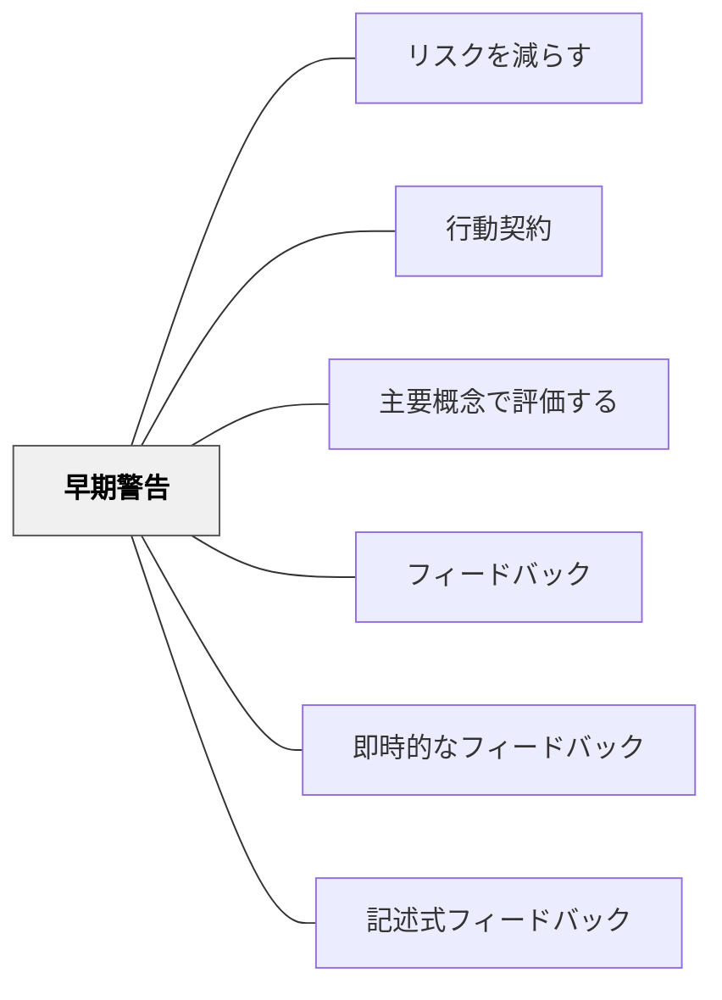

# 早期警告

> 学習者が遅れていることに気づくのは、学習者自身より先生が先だ。気づいたその瞬間が、介入のタイミングである。

## [Pattern Connection]

- **既存パタンとの関連**：[[パタン/フィードバック]] の下位パタンとして機能する。特に [[パタン/即時的なフィードバック]] の「タイミング」の重要性を「コース全体のスケール」に拡張した概念である。
- **補強された点**：フィードバックは「与えるもの」だけでなく「気づいて働きかけるもの」であるという視点を強化する。教師の観察力と介入意志がフィードバックの先行条件であることを示す。
- **修正・拡張された点**：「警告」という語感は否定的に響くが、本パタンが強調するのは「道筋を示すこと」であり、問題の指摘ではなく成功への道案内である。
- **他のパタンへの波及**：[[パタン/記述式フィードバック]] における「次に何をすべきか」の具体化に直接つながる。

## 背景（Context）

多くのコースや授業では、学習内容が積み上がる構造になっている。序盤の概念が理解されていなければ、後半の内容は完全に積み重なることができない。このような構造では、早い段階での躓きが、時間の経過とともに深刻な遅れに発展する。

学習者は自分が「遅れている」「理解できていない」ということに、教師ほど早く気づかない。認知的な盲点・恥・恐れから、問題の発見が遅れやすい。

## 問題（Problem）

学習者が序盤で躓いていても、それが明らかになるのは往々にして手遅れになってからである。評価の結果が返ってくるころには、誤解が積み重なっており、修正コストは膨大になっている。早期に介入できれば回避できた失敗が、見逃されたまま進行してしまう。

## 力のかたち（Forces）

- 学習者は自分が遅れていることに気づきにくく、問題を過小評価しがちである
- 教師はより広い視野を持っており、学習者の状態を客観的に見られる立場にある
- 時間は有限であり、遅れた分だけ取り戻すコストは増える
- 序盤の誤解は後半の学習全体を歪める
- 積み重なった誤りを修正しようとする努力は、早期に修正する努力より大きな負担になる
- 介入が遅れるほど、学習者の心理的ダメージ（あきらめ感・劣等感）も蓄積される

## 解決（Solution）

**学習者が理解できていない、または仕事量・進度についていけていないと気づいたら、早期に働きかけよ。** その働きかけは「問題の指摘」ではなく「成功への道筋の提示」でなければならない。

---

### 早期警告の方法

**個別の声がけ（私的）**
- 授業後に一言「最近どう？難しいところはある？」と尋ねる
- 廊下での一言（Joe Berginが35年後も覚えている恩師の声がけの例）
- 個別メール・メモによる非公開の確認

**短時間の確認テスト（頻繁に・早く返す）**
- 週次・隔週での小テストを行い、迅速に返却する
- 小テストの結果を見て、特定の学習者に声をかける機会にする

**FAQ・つまずきポイントの公開**
- コース全体を通じてよくある誤解・落とし穴をリストアップし、共有する
- 「多くの人がここで詰まります」という予告自体が準備を促す

---

### 介入の伝え方

- 問題を指摘するだけでなく、「次のステップ」を示す
- 「今のあなたには可能性がある、だからこそ伝えたい」という姿勢を示す
- 尊厳を守るために、公の場でではなく個別に伝える
- 成績が示すパフォーマンスより高い潜在力を感じるなら、それを明示する

---

### アンチパタン：沈むまで泳がせる（Sink or Swim）

介入せず「どうにかするだろう」と放置することは、アンチパタンである。沈むまで気づかせない・助けないことは、学習者を失うだけでなく教師の責任放棄でもある。

## 結果（Consequences）

- 学習者は自分の状況を早い段階で認識し、修正行動を取れる
- 教師の介入は「気にかけてもらえている」という安心感を学習者に与える
- 個別の声がけは尊厳を守り、公的な失敗のリスクなしに軌道修正を促す
- 誤解が積み重なる前に修正されるため、学習の総コストが下がる
- 適切なタイミングでの一言が、何十年も後まで学習者の記憶に残ることがある

## 関連パタン
- [[パタン/リスクを減らす]]
- [[パタン/行動契約]]
- [[パタン/主要概念で評価する]]

- [[パタン/フィードバック]] — 早期警告はタイムリーなフィードバックの一形態
- [[パタン/即時的なフィードバック]] — タイミングの重要性という点で同根
- [[パタン/記述式フィードバック]] — 早期警告の内容を「道筋」として文章で伝える

## クラスター図

## Actionable Insight

- 小テストや課題を返却するとき、得点だけでなく「この子、最近ついていけているか？」という目で一人ずつ眺める習慣をつける
- 「最近どう？」という一言声がけを、週に一人、気になる子どもに放課後か休み時間に試みる——廊下の一言が何十年後も残る
- コースの序盤でよくある誤解・つまずきポイントを箇条書きにして、授業の最初に「多くの人がここで詰まります、早めに確認してください」と伝えてみる

## 出典

Bergin, J., Eckstein, J., Volter, M., Sipos, M., Wallingford, E., Marquardt, K., Chandler, J., Sharp, H., & Manns, M. L. (2012). *Pedagogical Patterns: Advice For Educators*. Joseph Bergin Software Tools. (CC BY-SA 3.0)  
https://www.pedagogicalpatterns.org/

> "Therefore, give them Early Warning when you see that they are not coping with the amount of work, or they have misunderstood some topic. Advice should point a path to success, not just a roadblock." — Bergin et al. (2012)

> "Joe Bergin vividly remembers a respected Professor's quiet word in the elevator, even after 35 years." — Bergin et al. (2012)
