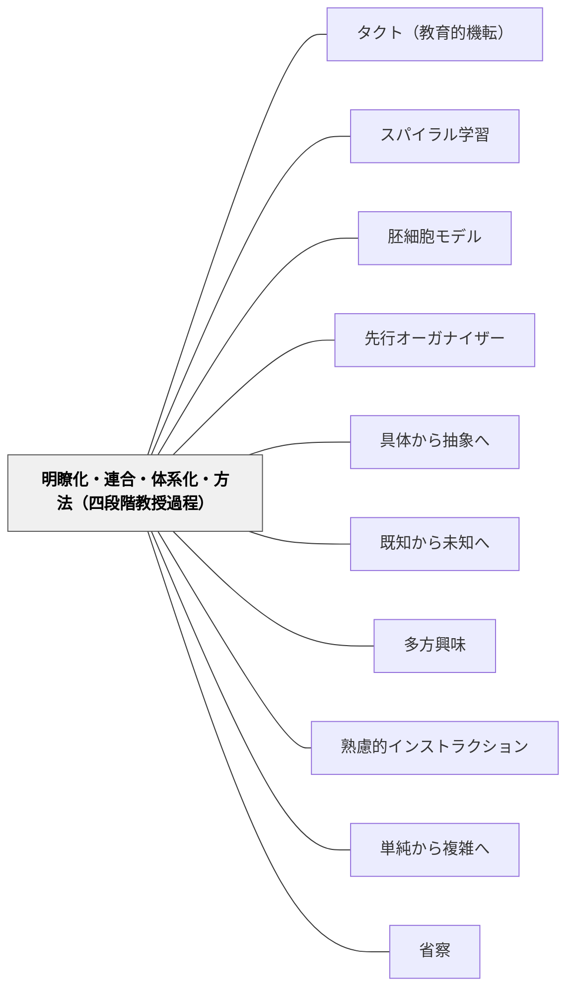

# 明瞭化・連合・体系化・方法（四段階教授過程）

> 知識を与えることと、知識が育つことは違う——育つ過程に四つの段階がある。

## [Pattern Connection]

**ヘルバルト（1806）教育学綱要——四段階の直接の源泉：**

本パタンはヘルバルトが§103〜§116で展開した教授過程論を直接パタン化したものである。この四段階は、19世紀のヘルバルト派教育学の中心理論であり、後の五段階教授法（ライン/ジラーによる整理）、現代のアクティブ・ラーニング論、スパイラル・カリキュラム論に影響を与えた。

> 「教授過程は、単なる知識伝達ではなく、児童の内部で『観念の自動的組織化』が生起する一連の働きである。」（§103）

- **スパイラル学習との接続**：四段階は「らせん的に何度も繰り返される」（§113）。同じ教材も学年・経験に応じて各段階の水準が高度化していく——これが[[パタン/スパイラル学習]]の歴史的起源。
- **アペルツィオーンとの接続**：「連合」段階はアペルツィオーン（新観念を既存観念群に同化させる）の実践的形態。
- **波及するパタン**：[[パタン/スパイラル学習]]・[[パタン/胚細胞モデル]]・[[パタン/先行オーガナイザー]]・[[パタン/具体から抽象へ]]；[[文献/教育学綱要（ヘルバルト）]] — 本パタンの出典

---

## 背景（Context）

[[パタン/熟慮的インストラクション]]の構造次元。教授は「一回の授業で完結する事実伝達」ではなく、学習者の内部で「観念の自動的組織化」が生起する連続的・反復的な過程である。伝統的な暗記主義・一方通行型教授では、この組織化は起きない。

## 問題（Problem）

授業が「教師から事実を伝える→生徒が記憶する」という一方通行で設計されると、知識が「孤立した断片」のまま残る。断片的な知識は応用力を持たず、やがて忘れられる。「観念の自動的組織化」が起きていない状態では人格形成にも寄与しない。

## 力のかたち（Forces）

- 鮮明な理解（明瞭化）なしに新知識は宙に浮く
- 既存知識との接続（連合）なしに長期記憶に残らない
- 体系化なしに転移・応用力が育たない
- 「学ぶ方法を学ぶ」（方法）段階に至らないと自律的な学習者にならない
- 四段階は一直線ではなく、らせん的に繰り返されるため授業時間内で「完結させよう」とすると歪む

## 解決（Solution）

**教授を「明瞭化→連合→体系化→方法」の四段階として設計し、各段階を意識的に経ながら学習者の観念組織化を支援する。四段階は一回で完結せず、らせん的に繰り返す。**

---

### 四段階の詳細

**第一段階：明瞭化（Clarity）**

新知識が学習者の意識に鮮明に現れる段階。

> 「教師は分かりやすい例示・具体的説明・感覚的体験を通じて、児童の中に新観念のはっきりとした像を形成させねばならない。あいまいな導入は後々まで誤解を残し、学習全体の土台を不安定にする。」（§109）

実践例：
- 「三角形の面積」を教える前に、三角形を紙で切り取り、長方形と並べて見比べる（感覚的体験）
- 「比喩」を教える前に、具体的な比喩文を3つ声に出して読む
- 分からなかったことを「わかった！」と感じる瞬間を意図的に設計する

**第二段階：連合（Association）**

新観念を既存の観念群と結び付け、意味ある関係網に統合する段階。

> 「教師は児童に、過去に学んだことや生活経験、他の教科で得た知識との関連を意識的に探らせる。これにより、新知識が孤立した断片にとどまらず、強固な記憶として保持されやすくなる。」（§110）

実践例：
- 「これは先週の○○と、どこが同じで、どこが違う？」と問う
- 「この現象に似たことを日常生活で見たことはある？」
- 新しい数学の公式を、既習の公式と並べて「どうつながっているか」を考える

**第三段階：体系化（System）**

個別の知識や経験を、より高次の原理・法則の下に統合し、全体的な世界像を築く段階。

> 「断片的情報は体系的知識とならぬ限り応用力を持たない。教師は、複数の事実や現象を整理・比較・総括し、児童が『知のネットワーク』を広げていくのを援助せねばならない。」（§111）

実践例：
- 単元末に「これまで学んだことを図にまとめてみよう」（概念マップ）
- 「これらの事例に共通する原則は何だろう」という抽象化の問い
- 学科横断的な「なぜ数学と理科でこの概念が出てくるのか」を考える

**第四段階：方法（Method）**

得られた知識・技能を自発的・創造的に用いる力を育てる段階。「学ぶ方法を学ぶ」。

> 「児童が自分なりの方法で問題を解決したり、新しい問いを立てたりできるようになることで、学びは真に自分のものとなる。」（§112）

実践例：
- 「同じ方法を使って、別の問題を自分で作ってみよう」
- 「今日学んだことを使って、自分の疑問を解いてみよう」
- 探究学習・プロジェクト学習——学んだ概念を実際の文脈で創造的に使う

---

### らせん的反復深化

四段階は一回きりで完結しない（§113）。同じ概念・教材でも、学年・経験が上がると：

| 学年 | 明瞭化 | 連合 | 体系化 | 方法 |
|------|--------|------|--------|------|
| 低学年 | 実物・感覚的体験 | 身近な生活経験との接続 | 単純な分類・比較 | 生活場面での適用 |
| 中学年 | 具体的な数・図形 | 既習単元との接続 | 原理・法則の初歩 | 練習問題の自己設定 |
| 高学年 | 抽象的な定義・公式 | 教科横断的な接続 | 体系的な知識の統合 | 創造的応用・問い設定 |

---

## 結果（Consequences）

- 学習が「事実の暗記」から「観念の有機的組織化」に変わる
- 体系化まで進んだ知識は転移・応用力を持ち、別の文脈でも使える
- 「方法」段階に到達した学習者は、新しい問いを自分で立てられるようになる
- らせん的な繰り返しによって、同じ概念が深まりながら再学習される

## クラスター図

## Actionable Insight

- 単元設計で「この授業は四段階のどこにあたるか」を確認する——明瞭化だけで終わっていないか（連合・体系化・方法が抜けていないか）
- 授業の冒頭に「前回学んだことを一言で言うと？」と問う——連合段階の始動。新しい知識が既知と接続する「橋」を明示的に渡す
- 単元末に「この単元の一番大事なことは何だったか」を概念マップや1文で書かせる——体系化の確認と同時に、学習者自身の観念組織化を可視化する
- 「今日学んだことを使って自分で問題を作ってみよう」を一学期に一度は試みる——方法段階（学ぶ方法を学ぶ）への橋渡し

## 出典

Herbart, J. F. (1806). *Allgemeine Pädagogik aus dem Zweck der Erziehung abgeleitet* §103–116. → [[文献/教育学綱要（ヘルバルト）]]

> 「これら四段階は、一回きりの学習で完結するものではなく、らせん的に何度も繰り返される。」——ヘルバルト（§113）

## 関連パタン
- [[パタン/タクト（教育的機転）]]
- [[パタン/スパイラル学習]] — らせん的反復深化の現代的実装
- [[パタン/胚細胞モデル]] — 体系化段階の「核となる概念」
- [[パタン/先行オーガナイザー]] — 連合段階を促す構造的準備
- [[パタン/具体から抽象へ]] — 明瞭化→体系化の抽象度次元
- [[パタン/既知から未知へ]] — 連合段階の認識論的基盤
- [[パタン/多方興味]] — 六種の興味が各段階を動機づける
- [[パタン/熟慮的インストラクション]] — 上位パタン
- [[パタン/単純から複雑へ]] — 四段階の深化次元
- [[パタン/省察]] — §117「教師もまた学び続ける」は方法段階の教師版
