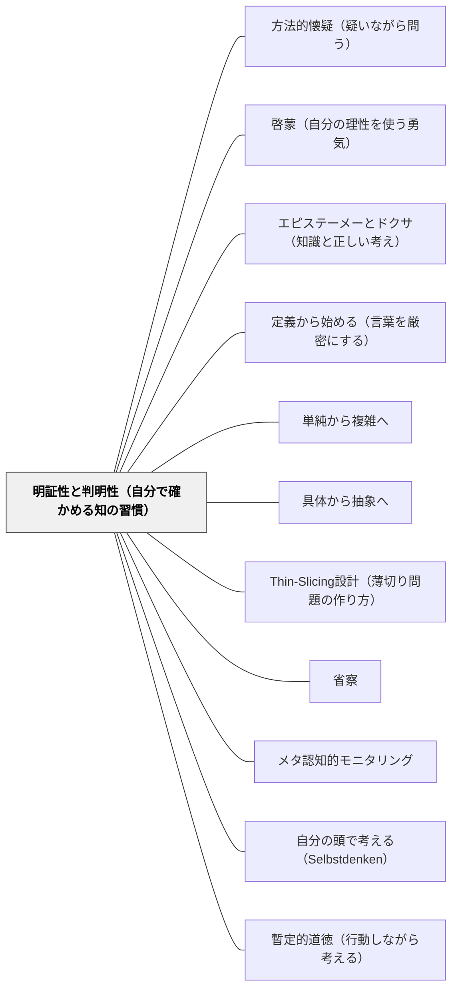

# 明証性と判明性（自分で確かめる知の習慣）

> 「私の採用する第一の規則は、私が明証的に真であると認識するものでなければ、いかなるものも真として受け入れないことであった。すなわち、拙速と偏見を注意深く避け、私が判明に真であると認識するほかは何も私の判断に入れないようにすることだった。」（デカルト『方法叙説』第二部）

---

## [Pattern Connection]

**方法叙説（デカルト, 1637）統合：**

デカルトの方法規則は四つあるが、その第一が「明証性（évidence）」の規則——明晰（claire）かつ判明（distincte）に認識できるものだけを真として受け入れる、というもの。「明晰」とは「はっきり認識できる」こと；「判明」とは「他のものと混同されずに区別できる」こと。

四つの方法規則が教育と結びつく：
1. **明証性**（évidence）: 明晰・判明に分からないものは受け入れない → 「自分で確かめる」
2. **分割**（analyse）: 問題を解決可能な最小部分に分割する → [[パタン/Thin-Slicing設計（薄切り問題の作り方）]]
3. **綜合**（synthèse）: 単純から複雑へと秩序立てて進む → [[パタン/単純から複雑へ]]・[[パタン/具体から抽象へ]]
4. **枚挙**（énumération）: 完全な見直しで何も省かない → [[パタン/省察]]

本パタンは主に規則1（明証性）の教育的展開を扱う。

- **既存パタンとの関連**:
  - [[パタン/啓蒙（自分の理性を使う勇気）]] との根本的な接続——カントの「自分の理性を使う勇気（Sapere aude）」の「使い方」の具体的方法論が、デカルトの明証性規則で与えられる。何のために自分の理性を使うのか——「自分で確かめるため」。
  - [[パタン/エピステーメーとドクサ（知識と正しい考え）]] との接続——ドクサ（正しいかもしれない意見）をエピステーメー（知識）に高める実践として、明証性の規則が機能する。「正しいかもしれない」から「自分で確かめた」への昇格。
  - [[パタン/自分の頭で考える（Selbstdenken）]] との直接対応——カントの「自分の頭で考える（Selbstdenken）」は啓蒙の核心；デカルトの明証性規則はそれをより具体的な認識論的基準で肉付けする。
- **補強された点**:
  - [[パタン/方法的懐疑（疑いながら問う）]] の「本当にそうか」という問い返しの後に、「では何を基準に受け入れるか」という答えを与える。懐疑と明証性は表裏一体。
  - [[パタン/定義から始める（言葉を厳密にする）]] の哲学的根拠として機能する——「判明に区別できること」という基準が、厳密な定義の必要性を生む。
- **他のパタンへの波及**:
  - [[パタン/暫定的道徳（行動しながら考える）]] — 「明証的でないことは受け入れない」という認識論的基準と、「確信がなくても行動する」という実践論的必要が組み合わさる構造
  - [[パタン/省察]] — 枚挙（方法規則4）は「見直し・確認・省察」と直接対応する実践

### 数学ガールの秘密ノート・整数で遊ぼう（結城浩, 2014）——「バシッとわかる」と「リクツがわかる」の区別

第1章の最重要エピソード。3の倍数判定法の証明を丁寧に示した後、ユーリはこう言う。

> 「お兄ちゃんが見せてくれた証明はわかったよ。リクツもちゃんとわかったけど、まだ納得できてない。バシっとわかってないところがある」

「証明の論理は追えた」と「腑に落ちた（納得した）」は別の認知状態である——これを学習者自身が言語化した最も鮮明な事例。

「バシッとわかってない」を解決したのは**島の比喩**：3で割った余り0・1・2の「島」に数を分け、「3の倍数を足すと、どんな数でも同じ島に留まる」という視覚的イメージ。論理の手順を「追う」理解から、「なぜそうなるか」の構造が見える理解への転換。

> ユーリ「ぐるぐるっと回って同じ島になるんだ！」

**「バシッとわかっていない」状態を教師が見抜くサイン：**

1. 「リクツはわかった、でも……」という但し書きが出る
2. 別の数・別の文脈で確かめると動かせない
3. 自分で例を作れない（→[[パタン/例示は理解の試金石（具体例で理解を確かめる）]]参照）

これは本パタンの「明証性の確認の四問」に具体的な感覚的手がかりを加える。「バシッとわかる」＝「理解が明晰かつ判明に到達した状態（明証性の達成）」、「リクツがわかる」＝「論理の手順は追えたが意味の腑落ちが未達の状態」。デカルトが「明晰かつ判明に」と述べたことを、ユーリが「バシッと」という感覚的な言葉で精確に表現している。

→ [[パタン/例示は理解の試金石（具体例で理解を確かめる）]]（新規）
→ [[文献/数学ガールの秘密ノート・整数で遊ぼう（結城浩）]]

---

## 背景（Context）

「先生がそう言ったから正しい」「教科書にそう書いてあるから」「みんながそうしているから」——こうした権威への依存は、学習の効率を高める側面もある。しかし、権威に従うことと自分で理解することは別のことだ。

デカルトは若い頃、「学校で学べることをすべて学んだ」と感じたとき、自分が実際には多くの疑問と不確実性に満ちていることに気づいた。知識の「量」が増えても、「理解の質」は必ずしも向上しない——それは、自分で確かめていないから。

明証性と判明性の規則は、「自分が本当に理解したかどうかを確認する基準」を与える。「明晰に見える」——霧の中でなくはっきり見える。「判明に区別できる」——他と混同されていない。この二つの基準を使えば、「分かったつもり」と「本当に分かった」の差が内省できる。

## 問題（Problem）

「分かったつもり」が「本当の理解」を妨げる：

- 解法を暗記して正解を出せるが、なぜその解法が使えるかを言えない
- 語彙を知っているが、自分の言葉で説明できない
- 「正しいと思う」と言えるが、「なぜ正しいか」を根拠ありで言えない
- テストに正解できるが、別の文脈で応用できない
- 教師が「理解した」と判断しても、子どもは「正解した」だけで「理解した」わけではない

## 力のかたち（Forces）

- 「分かったつもり」は心地よい——不確実性を抱え続けることより確信の快楽が先に来る
- 深い理解を目指すと時間がかかる——カリキュラムの進度と真の理解の間には緊張がある
- 「自分で確かめる」ためには、確かめる方法を知る必要がある——方法を教えることも教師の役割
- 「あいまいさを抱える力（ネガティブ・ケイパビリティ）」が育っている子は方法的懐疑と明証性の追求に強い
- すべてを「自分で最初から確かめる」ことは現実的ではない——何を確かめ何を信頼するかの優先順位が必要

## 解決（Solution）

**「分かった」を「明晰かつ判明に分かった」と区別する習慣を教室文化に組み込む。「自分の言葉で説明できるか」「なぜそうなるかの根拠を言えるか」という問いを、学習の確認基準として使う。教師がまず自分自身にこの基準を適用し、「分かった（と思っている）」と「本当に確かめた」を区別して見せる。**

---

### 明証性の確認の四問

学習後に使える自己確認の問い：

1. **「自分の言葉で説明できるか？」** — 明晰さの確認。教科書の言葉でなく、自分が納得している言葉で。
2. **「なぜそうなるか、根拠が言えるか？」** — 理由の確認。「そういうことになっている」でなく「こういう理由で」と言えるか。
3. **「別のものと区別できるか？」** — 判明さの確認。似たものと混同していないか。「速さ」と「距離」、「平均」と「中央値」——区別できて初めて判明に分かった。
4. **「別の場面でも使えるか？」** — 転移の確認。抽象化できているかどうかのテスト。

---

### 方法規則から生まれる教育実践

**分割（規則2）**: 理解できない問題は「どこが分からないか」に分割する。「全部分からない」は出発点; 「ここからここまでは分かる、ここが分からない」が精確な分析。→ [[パタン/Thin-Slicing設計（薄切り問題の作り方）]]

**綜合（規則3）**: 単純なものから複雑なものへと順序立てる。理解の積み上げに無理があると感じたら、「もっと単純な問題が分かっているか」を確認して戻る。→ [[パタン/単純から複雑へ]]

**枚挙（規則4）**: 理解の点検に漏れがないか確認する。「これも分かった、あれも分かった——全体はどうか」という振り返り。→ [[パタン/省察]]

---

### 具体例

**例1：算数「なぜ分数の割り算は逆数をかけるのか」**
「ひっくり返してかけるのが計算のルール」で止まらず、「なぜひっくり返すと答えが出るか、自分で確かめる」——具体的な数字（2÷1/3 = 2×3）で確かめ、図で確かめ、「こういう理由だから」と言える状態を目指す。明証的に分かった、と言えるまで確かめる。

**例2：国語「この登場人物の気持ちは〇〇だ」**
「なんとなくそう思う」でなく、「本文のここと、ここから、この根拠でそう考える」と言えるか——判明さの確認。別の登場人物との気持ちの違いが区別できるか——判明に区別できているかの確認。

**例3：教師自身への適用**
「この子は理解した」という判断を「明証的に確かめたか」——何をもって理解したと判断するか。発言・記述・別問題への応用——確認の根拠を明示する習慣が、より精確な形成的評価につながる。

**例4：岩井の数学デイリー**
「この問題、答えは合っていたが、本当に理解したか」——解けたことと理解したことは別。「別の数字に変えても同じ方法で解けるか」（転移テスト）、「なぜこの方法が使えるか言えるか」（根拠確認）——明証性の四問を自己適用する。

## 結果（Consequences）

- 「正解できた＝理解した」という単純な等号が崩れ、「理解した」に質的な基準が生まれる
- 「分かったつもり」に自分で気づける力が育つ——メタ認知的モニタリングの強化
- 深い理解が転移（別の文脈への応用）を支える——暗記に頼る学習より広い適用範囲
- ただし、すべての知識に明証性を要求することはできない——「今は信頼して進む、後で確かめる」という優先順位の判断が同時に必要

## 関連パタン

- [[パタン/方法的懐疑（疑いながら問う）]] — 明証性の裏面：疑いから始まって確かめる
- [[パタン/啓蒙（自分の理性を使う勇気）]] — 自分の理性を使う目的としての明証性
- [[パタン/エピステーメーとドクサ（知識と正しい考え）]] — 意見を知識に高める基準としての明証性
- [[パタン/定義から始める（言葉を厳密にする）]] — 判明性（区別できること）が厳密な定義を求める
- [[パタン/単純から複雑へ]] — 方法規則3（綜合）の教育的対応パタン
- [[パタン/具体から抽象へ]] — 方法規則2・3の実践的展開
- [[パタン/Thin-Slicing設計（薄切り問題の作り方）]] — 方法規則2（分割）の教育的設計
- [[パタン/省察]] — 方法規則4（枚挙）の教育的対応
- [[パタン/メタ認知的モニタリング]] — 「分かったつもり」を自覚する力の育成
- [[パタン/自分の頭で考える（Selbstdenken）]] — 明証性を求めることは自分の頭で考えること
- [[パタン/暫定的道徳（行動しながら考える）]] — 明証性を追い求めながら行動する実践知
- [[文献/方法叙説（デカルト）]] — 本パタンの出典

---

## クラスター図

## Actionable Insight

- 授業の確認場面に「自分の言葉で説明してみて」を加える——「正解か」でなく「説明できるか」への問いの転換が、理解の質を変える
- 「これで分かったか？」という問いを「これを別の問題でも解けそうか？」に変える——転移の確認が、表面的理解と深い理解を区別する試金石になる
- 子どもが「分かった」と言ったとき、「どの部分がはっきり分かった？どの部分はまだもやっとしている？」と聞き返す一言を持つ——明晰さと不明確さを区別する言語化を促す

---

## 出典

デカルト, ルネ（1637/2022）.『方法叙説』小泉義之訳. 講談社学術文庫. 第二部.

> 「私の採用する第一の規則は、私が明証的に真であると認識するものでなければ、いかなるものも真として受け入れないことであった。すなわち、拙速と偏見を注意深く避け、私が判明に真であると認識するほかは何も私の判断に入れないようにすることだった。」（第二部）
