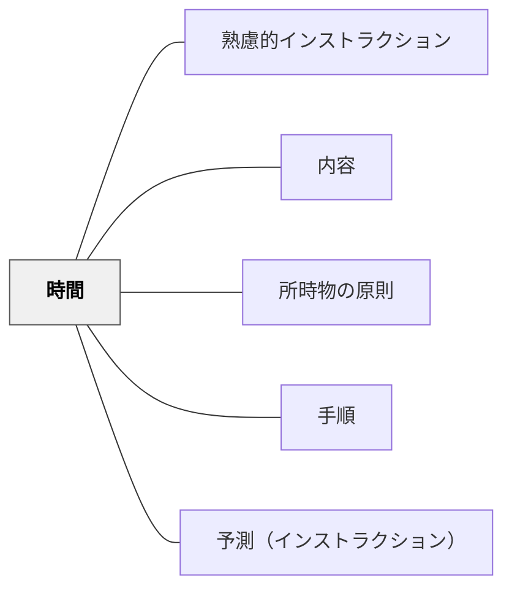

# 時間

> 所要時間を示すことで、受け手の不安を取り除き、見通しをもたせる。

## 背景（Context）
ワーマンの「理解の秘密」が示すインストラクションの内容6要素の一つが「時間」である。向山洋一の「所時物の原則」における「時」とも対応し、いつ・どれくらいの時間をかけるかを明示することはインストラクションの重要な構成要素とされる。時間の見通しがない状態では、受け手は不安を抱えながら作業することになる。

## 問題（Problem）
教師が「やってみましょう」と指示するとき、どれくらいかかるかが示されないことが多い。受け手は終わりが見えないまま作業し、どこで区切るべきかわからず、間違いがあっても気づきにくい。所要時間の欠如がフラストレーションや混乱を招く。

## 力のかたち（Forces）
- 所要時間がわかると受け手は見通しをもって集中できる
- 予想時間と実際の時間のズレが、自分の進捗状態（速すぎ・遅すぎ）を教えてくれる
- 時間を示しすぎると逆にプレッシャーになる場合がある
- 作業の性質によって「目安」と「締め切り」の使い分けが必要

## 解決（Solution）
**インストラクションに「〇分でやってみましょう」「だいたい5分ほどかかります」という形で所要時間の目安を組み込む。**

活動の始めに「この作業は3分で終わります」と伝えるだけで、受け手の集中度が上がる。時間が大幅にずれている受け手には、間違いを早期に発見するきっかけになる。長い課題では中間チェックポイントの時間も合わせて示す。

## 結果（Consequences）
- 受け手が見通しをもって活動に取り組める
- 時間的なずれが早期発見のサインとして機能する
- 教師の時間管理意識が高まり、授業全体のテンポが改善される

## クラスター図

## Actionable Insight

- 活動指示を出すとき「だいたい〇分でできます」という時間の目安を必ず添える——終わりの見通しがあるだけで学習者の集中度と安心感が高まる
- 長い課題には「10分後に最初のステップが終わっているはずです」と中間チェックポイントを設ける——時間的な節目が進捗の自己評価と早期の誤り発見を助ける
- 予想時間より大幅に速い・遅い学習者を観察する——時間のずれが課題の難易度ミスマッチや理解の過不足を発見する手がかりになる

## 出典

- 一つの教育のパタン・ランゲージ（岩井輝久）

## 関連パタン
- [[実践/個別支援級の複式算数：重さと面積をわたり・ずらしで学ぶ]]
- [[パタン/熟慮的インストラクション]] — 親パタン
- [[パタン/内容]] — 時間を含む6要素システム
- [[パタン/所時物の原則]] — 時間を含む準備原則
- [[パタン/手順]] — 時間と組み合わされる実行内容
- [[パタン/予測（インストラクション）]] — 時間と合わせて安心感を与える要素
