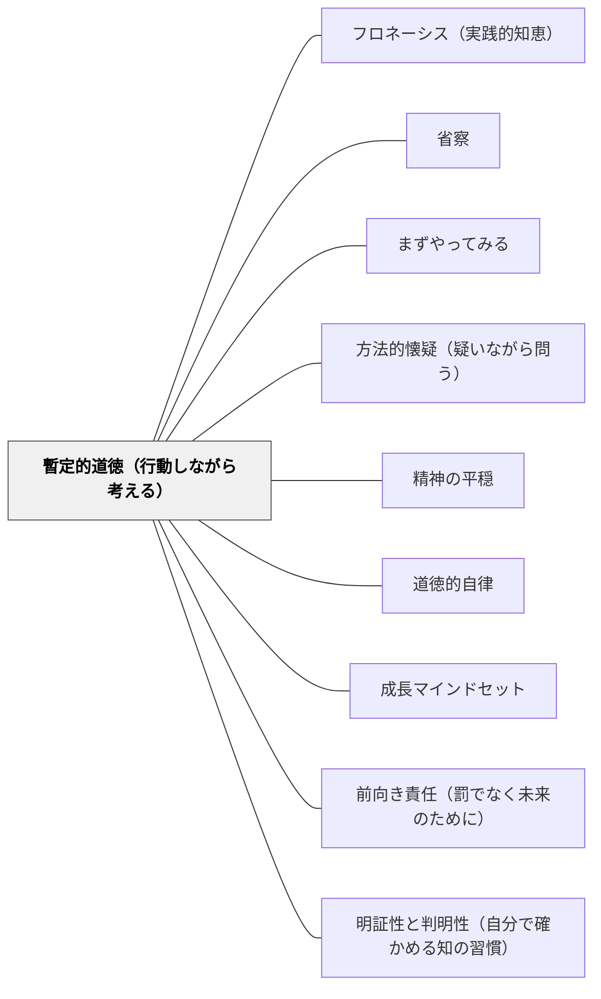

# 暫定的道徳（行動しながら考える）

> 確実な答えが見つかる前でも、人は行動し続けなければならない。古い家を建て直す間、仮住まいが必要なように——思考の改革の途中でも、暫定的な行動規則が必要だ。（デカルト『方法叙説』第三部を参照）

---

## [Pattern Connection]

**方法叙説（デカルト, 1637）統合：**

デカルトは第三部で、方法的懐疑によって旧来の知識を点検している間も「行動しなければならない」という実践的問題に直面した。「古い家の壁を壊した後、別の家が建つまでの間は仮住まいが必要だ」——これが暫定的道徳（la morale par provision）の比喩。

デカルトの四つの格率（暫定的道徳）：
1. **穏健の格率**：自国の法律と慣習に従い、最も中庸な宗教・意見を実践する
2. **断固の格率**：一旦決めたことは疑わしくとも、できる限り断固として確固に行動する
3. **欲求変更の格率**：世界の秩序より自分の欲求を変えることを選ぶ——意志の力は思考にのみ及ぶ
4. **理性への専念**：人生を理性と真理の探求に捧げる

- **既存パタンとの関連**:
  - [[パタン/フロネーシス（実践的知恵）]] との深い接続——フロネーシスは「状況の中で最善の行動を判断する実践的知恵」; 暫定的道徳は「確信が持てない状況での行動原則」を先立って設定するという構造。フロネーシスが判断の中身を扱うとすれば、暫定的道徳はその前提となる「行動するという決断」を扱う。
  - [[パタン/省察]] との接続——省察は「行動の後の振り返り」; 暫定的道徳は「行動の前の暫定原則の設定」。両者は前後の関係にある。
  - [[パタン/まずやってみる]] との対応——「まずやってみる」は実践の優先; 暫定的道徳はそれに「暫定的な枠組みを意識する」という認識論的深度を加える。
- **補強された点**:
  - [[パタン/道徳的自律]] に「不確実性の中での自律」という実践的補強が与えられる。カントの「普遍的法則」は確実な道徳的前提を想定するが、デカルトの暫定的道徳は「まだ確信が持てない」状況での自律をどう維持するかを示す。
  - [[パタン/精神の平穏]] との接続——「自分の欲求を変える（世界ではなく）」という第三格率は、精神の平穏の実践的技法として機能する。
- **他のパタンへの波及**:
  - [[パタン/方法的懐疑（疑いながら問う）]] — 懐疑しながら行動する——両者は「不確実性の中での知的誠実さ」の二つの側面
  - [[パタン/明証性と判明性（自分で確かめる知の習慣）]] — 暫定的道徳の期間中も「明証的なもの」への信頼は持ち続ける

---

## 背景（Context）

教師は「完全な答え」を持っていない状況で毎日教室に立つ。最適な授業を設計する確信がないまま授業をし、子どもへの対応に迷いながら判断を下し、来週の計画を立てながら今日の修正もする。

授業研究・教師教育・個人の省察——すべて「より良い実践を求める途中」であることを前提にしている。にもかかわらず、教師は明日の授業を「今日」設計しなければならない。

デカルトは第三部で、哲学的懐疑の検討中に直面した同じ問題を記述した。「道を歩いているとき、どちらに向かえばよいか分からなければ、一方向に決めてまっすぐ歩き続けるほうが、右往左往するよりよい」——これが暫定的道徳の実践論。

## 問題（Problem）

完全な答えを待っていると、行動が止まる：

- 「もっと研究してから実践する」では永遠に実践できない——理論と実践の乖離
- 「正しい答えが見つかるまで判断しない」では、子どもに対する無責任が生まれる
- 「今の自分の知識では不十分」という不安が、積極的な実験・試行を妨げる
- 逆に、「とにかくやればいい」という無原則な実践は、省察・改善の機会を失わせる
- 確信がないまま行動する後ろめたさが、教師の心理的安全性を損なう

## 力のかたち（Forces）

- 「今できる最善をする」という行動の必要と、「まだ分からない」という知的誠実さを両立する必要がある
- 暫定（provisional）とは「いずれ更新される」という前提を持つこと——「仮の」であることが正直さ
- 行動においては断固とする（格率2）ことで、揺らぎを減らし力を集中できる
- 自分がコントロールできないこと（子どもの反応・環境・制度）より、自分の態度・欲求・解釈をコントロールする（格率3）
- 暫定的道徳は「とりあえずの妥協」ではなく、「探求の継続のための安定した土台」

## 解決（Solution）

**確実な答えが出るまで待たず、「今日の自分にできる最善の暫定的判断」を設定して行動する。その判断は「いずれ更新される可能性がある」と明示的に意識しながら、行動においては全力で取り組む。行動と探求の継続を同時に維持する。**

---

### 教師のための暫定的道徳

**格率1：穏健——極端を避けて中庸の実践を選ぶ**
新しい知識・理論・研究で「今すぐすべてを変えたい」衝動が生まれたとき、一度立ち止まる。既存の実践を全否定するより、「今の実践にこの要素を一つ加える」という穏健な実験から始める。大きな改革より小さな実験を重ねることが、実践知を積む道。

**格率2：断固——一旦決めたらまっすぐ動く**
授業計画は「最善の暫定案」として設定し、実施中は揺らがない。「この方法が正しいかどうか」を授業中に悩むより、設計した通りに実施し、授業後に省察する。行動の質は意思決定の質と実施の質の両方で決まる——疑いながらでも実施中は全力で。

**格率3：欲求変更——コントロールできることに集中する**
「子どもが変わってくれれば」「環境がよければ」「制度が整えば」——外の世界への欲求を変えるより、自分の態度・問いの立て方・解釈の枠組みを変えることに集中する。コントロールできることとできないことを区別し、できることに力を注ぐ。

**格率4：探求への専念——「学び続ける教師」という使命を持つ**
「自分を教育する意図（l'intention de s'instruire）」（デカルト, 第六部）——教師自身が学習者であり続けることを、職業的使命として意識する。完成した知識の伝達者ではなく、探求の途中にある実践者として自己定義する。

---

### 具体例

**例1：新しい指導法を試みるとき**
「リーディング・ワークショップをやってみたいが、本当にうまくいくか自信がない」——これが方法的懐疑の状態。暫定的道徳の適用：まず小規模に試す（穏健）、試すと決めたら全力でやる（断固）、子どもが乗らなくても「やめてよかった」と後悔しない（欲求変更）、その結果から学ぶ（探求への専念）。

**例2：子どもへの判断を迫られるとき**
問題行動への対応を「どうすべきか完全には分からないが、今すぐ何か応答しなければならない」——暫定的道徳の典型場面。「今日の自分の最善判断」として行動し、後で省察する。「あの時こうすべきだった」という後悔より「次どうするか」に集中（欲求変更 + 探求）。

**例3：授業計画の設計**
「この単元の組み立て、これで本当に良いか分からない」——まず設計し（断固）、実施しながら子どもの反応を観察し（探求）、必要なら修正する（穏健な更新）。完璧な設計より試行と省察のサイクルが実践知を育てる。

**例4：岩井の数学デイリーへの適用**
「この問題、今の自分には難しすぎるかもしれない」——暫定的道徳の適用：「今日は解けなくても、取り組むと決める」（断固）、「すべての問題を解くより、一問を深く理解することに集中する」（穏健・欲求変更）、「次のステップを見つけることを目指す」（探求への専念）。

## 結果（Consequences）

- 「完璧な準備なしに実践する」という不安が「暫定的判断を誠実に実行する」という積極的な構えに変わる
- 実践と省察のサイクルが回りやすくなる——「行動してから学ぶ」という経験学習の肯定
- 「自分の欲求・態度をコントロールする」という格率3の習得が、心理的安全性と精神の平穏に貢献する
- ただし、「暫定的だから何でもよい」という誤解に注意——暫定的道徳は原則不在でなく、「今の最善」を誠実に設定するという実践

## 関連パタン

- [[パタン/フロネーシス（実践的知恵）]] — 状況的判断と暫定的道徳の哲学的接続
- [[パタン/省察]] — 暫定的実践の後に来る振り返り
- [[パタン/まずやってみる]] — 「行動してから学ぶ」実践の対応パタン
- [[パタン/方法的懐疑（疑いながら問う）]] — 懐疑しながら行動する——両者の表裏
- [[パタン/精神の平穏]] — 欲求変更（格率3）と精神の平穏の接続
- [[パタン/道徳的自律]] — 不確実性の中での自律的行動
- [[パタン/成長マインドセット]] — 「学び続ける教師」という自己定義
- [[パタン/前向き責任（罰でなく未来のために）]] — 行動の結果を未来への学習として扱う
- [[パタン/明証性と判明性（自分で確かめる知の習慣）]] — 暫定的道徳の期間中も追い求める認識の基準
- [[文献/方法叙説（デカルト）]] — 本パタンの出典

---

## クラスター図

## Actionable Insight

- 新しい指導法を試す前に「今週の暫定的計画」を明示する——「完璧ではないが、これで今週行動する」という言語化が、実践への踏み出しを容易にする
- 「子どもが変わってくれれば……」という思考に気づいたとき、「自分が変えられることは何か」に問いを切り替える一手間を持つ——デカルトの格率3（欲求変更）の日常練習
- 授業後の省察で「今日の暫定的判断を次にどう更新するか」を一行書くことを習慣にする——行動・省察・更新のサイクルを可視化する

---

## 出典

デカルト, ルネ（1637/2022）.『方法叙説』小泉義之訳. 講談社学術文庫. 第三部.

> 「疑いながら道を行くとき、一方向に歩むことを決めてそのままの方向にまっすぐ歩き続けるほうが、あちらこちらをさまよって野の真ん中に留まっているよりはるかに良い。」（第三部）
