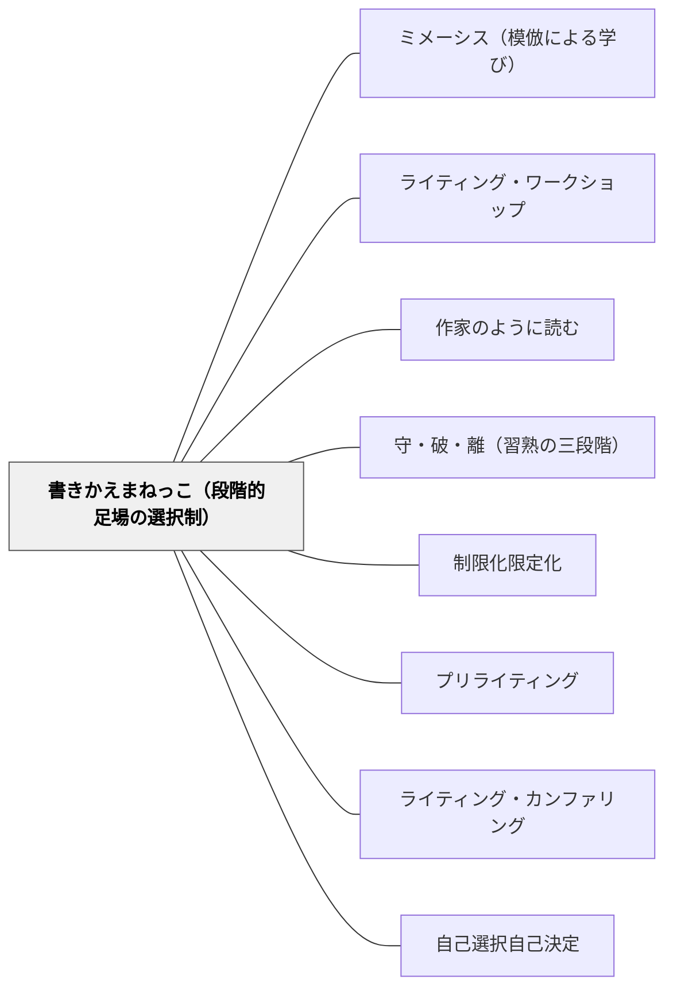

# 書きかえまねっこ（段階的足場の選択制）

> モデル文は全員の共有財産。「どこまで模倣するか」を学習者自身が選ぶことで、一人ひとりに合った足場が生まれる。

## Pattern Connection

### 岩井輝久実践（2025-01-16）——2年生の作家の時間の実践から

2年生の作家の時間において、岩井は以下の二本立て選択肢を設けた：

- **書きかえまねっこコース**：モデル文（教科書の物語文等）の構造・語句・展開を参考にして「書きかえる」。登場人物・舞台・出来事を自分のものに置き換える
- **オリジナルコース**：自分のオリジナルの物語を書く。ただし「モデルのお話の組み立てを参考にするといい」と明示されており、モデルへの参照は推奨される

> 「オリジナルコースの子にも、『スイミーのお話の組み立てを参考にするといい』と書かれていて、モデルの真似をすることが推奨されていることがわかる。」——澤田英輔（観察記録, 2025-01-16）

**観察された効果：**
- あるB児は、スイミーの「広い海のどこかに…」という書き出しにヒントを得て「ある日、広い森のどこかに…」と書き始めた。教師がモデルとして示したテキストが自然に吸収された例
- 模倣文化が定着しているクラスでは、行き詰まったときに教科書や参考資料を手に取ることが当然の行動として定着していた

**守破離との関係：**
このシステムは「守（型を守る）」から「破（型から抜け出す）」への移行を制度化する。書きかえまねっこコースが「守」の実践形態、オリジナルコースが「破」への橋渡しとして機能する。

- **既存パタンとの関連**：[[パタン/ミメーシス（模倣による学び）]] が模倣の認知的根拠を示すとすれば、本パタンはその実装として「どのくらい模倣するか」を学習者が選べる制度的構造を提供する；[[パタン/制限化限定化]] — 足場を選択することで各自に適切な制限が生まれる
- **補強された点**：「模倣 vs 創造」の二項対立を解消する。両コースともモデルを参照し、差異は「どこまで構造を借りるか」にあるだけ。この連続性が心理的な「模倣への抵抗感」を軽減する
- **他のパタンへの波及**：[[パタン/書きかえまねっこ（段階的足場の選択制）]] 自体が [[パタン/守・破・離（習熟の三段階）]] の実践的制度化；[[パタン/ライティング・ワークショップ]] — 独立書きの選択肢として機能；[[パタン/作家のように読む]] — モデル文の構造分析が書きかえまねっこの素地を作る；[[実践/作家の時間（2年生）]] — 本統合の出典実践

---

## 背景（Context）

ライティング・ワークショップにおいて、「自由に書く」アプローチと「モデルに従って書く」アプローチは長らく対立的に語られてきた。フレッチャー流の自由な書き方は書き手のアイデンティティと声（Voice）を育てるが、書き方の足場が何もないと多くの学習者が書けない。一方、モデルに沿った書き方は多くの学習者が書けるようになるが、画一的になりやすい。

岩井は2年生を担任した際、以前はフレッチャー方式（「書きたいことを、書きたいように書く」）を実践していたが、「教科書のモデル文を視写し、良いところを考え、その型を使って書く」という構造化アプローチへと変えた経緯がある。「多くの子が書けるようになっている実感がある」というのが、その選択の根拠であった。

書きかえまねっこコースは、この構造化アプローチの中で「自由に書きたい子」も「型が必要な子」も、同じ授業時間の中で並走できるようにする仕組みである。

## 問題（Problem）

作文指導において単一のアプローチを強いると：

1. **全員を「型」に縛る**と、既に書ける学習者の声（Voice）が失われ、表現の喜びが減少する
2. **全員を「自由」にする**と、足場が必要な学習者が「何を書けばよいか分からない」状態に陥り、書くことへの苦手意識が定着する
3. 教師が毎回足場の程度を個別に調整するのはカンファリングの負担が大きい

## 力のかたち（Forces）

- モデル文は「手本」でありながら「素材」でもある——ただ真似るだけでなく、自分の言葉で置き換えることで創造性が生まれる
- 「どちらのコースを選ぶか」を学習者が決めることで、自分の力量を自己評価する機会が生まれる
- 両コースが「等価なもの」として提示されないと、書きかえまねっこコースが「できない子のための簡単コース」というスティグマを持つ
- 教科書や良質な物語文がモデルとして機能するとき、作家の技法（書き出し・会話文・山場の作り方）が自然に吸収される
- 時間が経つにつれて書きかえまねっこコースを選ぶ学習者が減り、オリジナルコースへ移行することが自然に起きる

## 解決（Solution）

**同一のモデル文（高質な物語・教科書の例文等）を全員の共有リソースとして提示し、そのモデルをどこまで借りるかを学習者が選べる二本立てのコースを設ける。書きかえまねっこコース（モデルを構造的に模倣）とオリジナルコース（モデルを参照しながら独自の物語を書く）の両者にモデルへのアクセスを保証する。**

---

### 実践1：書きかえまねっこコース

**手順：**
1. モデル文（例：スイミー、教科書の物語）を全員で音読・分析する
2. 「登場人物は誰か」「どんな問題が起きるか」「どう解決するか」という物語の骨格を抽出する
3. 骨格のシートまたは板書を参照しながら、登場人物・舞台・出来事を自分のものに置き換えて書く

**具体例：**
- スイミーの「広い海のどこかに、ちいさなさかなのきょうだいたちが」→「広い森のどこかに、ちいさなうさぎのきょうだいたちが」
- 桃太郎の構造 →「りんごたろう」（同じ問題解決構造で主人公を変える）

---

### 実践2：オリジナルコース（モデル参照あり）

**手順：**
1. 同じモデル文を共有リソースとして参照可能にしておく
2. 「お話の組み立ては、このモデルを参考にしていい」と明示する
3. 登場人物設定カードで自分のキャラクターを決める
4. モデルの構造（起承転結・山場・解決）を意識しながら独自の物語を書く

**教師の関わり：**
- 書き詰まった学習者には「このモデルの組み立てを見てみよう」と教科書を持ってくる
- 一行おきに書かせ、後で加筆・修正しやすくする

---

### 登場人物設定カードの活用

ストーリーを先に構想するより、キャラクターを先に設計する方が学習者にとって書きやすい。登場人物設定カード（名前・見た目・性格・好きなこと等）を書きかえまねっこ・オリジナル両コース共通の事前活動として使う。

> 「登場人物設定カード、使ってる子が多い！やはり、ストーリーを考えるのではなくキャラクターを考えるのが、子どもにとって書きやすいんだろうな。」——澤田英輔（観察記録, 2025-01-16）

---

## 結果（Consequences）

- 「書けない」学習者が減る——書きかえまねっこコースが確実な足場として機能する
- モデル文への親しみが深まり、教科書テキストへの愛着と理解が増す
- 模倣をためらわない文化が育つ——「真似ることは学ぶことだ」という意識が定着する
- 学習者が自分の力量を把握し始める——「今回はまねっこ、次はオリジナルにしよう」という自律的な選択が現れる
- ただし、書きかえまねっこコースへの固定化が起きないよう、年度を通じてオリジナルコースへの移行を促す設計が必要

## 関連パタン

- [[パタン/ミメーシス（模倣による学び）]] — 模倣による学習の哲学的・認知的基盤
- [[パタン/ライティング・ワークショップ]] — 独立書きの選択肢として機能する授業構造
- [[パタン/作家のように読む]] — モデル文の構造分析が書きかえまねっこの素地を作る
- [[パタン/守・破・離（習熟の三段階）]] — 書きかえまねっこ→オリジナルへの移行が守破離の「守→破」
- [[パタン/制限化限定化]] — 足場を選択することで各自に適切な制限が自動的に生まれる
- [[パタン/プリライティング]] — 登場人物設定カードはプリライティングの一形態
- [[パタン/ライティング・カンファリング]] — 「このモデルを参考に」という一点の手渡し
- [[パタン/自己選択自己決定]] — コース選択のオーナーシップが書くことへの関与を高める
- [[実践/作家の時間（2年生）]] — 本パタンの実践的文脈
- [[メタパタン/足場は消えるために組む（フェードアウト）]] — 書きかえ→オリジナルへの移行は足場撤去の実装

## クラスター図

## Actionable Insight

- **次の物語創作単元で「コース」を提示する**：ロイロノートや板書で「書きかえまねっこコース」「オリジナルコース」の二択を示し、どちらを選んでもモデル文を参照できると明示する——選択肢を与えるだけで書き始める子が増える
- **書きかえまねっこの経験を積んでからオリジナルへ移行する**：年度初めは全員書きかえまねっこで同じ構造を体験させ、単元が進むにつれて「次はオリジナルも選べますよ」と提案する——守破離の「守」を制度化する
- **登場人物設定カードをコース選択前に書かせる**：コースを選ぶ前にキャラクターを決めておくと、「書きかえまねっこ」でも「オリジナル」でも書き始めやすい——ストーリー先行より人物先行の方が2年生には有効

## 出典

岩井輝久（2025年1月16日実践）、澤田英輔（2025）「岩井輝久さん作家の時間授業観察記録」（未公刊観察メモ）

> 「オリジナルコースの子にも、『スイミーのお話の組み立てを参考にするといい』と書かれていて、モデルの真似をすることが推奨されていることがわかる。」——澤田英輔（観察記録, 2025-01-16）
