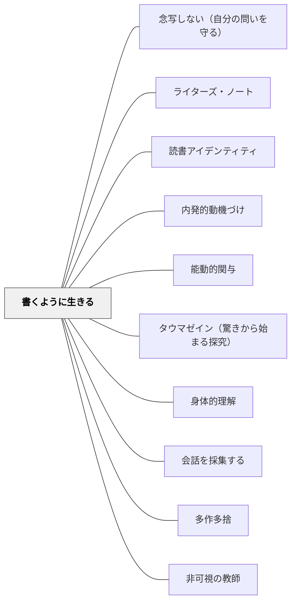

# 書くように生きる

> ライターズ・ノートは、学校の書く時間だけでなく、どこにいても、いつでも——作家として生きる場所を与えてくれる。

## Pattern Connection

**Fletcher（1996）A Writer's Notebook 統合（2026-06-02）：作家として生きるということ**

フレッチャーは問う。「作家と普通の人は何が違うか？」答えは才能でも知識でもない。

> 「Writers are like other people, except for at least one important difference. Other people have daily thoughts and feelings, notice this sky or that smell, but they don't do much about it. All those thoughts, feelings, sensations, and opinions pass through them like the air they breathe.」——Fletcher（1996）

普通の人も感じる。しかし作家は、感じたことを「とどめる」。その行為の習慣が「書くように生きる」の本質である。

**「私は作家だ」という自己認識：**
Fletcher の生徒 Meredith は、年度末の自己評価にこう書いた——「Some people would not pay attention if someone they knew said this. I did, because I'm a writer.」これは技術の変化ではなく、**自己認識（Identity）の変化**である。ノートを持つことが「私は作家だ」という感覚を生み、その感覚が観察の習慣を生む。

- **既存パタンとの関連**：[[パタン/ライターズ・ノート]] が「ノートの使い方と技法」を示すとすれば、本パタンは「ノートを持つことで生まれる作家としての存在様式」を扱う。道具（ノート）と在り方（生き方）の違い
- **補強された点**：[[パタン/読書アイデンティティ]] が「自分は読む人間だ」という自己像を扱うように、本パタンは「自分は書く人間だ」という自己像の形成を扱う——SK I LL（技術）× WILLの書くバージョン
- **他のパタンへの波及**：[[パタン/内発的動機づけ]] — 「やらされる書き」でなく「書かずにいられない」という内側からの衝動；[[パタン/能動的関与]] — 世界への能動的な関与がノートの素材になる

---

### 結城浩（2013）数学ガールの誕生——「内在律」：書くことで浮かび上がる問い

Fletcherが「書くように生きる」を「作家としての自己認識」として定義するとすれば、結城浩は『数学ガールの誕生』で「書くことが思考を生む」という内在的なプロセスを「内在律」として示す。

**内在律（p.228）：**

> 「文章をきちんと書こうとすると、自然に浮かび上がってくる疑問を大切にする。文章にまとめようとすると自然に生じざるを得ない秩序、それが内在律です。」——結城（2013）

「書くこと」は思考を整理する道具ではなく、思考を生み出す行為である。書き始めるまで存在していなかった疑問が、書くプロセスの中で自然に浮かび上がる。「内在律」とは、このプロセスが必然的に生み出す秩序の感覚である。

Fletcherの「Fierce Wonderings（激しい問い）」を書くことで作家が問いを発見するのと同様に、結城は「書きながら自分のまちがいを発見し、それがネタになる」と語る——書くことが勉強になり、勉強した内容がさらに書くものになる。

**書くことが学びになる循環：**

| 段階 | プロセス |
|---|---|
| 書き始める | 「ここを説明しよう」と書き始める |
| 疑問が浮かぶ | 「あれ、これは本当にそうなのか？」という問いが生まれる |
| 調べる・考える | 浮かんだ疑問に向き合う——これが本物の勉強 |
| また書く | 調べた内容をさらに書く中で、また疑問が生まれる |

このサイクルは「書く前に全部知っている必要はない」ことを示す。書き始めることが、知ることの出発点になる。

**自分のまちがいがネタ元：**

結城は「典型的なまちがいの出所は著者自身」と語る。本を書くために自分が勉強し、まちがえた体験が、学習者がつまずく箇所を知る源泉になる。「書くように生きる」とは「まちがいを記録しながら生きる」ことでもある——自分の躓きを「自分の中のテトラちゃん」として大切にすること。

- **補強された点**：「書くように生きる」が「生活の中で書き溜める」（Fletcher）という行動パタンを示すとすれば、「内在律」は「なぜ書くことが学びになるのか」という認知的根拠を加える。書くことは素材を記録するだけでなく、書く行為自体が問いを生み出す。
- **他のパタンへの波及**：[[パタン/ライターズ・ノート]]（「内在律」が生まれる場としてのノート）；[[パタン/タウマゼイン（驚きから始まる探究）]]（書くことで浮かぶ疑問がタウマゼインの一形態）；[[文献/数学ガールの誕生（結城浩）]]

---

### 鶴見俊輔（2010）思い出袋——「混同を消し去らなかった」ことが文体を育てる

Fletcherが「書くように生きる」を「作家としての自己認識」として定義し、結城浩が「内在律（書くことで問いが浮かぶ）」として示したとすれば、鶴見俊輔は『思い出袋』（2010）で「書くように生きる」の最も根源的な条件を描いた——「混同を消し去らないこと」である。

**川上弘美の「混同」——未熟さにとどまることが文体を育てる（思い出袋 第9知見）：**

川上弘美が小学生時代に書いた感想文の「混同」（論理的に分かれているべきものが混じり合っている状態）が、今の彼女の文体の核にある、と鶴見は語る。

> 「その混同を、昔のこととして消し去らなかったところから、この人の文体が生まれてきた。」——鶴見（2010）

「混同」を「論理が未熟だった子どもの頃のこと」として修正・克服するのではなく、そのまま持ち続けたこと——この「消し去らないこと」が文体の源泉である。

**「書くように生きる」の隠れた条件——混乱にとどまる勇気：**

Fletcherの「書くように生きる」は「感じたことをとどめる」という行為の習慣を示す。しかし鶴見は「感じたことをとどめる」だけでなく、「うまく整理できないこと・論理的に矛盾していること・混乱していること」をそのまま保つことを示す。

「書くように生きる」の深い形態は：
- 感じたことを書き留める（Fletcher）
- 書くことで問いが浮かぶ（結城浩・内在律）
- 混乱・混同・未分化のままにとどまる（鶴見）

「混同」は整理すべきエラーではなく、書く者の個性の核になりうるものである。

**「混同を消し去らない」と「念写しない」の関係：**

鶴見が「念写する優等生＝転向の常習犯」として批判した構造は、「混同を消し去ること」にもつながる。念写（先生の正解を推測して書く）は、「混同している自分の感覚」を消去して「整理された他者の論理」に置き換える行為でもある。「書くように生きる」は「混同を消し去らない」という抵抗と一体である。

| 念写型の書き方 | 「書くように生きる」型の書き方 |
|---|---|
| 先生の正解を推測して書く | 自分の感覚・混同をそのまま書く |
| 混乱は整理してから書く | 混乱のまま書き始め、内在律が浮かぶのを待つ |
| 書いた後に「正しかったか」を確認する | 書いた後に「これが自分の問いだったか」を確認する |
| 書き終わると忘れる | 「混同」は残り続け文体になる |

**鶴見自身の「書くように生きる」——「不良少年に水をやる」：**

> 「私は、自分の内部の不良少年に絶えず水をやって、枯死しないようにしている。」——鶴見（2010）

「不良少年」とは制度に馴染まない・階段を上るようにものを考えない部分である。「書くように生きる」の鶴見版は、この「制度化されない自分の部分」に水をやり続けることとして語られる。

- **補強された点**：「書くように生きる」に「混同・未分化・混乱を消し去らない」という新しい次元が加わる。Fletcherの「感じたことを書き留める」に「感じたことが混乱していてもそのまま保つ」という勇気の要素が付け加わる。書くことが「整理された思考の記録」ではなく「混乱の保存」として機能するとき、文体と思考の深みが育つ。
- **他のパタンへの波及**：[[パタン/念写しない（自分の問いを守る）]] — 「混同を消し去らない」は「念写しない」の書くバージョン；[[パタン/タウマゼイン（驚きから始まる探究）]] — 混乱・混同は「定義のふちをあふれ出る」タウマゼインの未整理な形態；[[文献/思い出袋（鶴見俊輔）]] — 本統合の出典

---

## 背景（Context）

学校での「書くこと」は授業時間の中だけで行われることが多い。題材は教師が与え、時間が来たら書き始め、時間が来たら終わる。この構造では、書くことが「学校の課題」としてしか機能しない。

しかし作家の書き方は違う。作家はいつでもどこでも目を開き耳を澄ます。気になることに出会ったら書き留める。友人との会話の中で、通勤電車の中で、夜眠る前に——書くことは生活と一体化している。

## 問題（Problem）

「書くことの授業」が終わったとたんに書かなくなる。「ネタがない」「何を書けばいいかわからない」が繰り返される。これは技術の問題ではなく、**書くことを自分の生活と切り離して考えているからである。**

## 力のかたち（Forces）

- 書く素材は「書こうとするとき」ではなく「生活の中」で生まれる
- しかし「気になった」「感じた」は書き留めなければ消える
- 「私は作家だ」という自己認識がなければ、日常の出来事を書く素材として見ることができない
- 教師がモデルを見せなければ、この見え方は子どもには自然に生まれない
- ノートは「義務」ではなく「自分のもの」でなければ生活と一体化しない

## 解決（Solution）

**ライターズ・ノートを「学校の道具」でなく「自分の道具」として持ち、生活の中で書き溜める。教師が自分のノートを見せ、「私はこれが気になったから書いた」を日常的に共有する。**

> 「A writer's notebook gives you a place to live like a writer, not just in school during writing time, but wherever you are, at any time of day.」——Fletcher（1996）

---

### 実践1：教師のノートを見せる（最も強力な文化形成）

教師が自分のライターズ・ノートを持ち、週1回程度「先生がノートに書いたこと」を共有する。

- 「昨日、電車でこんな会話を聞いた。気になったから書いた」
- 「散歩中に見た壊れた傘の映像が頭から離れなくて」
- 「このニュースを読んだとき怒りがこみ上げてきたから書いた」

教師の「なぜ書いたか」を語ることが、子どもに「書く理由」の多様なモデルを提供する。

**Donna Barnes（Maine）の実践**（Fletcher 1996 所収）：5年生の担任が「生徒にノートを持たせるなら、自分も持つ」と決意。自分の離婚について書いた詩を生徒に共有した——これが「ここでは本当のことを書いていい」という文化を作った。

---

### 実践2：「何があなたを動かすか」を問う（Unforgettable Stories）

テーマを与えるのではなく、「何が気になるか・腹が立つか・不思議か・悲しいか」を探す時間をノートに設ける。

- 「先週、ニュースで見て忘れられないものは？」
- 「最近、見ていてずっと頭に残っている場面は？」
- 「誰かが言った一言で、今も心に残っていることは？」

答えを求めるのではなく、「自分が何によって動かされるか」を探索すること自体が目的。

---

### 実践3：「作家の目でいる時間」を作る（Mind Pictures）

5分間の観察活動をノートの起動に使う。

1. 教室の窓の外を見る、または学校の廊下を歩く（5分）
2. ノートを開いて「見えた・聞こえた・感じたこと」を書く（5分）
3. 一文だけ選んで声に出す

「作家の目標はスポンジになること」（Fletcher, 1996）——スポンジは選ばない、すべてを吸収する。その吸収力を育てることが「書くように生きる」の第一歩。

---

### 「書くように生きる」の3段階

| 段階 | 状態 | 教師の支援 |
|---|---|---|
| **知覚** | 世界を書き手として見る・聴く・感じる | 観察活動・教師のモデリング |
| **記録** | 気になったことをノートに書き留める | ノートへの定期的な書き溜め |
| **回帰** | ノートを読み返し、書く種を見つける | 再読活動・Lifting a Line |

---

## 結果（Consequences）

- 「書きたいことがない」が減る——日常の観察が素材になる
- 書くことが授業の中だけでなく生活と一体化し始める
- 「私は書く人間だ」というアイデンティティが育つ
- 教師のモデリングが「ここでは本当のことを書いていい」という心理的安全を生む
- ただし、「ノートを持っているだけ」では変わらない——日常の観察と記録の習慣が育つには時間がかかる

## 関連パタン
- [[パタン/念写しない（自分の問いを守る）]]

- [[パタン/ライターズ・ノート]] — ノートの具体的な使い方・技法・評価
- [[パタン/読書アイデンティティ]] — 「私は読む人間だ」の書くバージョン
- [[パタン/内発的動機づけ]] — 外からの義務でなく内側からの衝動で書く
- [[パタン/能動的関与]] — 世界への関与が書く素材になる
- [[パタン/タウマゼイン（驚きから始まる探究）]] — 驚きが観察と記録の動機になる
- [[パタン/身体的理解]] — 5感による観察が書く材料になる
- [[パタン/会話を採集する]] — 耳を澄ます行為が書くように生きるの一形態
- [[パタン/多作多捨]] — 書いたものの多くは使われない。それでも書き続ける
- [[パタン/非可視の教師]] — 教師がモデルを見せてから消えることが文化をつくる
- [[文献/A Writer's Notebook（Fletcher）]] — 本パタンの出典

## クラスター図

## Actionable Insight

- **来週から「先生のノートタイム」を作る**：授業の最初の2分間、「今週先生がノートに書いたこと」を一つ見せる。技術の説明より前に「なぜ書いたか」を語ることが文化をつくる
- **「この一週間で気になったこと」リストを書かせる**：テーマを与えずに5分間——「見た・聞いた・感じた・気になった」を箇条書きで。これだけでノートの素材探しの筋肉が育ち始める
- **「私は作家だ」を意識させる一文**：年度初めのノート1ページ目に「私はなぜノートを持つか」を書かせる——Meredith のように「私は作家だから気づく」という自己認識への橋がかかる

## 出典

Fletcher, R. (1996). *A Writer's Notebook: Unlocking the Writer Within You*. HarperCollins.

> 「A writer's notebook gives you a place to live like a writer, not just in school during writing time, but wherever you are, at any time of day.」——Fletcher（1996）
