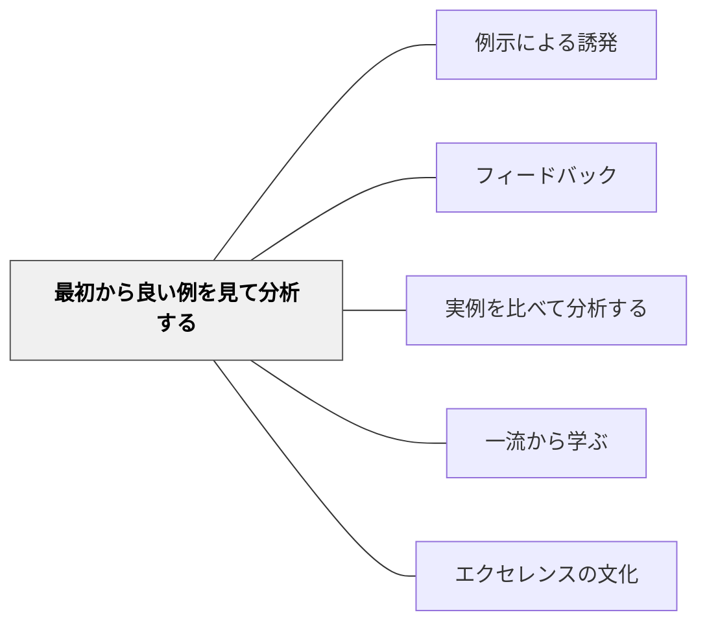

# 最初から良い例を見て分析する

> 「これが目指すべき姿」というポジティブなビジョンから始める。

## 背景（Context）

悪い例から入ることで「何をしてはいけないか」はわかるが、「何を目指すか」のビジョンが与えられないまま学習が始まることがある。最初から優れた実例を見て分析することで、「こういうものを目指す」というポジティブな方向性が確立される。

## 問題（Problem）

悪例や不備のある例ばかりを使うと、学習者の目が「避けるべきこと」に向きがちになる。「こうなりたい」という憧れ・ビジョンが学習の動機として重要である。

## 力のかたち（Forces）

- 高い水準の例を最初に見ることで、目標の天井が高くなる
- 「こんなものが書けるんだ」という驚きが動機を高める
- 良い例の分析は、達成規準を「引き出す」体験になる

## 解決（Solution）

**最初に優れた実例（プロの作品・過去の優秀な学習者の作品・一流の研究など）を示し、「何が良いか・なぜ良いか」を分析することから学習をスタートする。**

例：
- 作文の授業で、最初にピューリッツァー賞の記事を読む
- 図工で、最初に名画を鑑賞する
- 理科の実験で、優れた実験レポートを見て分析する

## 結果（Consequences）

- 学習のゴールに向けたポジティブなビジョンが共有される
- 「こんな作品が作れる」という自己効力感が育つ
- 一流の基準が学習者の中に内面化される

## クラスター図

## Actionable Insight

- 単元の最初に「優れた作品・報告書・実例」を1つ提示し「何がすごいか」を問う——ポジティブなビジョンを最初に持つことで学習者の目標の天井が高くなる
- 良い例を分析した後「今日の目標はこんな作品を作ること」とクラスで共有する——高い基準が学習者の間で内面化されることで挑戦への意欲が生まれる
- プロの作品・先輩の作品・一流の研究などを「憧れの例」として教室に常時掲示する——日常的に卓越のモデルが視界に入ることで内部の基準が上がる

## 出典

- 一つの教育のパタン・ランゲージ（岩井輝久）

## 関連パタン
- [[実践/ノート指導（読み書きハンドブック・ノート検定）]]
- [[パタン/例示による誘発]]

- [[パタン/フィードバック]] — 親パタン
- [[パタン/実例を比べて分析する]] — 分析による規準構築
- [[パタン/一流から学ぶ]] — 一流を出発点にする
- [[パタン/エクセレンスの文化]] — 高い基準への志向
