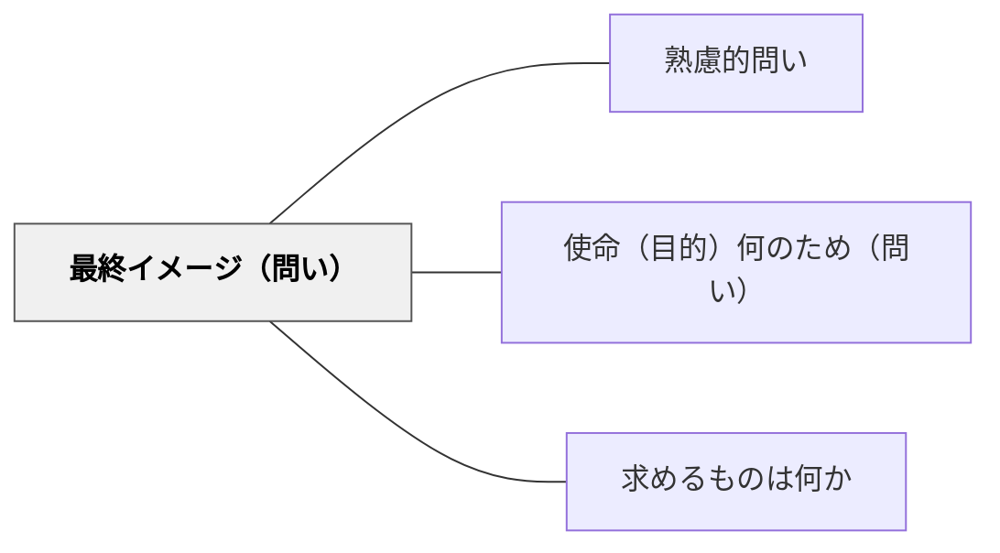

# 最終イメージ（問い）

> 「完成したらどんな状態か？」とゴール像・理想の姿を問うことで、学習者は目的地を自らイメージして進む。

## 背景（Context）
学習者が課題に取り組む際、「最終的にどんな状態になるか」のイメージが欠けていることが多い。教師から手順を教えられても、ゴールの姿が見えなければ、途中で方向を見失いやすい。最終イメージを明確にすることは、自己調整学習の重要な出発点であり、創造的な活動においては特に不可欠である。

## 問題（Problem）
最終イメージを問われない学習者は、「手順通りやること」を目標にしてしまい、柔軟な判断や調整ができない。また、完成状態が曖昧なまま進むと、自分の進捗を評価できず、フィードバックを活かせない。グループ活動では、メンバー間でゴールのイメージが共有されないために摩擦が生じることもある。

## 力のかたち（Forces）
- 明確なゴールイメージは、学習の自己調整（モニタリング・修正）を可能にする
- ゴールが共有されると、協働の方向性と役割分担が明確になる
- 最終イメージを問うことで、評価基準を学習者自身が内面化できる
- イメージが具体的すぎると創造性を制限し、漠然としすぎると機能しない

## 解決（Solution）
課題の前に「できあがったとき、どんな状態になっていればいいと思う？」と問いかける。例えば、作文の授業で「書き終わったとき、読んだ人にどう感じてほしいか？」と問い、目指す読者体験を言語化させる。プロジェクトの開始時に「理想のゴールを一言で言うなら？」とチームで共有させる。中間地点でも「今の状態と最終イメージのギャップはどこにある？」と問い直しを促す。

## 結果（Consequences）
- 学習者が目標を自ら設定・調整する自己調整力が育まれる
- 完成状態の基準を内面化することで、自己評価の精度が高まる
- グループでゴールイメージを共有することで、協働の質と効率が向上する

## 関連パタン
- [[パタン/熟慮的問い]] — 親パタン
- [[パタン/使命（目的）何のため（問い）]] — 使命とゴールイメージはセットで問うと効果的
- [[パタン/求めるものは何か]] — ポリア的な「答えのイメージ」と共鳴する

## クラスター図

## Actionable Insight

- 課題に入る前に「完成したとき、どんな状態になっていれば成功か？」と問い、一文で書かせる——ゴール像の言語化が、取り組み中の自己モニタリングの基準になる
- グループ活動の開始時に「チームとしての理想のゴールを一言で言おう」と共有する時間を2分取る——ゴールイメージの共有がメンバー間のズレを防ぎ協働の質を高める
- 活動の中間地点で「今の状態と最初にイメージしたゴールの差はどこにある？」と問い直す——中間点でのギャップ確認が軌道修正と自己調整力を育てる

## 出典
- [[文献/熟慮的問いのパターンリスト（動画記録）]]
