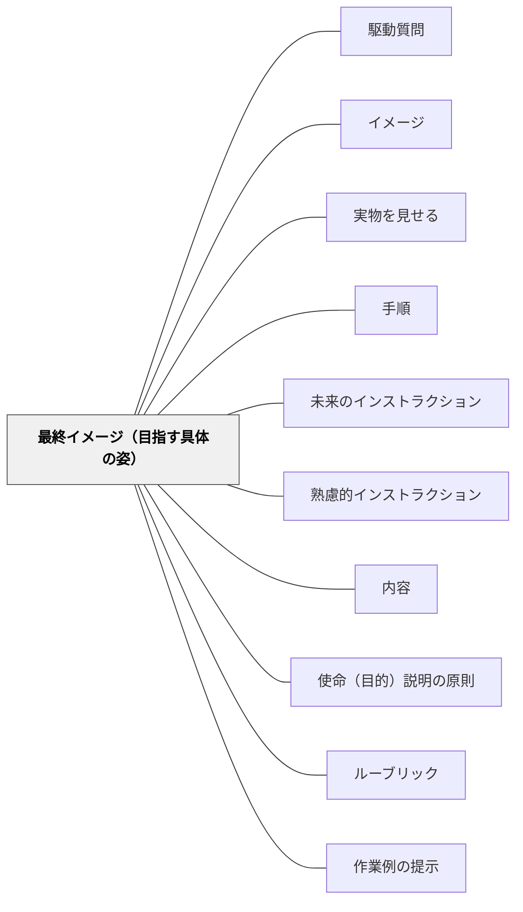

# 最終イメージ（目指す具体の姿）

> 受け手が最終的な完成形を具体的に知っていると、主体的に取り組める。

## 背景（Context）
ワーマンの6要素における「最終目的」を発展させた概念で、インストラクションの最終結果・具体的なゴールを明示することの重要性を示す。使命（なぜやるか）とは異なり、最終イメージは「どうなったら完成か」という具体的な状態を指す。

## 問題（Problem）
手順だけを伝えて最終イメージを示さないと、受け手は「どこまでやればよいのか」「うまくできているのか」がわからないまま進む。途中で手が止まったり、過剰にやりすぎたりする。料理のレシピで最終的な完成品の写真がないと、どんな色・形に仕上げればよいかわからない状態と同じである。

## 力のかたち（Forces）
- 最終イメージが具体的なほど受け手は自律的に動ける
- 完成形を見せることへの抵抗（「答えを教えてしまう」という感覚）がある
- 最終イメージは使命より具体的であり、「見える形」で示せると効果的
- 受け手が最終イメージを持つことで、自分の想像力を活かした取り組みが生まれる

## 解決（Solution）
**インストラクションの中で「これが完成した状態です」という具体的な最終イメージを示す。可能であれば見本・例・写真・実物などで可視化する。**

「終わったらこんな状態になっています」「できあがりのイメージはこうです」と言葉・図・見本で示す。最終イメージを受け手に伝えることで、途中の判断・修正が受け手自身でできるようになる。「答えを教える」のではなく「目的地を共有する」という発想で提示する。

## 結果（Consequences）
- 受け手が自律的に取り組みを調整できるようになる
- 完成のタイミングが明確になり、やりすぎや途中放棄が減る
- 最終イメージを共有することで、評価基準の透明性が上がる

## クラスター図

## Actionable Insight

- 活動を始める前に「終わったらこんな状態になります」という見本・例・完成形を必ず1つ示す——最終イメージが明確なほど受け手は自律的に取り組みを調整できる
- 「答えを教えてしまう」という感覚を「目的地を共有する」という発想に切り替える——完成形の共有は正解の提示ではなく学習者が自分で到達するための地図である
- 活動後に「最初に見せたイメージと、自分の結果を比べてどうか？」と自己評価させる——最終イメージとの照合が改善志向と自己評価力を育てる

## 出典

- 一つの教育のパタン・ランゲージ（岩井輝久）

## 関連パタン
- [[パタン/駆動質問]]
- [[パタン/イメージ]]
- [[パタン/実物を見せる]]
- [[パタン/手順]]
- [[パタン/未来のインストラクション]]
- [[パタン/熟慮的インストラクション]] — 親パタン
- [[パタン/内容]] — 6要素の枠組み
- [[パタン/使命（目的）説明の原則]] — 最終イメージと対で必要な要素
- [[パタン/ルーブリック]] — 最終イメージの評価基準化
- [[パタン/作業例の提示]] — 具体的な最終イメージの提示手法
