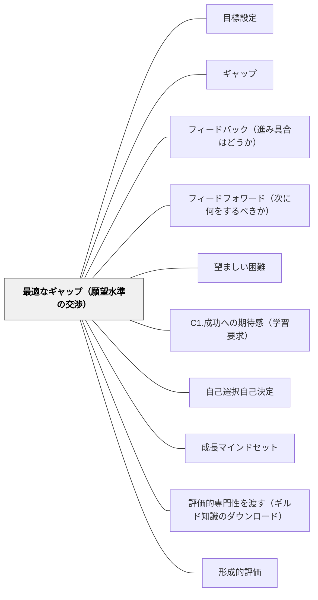

# 最適なギャップ（願望水準の交渉）

> 遠すぎれば目標は捨てられ、近すぎれば埋める気が起きない。ギャップの大きさそのものを、教師が設計する変数として扱う。

## 背景（Context）

Sadler（1989）によれば、標準（standard／reference level）とは、ある発達段階で期待されるパフォーマンスや卓越性の水準を指す。それはただそこにあるだけでは標準にすぎない。**望まれ、目指され、志向されたとき**にはじめて goal（目標）になる。

そして Sadler は、外から与えられた目標の脆さを率直に書いている。教師が割り当てた目標を、学習者は無視することも拒否することもできる。その場合、強制的な状況を除けば、その目標が達成に及ぼす影響はほとんどない。

> Only when a learner assumes ownership of a goal can it play a significant part in the voluntary performance.
>
> 学習者が目標のオーナーシップを引き受けたときにだけ、目標は自発的なパフォーマンスにおいて重要な役割を果たしうる。

目標の中身についても研究の蓄積がある。Sadler は Locke, Shaw, Saari & Latham（1981）のレビューを引き、**hard goals** が最も強くパフォーマンスに影響することを紹介する。hard goals とは、一般的・曖昧ではなく具体的かつ明確であること、単純・容易ではなく難しく挑戦的であること、そして現在のパフォーマンス水準よりも**その個人の能力の上限に近い**こと。hard goals は注意を集中させ、努力を動員し、課題への粘り強さを高める。これに対して「できるだけがんばりなさい（do-one's-best）」型の目標は、目標がまったくない場合とたいして変わらないことが多い。

ここまでは「どんな目標を立てるか」の話である。本パタンが扱うのはその先——目標と現在地の**あいだの距離**そのものである。

## 問題（Problem）

目指す水準と現在地のあいだのギャップは、大きすぎると「どうせ届かない」と目標そのものが放棄され、小さすぎると「埋める価値がない」と努力が起きない。到達不可能と知覚された目標は、目標として機能しなくなる。

やっかいなのは、**同じ大きさのギャップが学習者によって違う意味を持つ**ことだ。Sadler は、絶対的な大きさとしては同一のギャップが、意欲と自信のある学習者には強力な刺激になりうると指摘する。そういう学習者は最初に何度か失敗しても離れていかない。同じ距離が、別の学習者には最初の一回の失敗で諦める理由になる。距離は物理量として測れても、その意味は一人ひとり違う。

さらに時間軸の問題がある。期待水準の上昇速度が実際の改善速度を上回り続けると、学習者はついていけない。**実際には進歩が起きていても、達成感がほとんど生まれない**。すると次第に自分の試みが真剣に受け取られていないと感じ、パフォーマンスのギャップは進行的に広がって自己強化的になり、学習者は心が折れて脱落する。これは能力の問題ではなく、期待の上げ方の設計の問題である。

## 力のかたち（Forces）

- **挑戦させたい vs 折りたくない**——hard goals が効くという知見は「高く置け」と言う。しかし高すぎる目標は到達不可能と知覚されて放棄される。効く高さと折る高さは連続していて、境目は学習者ごとに違う
- **距離の客観的な大きさ vs 距離の知覚**——教師が測る「あと何点」「あと何cm」と、子どもが感じる遠さは一致しない。同じ距離が刺激にも断念にもなる
- **期待を上げる速さ vs 改善の速さ**——期待を上げなければ成長が止まる。しかし改善より速く上げ続けると、進歩していても達成感が生まれず、ギャップが自己強化的に広がる
- **教師が決める目標 vs 学習者が所有する目標**——教師が決めれば適切な難度を設計できるが、拒否されれば効かない。学習者に委ねれば所有されるが、易しすぎたり非現実的だったりする
- **学級としての一つの標準 vs 複数の水準**——一つの標準は指導を単純にするが、学力の幅に対応できない。Sadler は、教室では最上段だけでなく複数の水準の標準に学習者がアクセスできる必要があると述べる（この幅が通知表の評定段階に対応している必要はない）

## 解決（Solution）

**ギャップの大きさそのものを設計変数として扱う。原則としては hard goals（具体的・明確で、易しすぎず、現在の到達度より能力の上限に近い目標）を置く。そのうえで、当面は願望水準（aspiration level）を学習者一人ひとりと交渉し、最終的には学習者自身がその目標を設定し、内面化し、自分のものとして所有する状態を目指す。**

Sadler の書き方は慎重である。最適なギャップは研究に値する問題だと述べたうえで、当面できることとして「教師が学習者と願望水準を交渉するか、少なくとも個々の学習者の特性を考慮に入れるとよい」と書く。そして**究極の目標は、学習者自身が目標を設定し、内面化し、採用して、到達しようという決意が生まれている状態**だとする。

つまり交渉は終着点ではなく、移行の途中に置かれる手段である。教師が距離を決める段階 → 教師と学習者が距離を交渉する段階 → 学習者が自分で距離を決める段階。この順に手を引いていく。

もう一つの設計上の柱が、**標準を複数の水準で用意しておく**ことだ。最上段の見本しか教室にないと、そこから遠い子にとって距離はつねに大きすぎる。到達しうる複数の段の見本が見えていれば、一人ひとりが自分の次の一段を選べる。

---

### 場面1：漢字テストの目標を一律の満点から交渉に変える（国語・第3学年）

これまで、週の漢字テストの目標は全員「10問中10問」だった。合格ラインが一つしかない教室では、前回3点だった子にとってのギャップは7点、9点だった子にとっては1点である。同じ「満点をめざそう」という声かけが、一方には到達不可能の宣告、他方には努力に値しない距離として届いていた。

そこで、テストを返すときに一人ずつ短く聞くことにした。「次、何点をねらう」。前回3点だったA児は「5点」と答えた。教師は「6点にしない」と一度だけ返し、A児は「じゃあ6」と決めた。これが交渉である。教師が7点と決めて渡すのでも、A児の5点をそのまま通すのでもない。

翌週A児は6点を取った。満点ではないが、A児にとってははじめて自分で決めた目標に届いた回だった。**距離を交渉することの効果は、点数そのものより「その目標が自分のものである」という一点にある。**

---

### 場面2：走り高跳びのバーの高さ（体育・第5学年）

走り高跳びでは、距離の知覚差が目に見える形で現れる。同じ80cmのバーを前にして、B児は「あと5cm上げてみる」と言い、C児は跳ぶ前から「無理」と言って列の後ろに下がる。二人の実際の記録差はわずかである。距離は同じでも意味が違う。

学習カードに、自分の記録に応じた三つの高さを書き込めるようにした。「今日跳べた高さ」「今日ねらう高さ」「いつか跳びたい高さ」。ねらう高さは自分で決め、跳べたら書き換えてよい。C児は「今日ねらう高さ」に、跳べた高さと同じ数字を書いた。教師はそれを認めた。三回跳んで三回とも成功した後、C児は自分で2cm上げた。

**教師が距離を決めなかったことが、C児が距離を動かせるようになる条件だった。**なお、跳べる高さの上限を教師が把握しておくことは必要である。安全と、hard goals の「能力の上限に近く」という条件は、教師の側の見取りに支えられている。

---

### 場面3：期待の上昇が改善を追い越していた学期（国語・作文）

作文の指導で、教師は毎回新しい観点を足していた。1回目は「はじめ・中・おわり」、2回目は「会話文を入れる」、3回目は「気持ちを様子で書く」、4回目は「書き出しを工夫する」。よい指導のつもりだった。

しかしD児の作文は、回を追うごとに短くなった。振り返りには「前より下手になった」と書いてあった。実際には、D児の文章は1回目より確実に良くなっていた。**進歩は起きていたが、期待の上がる速さがそれを一貫して上回っていたため、達成感が一度も生まれなかった**のである。Sadler が記述した悪循環の入口そのものだった。

教師は5回目で観点を足すのをやめ、D児の1回目と4回目を並べて見せた。「会話文、前は無かったのに今は三つ入っている」。D児は自分の進歩を、はじめて距離が縮まった証拠として見た。次の回から、教師は観点を足すペースを二回に一度に落とした。

---

### 特別支援の視点：ギャップが広がる速度を監視する

学習に困難のある子では、改善の速度が学級の平均より緩やかであることが多い。学級全体の期待水準を一定のペースで上げていくと、この子たちのギャップだけが構造的に、そして自己強化的に広がっていく。本人が努力していても、である。

だから見るべき指標は「今どのくらい離れているか」ではなく、**「離れ方の速度」**である。前の学期と比べて距離が広がっているなら、それは本人の努力量の問題ではなく、期待の上げ方の設計の問題として扱う。

具体的には、その子にとっての標準を学級の最上段から切り離し、複数用意した水準のうち届く段に置き直す。Sadler が書くとおり、この幅が通知表の評定段階に対応している必要はない。評定は評定として別に処理し、日々の学習で見る距離は本人が埋められる距離にする。**達成感が一度も生まれない期間を長く作らない**ことが、脱落を防ぐ最大の手立てになる。

## 結果（Consequences）

**利点**

- **目標が実際に効くようになる**——外から与えて拒否されていた目標が、交渉を経て所有されると、自発的なパフォーマンスに効きはじめる
- **諦めと手抜きの両方が減る**——遠すぎて放棄される子と、近すぎて努力しない子の両方に、それぞれの距離が用意される
- **脱落の予兆を早く捉えられる**——「距離の広がる速度」を見る習慣ができると、成績が下がる前の段階で期待の上げ方を調整できる
- **学力の幅に構造で対応できる**——複数水準の標準を教室に用意しておくことは、個別対応を都度発明するよりコストが低く、持続する

**注意点・リスク**

- **交渉が目標の値下げ交渉になる**——「何点ねらう」と聞くだけでは、確実に取れる数字が返ってくる。教師が一度だけ上向きに押し返す役を持たないと、hard goals の条件（能力の上限に近い）が崩れる
- **距離を下げ続けると期待が固定される**——届く距離を用意することと、その子への期待を低く据え置くことは違う。距離は下げても、上げ直す時期をあらかじめ決めておく
- **複数水準が固定的な区分けに変わる**——三段階の見本を用意したつもりが、「この子は下の段の子」という学級内の身分になってしまうことがある。段は行き来するものとして運用し、誰がどの段かを掲示しない
- **交渉に時間がかかる**——一人ずつ聞けば時間は要る。全員に毎回行うのではなく、単元の節目や、距離が広がりつつある子に絞って行う
- **最適なギャップの値は分かっていない**——Sadler 自身が「研究に値する問題」と書いている通り、最適な距離を決める公式はない。ここは教師の見取りが担う領域として残る

## 関連パタン

- [[パタン/目標設定]] — 目標をどう立てるかを扱う。本パタンは目標と現在地の距離そのものを設計変数として扱い、距離の知覚差と、期待の上昇が改善を上回るときの脱落を扱う
- [[パタン/ギャップ]] — ギャップという概念そのもの。本パタンはその大きさをどう調整するかを扱う
- [[パタン/フィードバック（進み具合はどうか）]] — 現在地とゴールを並べて比較する技法。本パタンはその比較の結果生まれる距離をどう扱うかを引き受ける
- [[パタン/フィードフォワード（次に何をするべきか）]] — ギャップを埋める行動の提案。距離が適切であって初めて次の一手が意味を持つ
- [[パタン/望ましい困難]] — 難しさが学習を強める。本パタンは「強めるどころか折ってしまう難しさ」の境目を扱う
- [[パタン/C1.成功への期待感（学習要求）]] — 成功の見通しが動き出す条件になる。距離が大きすぎると見通しが失われる
- [[パタン/自己選択自己決定]] — 目標のオーナーシップ。外から与えた目標は拒否されうる
- [[パタン/成長マインドセット]] — 距離を「今はまだ」と読める構え。同じ距離の知覚を変える
- [[パタン/評価的専門性を渡す（ギルド知識のダウンロード）]] — 距離を測るには質の概念が要る。本パタンはその測定結果の使い方を扱う
- [[パタン/形成的評価]] — 上位の枠組み

- [[概念/自我関与と課題関与（フィードバックが向ける先）]] — ギャップへの四つの反応。①が起こるのは成功への信念が高いときだけ
## クラスター図

## Actionable Insight

- **返却時に「次、どこをねらう」と一人ずつ聞き、一度だけ上に押し返す**——テストやカードを返すその場で目標を交渉する。子どもの答えが確実に届く数字だったら、「一つ上にしない」と一度だけ言い、最終決定は本人に渡す。決めた数字は本人が書く
- **教室に「届く段」を三つ掲示する**——最上段の見本だけでなく、その手前の二段の見本も並べて貼る。どの段を今ねらうかは各自が選ぶ。誰がどの段かは掲示しない
- **学期の途中で「距離が広がっている子」を名指しで洗い出す**——今の点数ではなく、前の学期と比べて期待との差が広がった子を3人まで書き出す。その子には観点を足すのを一回止め、前の作品と今の作品を並べて進歩を見せる

## 出典

Sadler, D. R. (1989). Formative assessment and the design of instructional systems. *Instructional Science, 18*(2), 119–144.

> A learner may decide to ignore or reject an external goal, in which case it is likely to have little if any effect on achievement except in a coercive situation. Only when a learner assumes ownership of a goal can it play a significant part in the voluntary performance.
>
> 学習者は外から与えられた目標を無視することも拒否することもできる。その場合、強制的な状況を除けば、その目標が達成に及ぼす影響はほとんどない。学習者が目標のオーナーシップを引き受けたときにだけ、目標は自発的なパフォーマンスにおいて重要な役割を果たしうる。（p. 129）

> Hard goals are defined as being specific and clear rather than general or vague, harder and challenging rather than simple or easy, and closer to the upper limit of an individual's capacity to perform than to the current level of performance. Hard goals act to focus attention, mobilize effort, and increase persistence at a task. By contrast, do-one's-best goals often turn out to be not much more effective than no goals at all.
>
> hard goals とは、一般的・曖昧ではなく具体的かつ明確であり、単純・容易ではなく難しく挑戦的であり、現在のパフォーマンス水準よりもその個人の遂行能力の上限に近い目標と定義される。hard goals は注意を集中させ、努力を動員し、課題への粘り強さを高める。対照的に「できるだけがんばる」型の目標は、目標がまったくない場合とたいして変わらないことがしばしばである。（p. 129）

> If the rate at which expectations are raised is consistently greater than the rate of improvement, the inability of the student to keep pace results in little or no sense of accomplishment even though improvement may actually be occurring. This in turn may lead to a situation where successive attempts are taken less and less seriously, the performance gap widens progressively and becomes self-reinforcing, and the student loses heart and effectively drops out.
>
> 期待が上げられる速度が改善の速度を一貫して上回るなら、学習者はそのペースについていけず、実際には改善が起きていても達成感はほとんど、あるいはまったく生まれない。これはやがて、次々の試みが次第に真剣に受け取られなくなり、パフォーマンスのギャップは進行的に広がって自己強化的になり、学習者は心が折れて事実上脱落する、という事態を招きうる。（p. 130）

> It would be useful to research the optimum gap between an individual learner's current status and the aspiration. ... Initially, the teacher may find it useful to negotiate the aspiration level with the student, or at least to take individual student characteristics into account. The ultimate aim should be to have the student set, internalize and adopt the goal, so that there is some determination to reach it.
>
> 個々の学習者の現状と願望とのあいだの最適なギャップを研究することは有益であろう。……当面は、教師が学習者と願望水準を交渉するか、少なくとも個々の学習者の特性を考慮に入れることが有用だろう。究極の目標は、学習者自身が目標を設定し、内面化し、採用して、そこに到達しようという決意が生まれている状態にすることである。（p. 130）

Locke, E. A., Shaw, K. N., Saari, L. M., & Latham, G. P. (1981). Goal setting and task performance: 1969–1980. *Psychological Bulletin, 90*(1), 125–152.（Sadler 1989 における引用）
