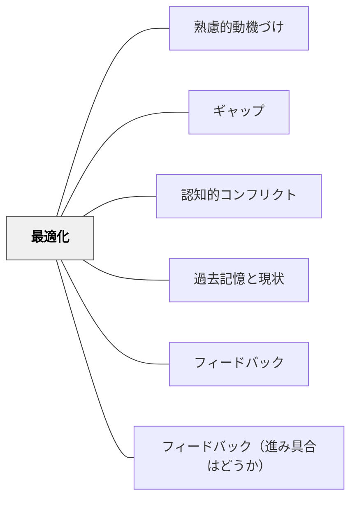

# 最適化

> 「もっとよくしたい」という欲求は、人間に深く根ざした動機の源泉である。現状と理想のギャップが、改善へのエネルギーを生む。

## 背景（Context）
人間には現状を理想状態へと近づけようとする内発的な傾向がある。この「最適化」の動機は、工芸・スポーツ・学習・仕事のあらゆる場面で見られる。学習においては、自分のパフォーマンスや作品を「より良いものに」しようとする欲求として現れる。

## 問題（Problem）
現状に満足してしまうと改善への動機が生まれない。一方で、現状と理想のギャップが大きすぎると諦めにつながる。ちょうど良い大きさのギャップが、最適化動機の源泉になる。

## 力のかたち（Forces）
- 最適化動機は達成可能な改善目標があるとき最も機能する
- 「もっとよくできる」という感覚は、現状を「完成」でなく「プロセス」として捉えることから生まれる
- フィードバックが具体的で改善可能なとき、最適化の方向性が見える
- 学習者が自分の作品や成果を「育てるもの」として捉えると最適化動機が高まる

## 解決（Solution）
**学習者が自分のパフォーマンス・作品・思考を「現状」として捉え、「より良い状態」との差を意識することで、改善・洗練への内発的動機を引き出す。**

反復的な修正・改善のサイクルを設計する（イテレーション）、「今のベストを出した後、さらに改善する」という活動構造を作る、他者のフィードバックや自己評価で改善点を見つける機会を設ける、作品を継続的に育てるポートフォリオ形式を活用するなどが有効である。

## 結果（Consequences）
- 学習者が「一回やって終わり」でなく、継続的に改善しようとする姿勢を持つ
- 「まだ良くなれる」という成長マインドセットが育つ
- 改善のサイクルが深い学習・熟達への道筋となる

## クラスター図

## Actionable Insight

- 作品・回答の「第2ドラフト」の機会を単元に1回作る——「一回やって終わり」でなく「さらに良くする」という構造が最適化動機を引き出す
- フィードバックを「間違いの指摘」でなく「1点だけ改善するとしたら」という形で伝える——具体的な改善の方向性が見えるとき最適化のエネルギーが動き始める
- 学習者の作品をポートフォリオとして蓄積し「前回より何が良くなったか」を定期的に問う——自分の作品を「育てるもの」として捉える経験が継続的な改善志向を育てる

## 出典

- 一つの教育のパタン・ランゲージ（岩井輝久）

## 関連パタン
- [[パタン/熟慮的動機づけ]] — 親パタン
- [[パタン/ギャップ]] — 関連パタン
- [[パタン/認知的コンフリクト]] — 関連パタン
- [[パタン/過去記憶と現状]] — 関連パタン
- [[パタン/フィードバック]] — 関連パタン
- [[パタン/フィードバック（進み具合はどうか）]] — 関連パタン
