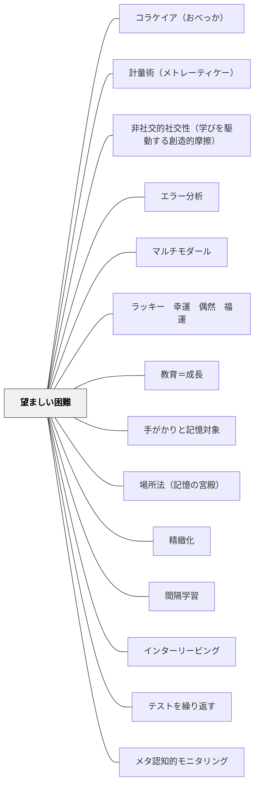

# 望ましい困難

> 「難しく感じる」は効いているサイン——学習中の困難感が長期記憶を強化する。

## Pattern Connection

**Weinstein & Sumeracki（2018）統合（2026-05-20）**：

*Understanding How We Learn*（東京書籍, 2022）全体を貫く核心概念として「望ましい困難（Desirable Difficulties）」が登場する。これはロバート・ビョーク（Robert Bjork, 1994）が提唱した概念だ。本パタンは [[パタン/間隔学習]]・[[パタン/インターリービング]]・[[パタン/テストを繰り返す]] の3パタンで個別に言及されていた「難しく感じるが効果的」という知見を、独立したパタンとして体系化する。

- **既存パタンとの関連**：3パタンそれぞれで「望ましい困難」は言及されていたが、独立した原理として整理されていなかった。本パタンはその共通基盤として機能する。
- **補強された点**：「楽な勉強法が好まれる」という学習者（と教師）の心理バイアス——流暢性の錯覚（Illusion of Fluency）——への対処として、困難感の意味を明示的に学習者に説明すること自体が学習改善に寄与することが示された。
- **他のパタンへの波及**：[[パタン/メタ認知的モニタリング]] — 「この難しさは望ましい困難か、理解不足による困難か」を区別するモニタリングが必要になる。[[パタン/成長マインドセット]] — 「困難は成長のサイン」という価値観が望ましい困難を支える文化的基盤。

## 背景（Context）

学習の効果は「勉強中の感覚」と相関しない。

「わかった感」「楽に進めた感」「スムーズに読めた感」は、実際の長期記憶への定着とは別物だ。

- **再読**は「わかった気がする（流暢性の錯覚）」を生むが、1週間後の記憶テストでは検索練習に大きく劣る
- **詰め込み（まとめ学習）**はテスト前日に「よく復習できた感」があるが、2週間後には大半を忘れる
- **ブロック練習**は「できた感」を生むが、混合テストでの成績はインターリービングより劣る

**逆説**：学習中に難しく感じる方法が、長期記憶への定着に優れている——これが「望ましい困難」の本質だ。

## 問題（Problem）

- 学習者は「楽な勉強法（再読・ブロック練習・詰め込み）」を「効果的」と錯覚する（流暢性の錯覚）
- 教師も「わかりやすい授業 = 良い授業」という思い込みから、困難感を除去しようとする
- 検索練習・間隔学習・インターリービングは「効いている」のに「非効率だ」「難しすぎる」と感じられる
- 結果として、科学的に効果が証明された学習法が敬遠される

## 力のかたち（Forces）

- 「忘れかけた頃に思い出す」努力（間隔学習）は難しく感じるが、記憶の痕跡を強化する
- 「どの方法を使うか判断しながら解く」（インターリービング）は難しく感じるが、転移力を育てる
- 「情報を取り出す」（検索練習）は難しく感じるが、その行為自体が記憶を強化する
- 「難しい」には2種類ある——「望ましい困難」と「理解不足による困難」は区別が必要
- メカニズムを説明することで学習者の困難感への耐性が高まる

## 解決（Solution）

**「難しく感じる」ことをネガティブなシグナルではなく「学習が起きている証拠」として捉え直す。間隔・混在・検索を設計に意図的に組み込み、その困難感の意味を学習者に明示的に説明せよ。**

---

### 望ましい困難の3形式

| 形式 | 難しく感じる理由 | なぜ効果的か |
|------|---------------|------------|
| **間隔学習** | 「忘れかけている」から思い出しにくい | 想起努力が記憶の痕跡を強化する |
| **インターリービング** | 「次は何を使えばいいか」判断が必要 | 弁別力・転移力が育つ |
| **検索練習** | 「まだ完全に覚えていない」状態が露出する | 引き出す行為自体が記憶を強化する |

---

### 望ましい困難と単なる困難の区別

「望ましい困難」と「理解不足による困難」は別物だ。

| 望ましい困難 | 単なる困難（避けるべき） |
|------------|----------------------|
| 「少し忘れた頃の検索練習」 | 「最初から教えていない内容のテスト」 |
| 「混合問題（初期学習が完了した後）」 | 「基礎が固まる前のインターリービング」 |
| 「間隔を空けた復習」 | 「全く手がかりのない問題」 |

**判断の基準**：初期学習が完了し「何を学んでいるか」が理解できている段階での困難が「望ましい困難」になる。基礎がない状態で混在させることは単なる混乱。

---

### 流暢性の錯覚への対策

**流暢性の錯覚（Illusion of Fluency）**：再読・蛍光ペン・単語の反復書きは「わかった感」を生むが、記憶定着には弱い。学習中の「流暢さ」が実際の記憶を保証しない。

診断質問：「教科書を閉じて、今日学んだことを全部書けますか？」
- 書けない＝流暢性の錯覚状態
- 書ける＝本当に記憶している

→ [[パタン/テストを繰り返す]] のフリーリコール（自由再生）が最も直接的な対策。

---

### 学習者への説明（必須）

望ましい困難は、その意味を学習者が理解しないと逆効果になる（「難しい授業だ」という不満になるだけ）。

> 「この練習が難しく感じるのは、脳が一生懸命に記憶を取り出そうとしているからです。その努力が記憶を強くします。楽に感じる再読より、難しく感じる想起練習の方が1週間後にはるかに多く覚えています」

→ 科学的な根拠を学習者と共有することで、困難感への耐性と継続の動機が生まれる。

---

## 結果（Consequences）

- 間隔学習・インターリービング・検索練習を継続することで長期記憶への定着が大幅に向上する
- 「難しい学習法」への心理的障壁が下がり、科学的に効果的な学習法を実践できるようになる
- 学習者がメタ認知的に「自分の感覚」と「実際の記憶状態」の乖離を認識できるようになる
- ただし、望ましい困難の効果には「初期学習の完了」が前提——基礎がない段階での混在は混乱のみ

## 関連パタン
- [[パタン/コラケイア（おべっか）]]
- [[パタン/計量術（メトレーティケー）]]
- [[パタン/非社交的社交性（学びを駆動する創造的摩擦）]]
- [[教科/算数]]
- [[教科/国語]]
- [[教科/算数・数学で使うパタン]]
- [[パタン/エラー分析]]
- [[パタン/マルチモダール]]
- [[パタン/ラッキー　幸運　偶然　福運]]
- [[パタン/教育＝成長]]
- [[パタン/手がかりと記憶対象]]
- [[パタン/場所法（記憶の宮殿）]]
- [[パタン/精緻化]]

- [[パタン/間隔学習]] — 望ましい困難の最も強力な実装
- [[パタン/インターリービング]] — 判断困難が転移力を育てる
- [[パタン/テストを繰り返す]] — 検索困難が記憶を強化する
- [[パタン/メタ認知的モニタリング]] — 「この困難は望ましいか」を判断するモニタリング力
- [[パタン/成長マインドセット]] — 「困難は成長のサイン」という価値観が望ましい困難を支える
- [[パタン/具体例]] — 例から概念を一般化する活動が望ましい困難の一形式
- [[概念/認知負荷理論]] — 認知負荷の管理と望ましい困難の関係
- [[実践/学習科学の6方略]] — 6方略の共通原理として機能
- [[文献/認知心理学者が教える最適の学習法（Weinstein & Sumeracki）]] — 一次資料

## クラスター図

## Actionable Insight

- **「今日の練習が難しく感じたら、それは脳が一生懸命働いている証拠です」を授業の冒頭に1回言う**——この一言が検索練習・インターリービングへの学習者の抵抗感を下げる。一度説明すれば、その後の「難しい」は「効いている」というメッセージになる
- **「教科書を閉じてから」の習慣を1回作る**——再読の代わりに「閉じて思い出す」を入れるだけで流暢性の錯覚を破れる。採点せずに「自分で確認する」として実施する
- **「なぜこの練習をするのか」を学習者に説明する**——「混ぜた練習は難しく感じますが、それが力になっている証拠です」という説明なしに望ましい困難をデザインしても、学習者の不満にしかならない

## 出典

Weinstein, Y., Sumeracki, M., & Caviglioli, O.（2018）. *Understanding How We Learn: A Visual Guide*. Routledge.

Bjork, R. A.（1994）. Memory and metamemory considerations in the training of human beings. In J. Metcalfe & A. Shimamura（Eds.）, *Metacognition: Knowing about knowing*. MIT Press.

> 「学習が困難に感じられるとき、それは実際に学習が起きているサインである可能性が高い。」——Weinstein & Sumeracki（2018）

> 「読み直しは最もよく使われる勉強法であるが、同時に最も過大評価されている勉強法でもある。」——Weinstein & Sumeracki（2018）
