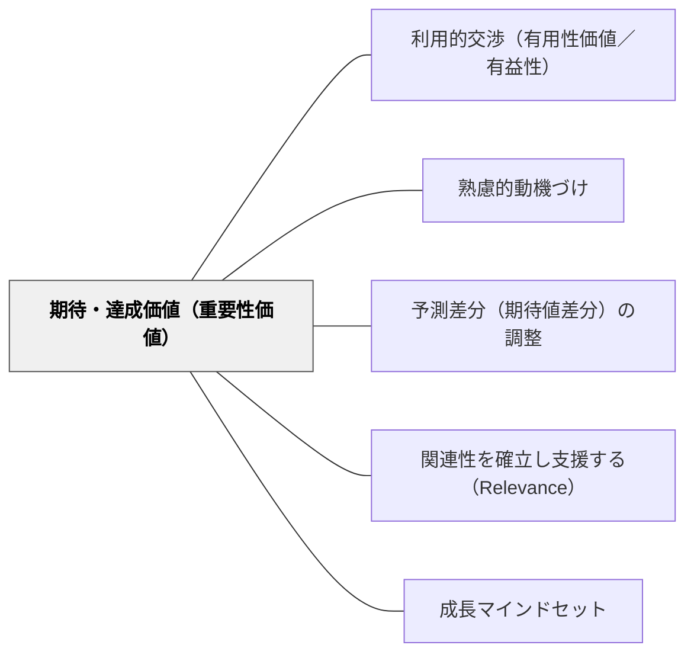

# 期待・達成価値（重要性価値）

> 「できそうか」と「やる価値があるか」の両方が揃ってはじめて人は動く。

## 背景（Context）
期待価値理論（Eccles et al.）によれば、動機付けは「成功への期待（自分にできそうか）」と「達成価値（やることに意味・価値があるか）」の積で決まる。どちらが欠けても行動につながりにくい。達成価値には内発的価値・外発的価値・有用性価値・コスト（取り組むことのデメリット）の各側面がある。

## 問題（Problem）
学習者が「やる気が出ない」ときの原因は様々だが、「どうせできない」という期待の低さと「これをやって何の意味がある」という価値の低さのどちらか、あるいは両方であることが多い。原因を特定せずにアプローチしても効果が出にくい。

## 力のかたち（Forces）
- 期待と価値のどちらが不足しているかを診断する必要がある
- 有用性価値（将来役立つ）は外から提示できるが、内発的価値は学習者自身が感じるもの
- コスト（時間・労力・機会損失）も動機に影響する
- 文化的・社会的背景が価値の認識に影響する

## 解決（Solution）
**学習者の期待（自己効力感）を高めながら、達成価値（内発的・有用性・外発的）を多面的に提示し、動機付けの2軸を同時に支援する。**

期待を高めるにはスモールステップと成功体験を提供する。有用性価値を高めるには「この学習が実生活・将来でどう役立つか」を具体的に示す。内発的価値は学習者自身の好奇心・興味と学習内容をつなぐことで育まれる。

## 結果（Consequences）
- 動機の原因を特定した的確なアプローチが可能になる
- 学習者が自分の動機を内省・言語化できるようになる
- 内発的価値の育成は長期的な自律学習者の形成につながる

## クラスター図

## Actionable Insight

- 「やる気が出ない」学習者に「自分にできそうか」vs「価値を感じていないのか」を診断する——原因を特定してアプローチすることで動機付けが効果的になる
- スモールステップと成功体験で期待（自己効力感）を高める——「どうせできない」という期待の低さに対処する
- 「この学習が実生活・将来でどう役立つか」を具体的に示す——有用性価値が「これをやって何の意味がある」という価値の低さに対処する

## 出典

- 一つの教育のパタン・ランゲージ（岩井輝久）

## 関連パタン
- [[パタン/利用的交渉（有用性価値／有益性）]]
- [[パタン/熟慮的動機づけ]] — 親パタン
- [[パタン/予測差分（期待値差分）の調整]] — 期待の調整に関連
- [[パタン/関連性を確立し支援する（Relevance）]] — 有用性価値の提示に関連
- [[パタン/成長マインドセット]] — 期待（自己効力感）の向上に関連
