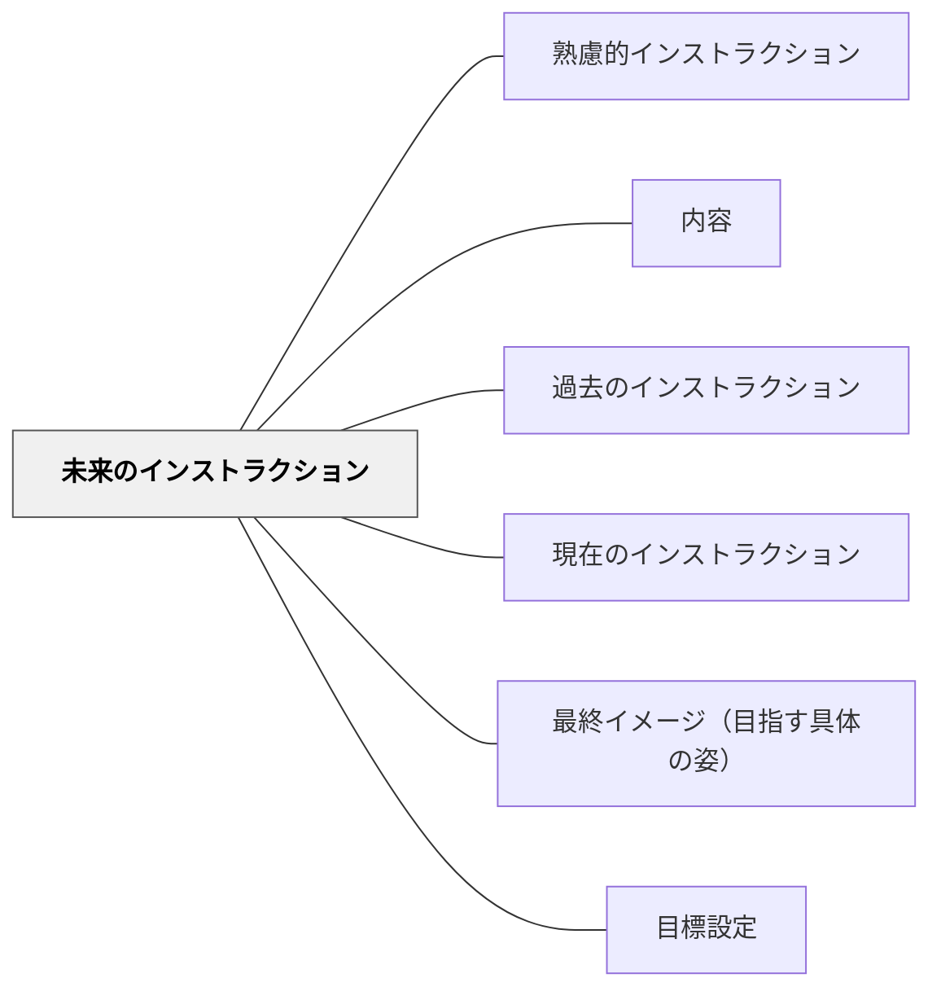

# 未来のインストラクション

> 将来の行動を求めるインストラクションは、ビジョンと期待を明確に示す。

## 背景（Context）
ワーマンが分類した3種類のインストラクションのうち、「未来のインストラクション」は将来のいつかの行動を求めるものである。ビジョン提示・目標設定・長期的な期待や暗黙の期待などがこれに当たる。「来週までに」「この学期中に」「将来的には」という形で直接的・間接的に伝えられる。

## 問題（Problem）
未来のインストラクションは即座の行動を求めないため、曖昧なままになりやすい。「いつかやってほしい」「できるようになってほしい」という期待が漠然としていると、受け手はいつ・どのように取り組めばよいかわからない。暗黙の期待として伝えられると、受け手が気づかないまま評価されることもある。

## 力のかたち（Forces）
- 期限と最終イメージが明確なほど、受け手は計画を立てやすい
- 遠い未来への指示は現在の行動と結びつきにくい
- 暗黙の期待（言わずに期待する）は双方にとって危険な状態を生む
- ビジョンを共有することで集団としての方向性が揃う

## 解決（Solution）
**未来のインストラクションでは、いつまでに・どのような状態になることを期待するかを明示し、可能であれば現在の行動との接続を示す。**

「来週の授業までに○○を読んでおく」「この学期の終わりまでに△△ができるようになる」という形で期限と最終イメージを具体化する。暗黙の期待は言語化して伝える。ビジョン・目標として伝える場合は、受け手が自分の行動計画を立てられるよう足場をかける。

## 結果（Consequences）
- 受け手が見通しを持って取り組めるようになる
- 暗黙の期待が減り、送り手・受け手の認識のズレが小さくなる
- 長期的な目標が現在の行動と結びつくことで動機が持続する

## クラスター図

## Actionable Insight

- 「来週の授業までに○○を読んでおく」「学期末までに△△ができるようになる」と期限と最終イメージを具体化する——見通しが明確なほど受け手は計画を立てやすく長期的な動機が持続する
- 暗黙の期待（言わずに期待していること）を言語化して伝える——明示されない期待で評価することが最も信頼を損なう
- ビジョン・目標として伝える場合は「今週何をすればそこに向かえる？」という近接目標の足場をかける——遠い未来への指示は現在の行動と結びつかなければ機能しない

## 出典

- 一つの教育のパタン・ランゲージ（岩井輝久）

## 関連パタン
- [[パタン/熟慮的インストラクション]] — 親パタン
- [[パタン/内容]] — インストラクションの内容の種類
- [[パタン/過去のインストラクション]] — 対比となる種類
- [[パタン/現在のインストラクション]] — 対比となる種類
- [[パタン/最終イメージ（目指す具体の姿）]] — 未来の状態の具体化
- [[パタン/目標設定]] — 未来への方向づけ
