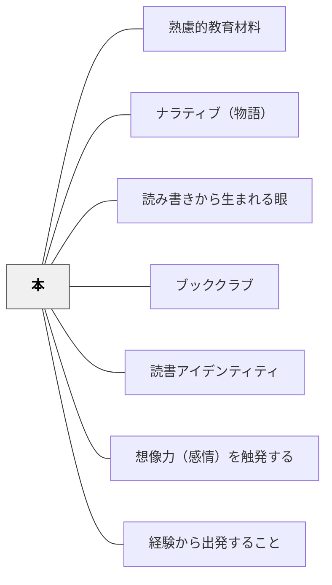

# 本

> 書籍・絵本・読み物は最も汎用性の高い教育材料の一つである。

## 背景（Context）

本（書籍・絵本・読み物）は、語彙・概念・物語・知識・感情体験を豊かに提供する教育材料である。キアラン・イーガンはナラティブの力として物語の感情触発効果を強調し、マリリン・バーンズは絵本を算数授業に活用する実践を報告している。

## 問題（Problem）

教科書だけを教材とすると、学習者が豊かな読書体験・知識体験を持てず、言語感覚や概念的理解が浅くなる。

## 力のかたち（Forces）

- 良い本は感情・想像力を強く触発する
- 絵本は具体的なイメージを提供し低学年でも有効
- 本の選択には質の見極めが必要

## 解決（Solution）

**教科の学習目標と結びついた書籍・絵本を意図的に選択し、教材として活用する。特に絵本と教科（算数等）を組み合わせた授業設計を検討する。**

## 結果（Consequences）

- 学習内容が感情的・概念的に豊かになる
- 読書習慣と学習の連携が生まれる

## 関連パタン

- [[パタン/熟慮的教材教具]] — 親パタン
- [[パタン/ナラティブ（物語）]] — 本の物語的力
- [[パタン/読み書きから生まれる眼]] — 読書による概念形成

- [[パタン/ブッククラブ]] — 本を核にした協働読書の実践形態
- [[パタン/読書アイデンティティ]] — 本との出会いが読書アイデンティティを育てる
- [[パタン/想像力（感情）を触発する]] — 本の物語が感情・想像力を強く引き出す
- [[パタン/経験から出発すること]] — 本の読書体験を学びの起点にする
## クラスター図

## Actionable Insight

- 絵本を算数・理科・社会の授業の導入に使い「この本と今日の学習はどこでつながる？」と問いかける——感情と想像力を触発する物語が概念学習への入り口を豊かにする
- 単元に関連する本を1冊紹介し「読んだ人は学習内容とつながる場面を1つ報告して」と投げかける——自発的な読書と学習の連携が読書習慣と概念理解を同時に育てる
- 教科書とは別に「今日の学習に関係する本」を教室の棚に置いておく——環境が学習者の好奇心を育て読書を学びの自然な延長として位置づける

## 出典

- キアラン・イーガン（2010）『想像力を触発する教育――認知的道具を活かした授業づくり』北大路書房
- マリリン・バーンズ（2004）（算数と絵本の授業）
