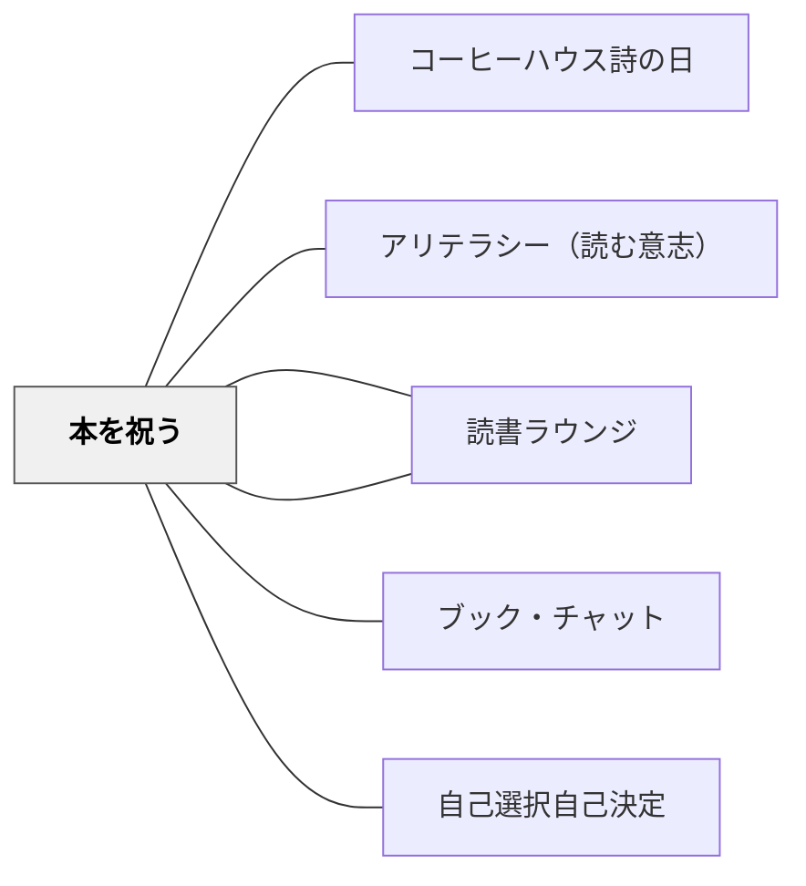

# 本を祝う

> 本を祝う——それは「読書は祝うに値するものだ」というメッセージを、制度として教室に埋め込むことだ。Golden Recommendation Shelf の輝き、First Read Club のステッカー、YA Café の朝のホットチョコレート——これらが「本が特別だ」という文化を作る。

---

## Pattern Connection

**出典**: Layne, S. L.（2009）*Igniting a Passion for Reading: Successful Strategies for Building Lifetime Readers*. Stenhouse. Chapter 8: "There's a Party Goin' on Right Here"

- **既存パタンとの関連**：[[パタン/アリテラシー（読む意志）]] の WILL育成戦略の「物理的・制度的な外側からのアプローチ」として機能する。内発的動機を育てる直接介入（ブック・チャット）と、外側から文化を作るアプローチ（本を祝う）の二本柱の一方
- **補強された点**：[[パタン/読書アイデンティティ]] の「本が好きな人間としての自己像」を、クラスの「祝祭的文化」として集合的に支える。個人の読書体験をコミュニティの喜びとして位置づける
- **他のパタンへの波及**：[[パタン/読書ラウンジ]] — ラウンジが YA Café などの祝祭活動の物理的な舞台になる。[[パタン/ブック・チャット]] — Read Arounds が非公式なブック・チャットの発生場所になる

---

## 背景（Context）

Layne（2009）第8章「There's a Party Goin' on Right Here」は、「本を祝う」という哲学を中心に展開する。

読書の意志（WILL）を育てるためには、「読む体験そのもの」が楽しいことが必要だ——しかしその「楽しさ」は体験だけでなく**文化**からも来る。「本が祝われる教室」に所属していること自体が、読書アイデンティティを支える。

Golden Recommendation Shelf の特別な棚、First Read Club のステッカー、YA Café の朝のホットチョコレート——これらは読書の「お祭り」を制度として教室に埋め込む。

## 問題（Problem）

本を読む動機は、内発的なものだけでは育たないことがある。

- 「読みなさい」「本を読むのは大切だ」という言葉だけでは、WILLは動かない
- 本について語れる仲間・本が特別に扱われる文化がない教室では、「読む人間であること」が孤独な行為になる
- 読書を「義務」として制度化すると（感想文・読書記録の提出）、読書が苦痛と結びつく

読書を「祝う」——本を価値ある・楽しい・共有するに値するものとして扱う文化が、WILLの外側からの支えになる。

## 力のかたち（Forces）

- 「特別な場所」「特別なステッカー」という可視的なシグナルが本への関心を引き上げる
- 「誰かが薦めた」という社会的証明が選書の質を上げる
- 「最初に読んだ人」としての記録が読書行動の動機になる
- お茶と軽食という非公式な文脈が読書コミュニティの「緩さ」を作る
- 多様なジャンル（詩・漫画・雑誌・新聞）への突然の招待が、固定された読書観を揺さぶる
- 祝祭は「義務感なし」であることが条件——強制した瞬間に文化が死ぬ

## 解決（Solution）

**本を祝う諸実践を年間に計画的に配置し、「この教室では本は価値あるものとして扱われている」という文化を制度として作る。**

---

### Golden Recommendation Shelf（ゴールデン推薦棚）

特別な棚に「読んで最高だった本だけ」を置く。

**8つの設置・運用ヒント**：
1. 「ゴールデン」という名前を大切にする——誰でも置ける棚ではない
2. 教師が最初にモデルを示す（最初の3冊を自分で選んで置く）
3. 生徒も棚に本を置けるが、**理由（「なぜこれがゴールデンか」）** を一言書いたカードと一緒に置く
4. "Highly Recommended" ステッカーを表紙に貼る
5. 棚は目立つ場所に——ラウンジの近くや教室の入口
6. 定期的に入れ替える（学期ごとなど）
7. 「ゴールデン棚から1冊選ぶ」を選書オプションとして明示する
8. 保護者に「ゴールデン棚の本リスト」を通知する

---

### First Read Club（初読クラブ）

新着本の裏表紙の内側に小さなラベルを貼る：

```
This book was First Read by: _______________
Date: _______________
```

**目的**：その本を「最初に読んだ人」として永遠に記録される。

**運用**：
- 新しい本が来るたびにラベルを貼っておく
- 最初に読んだ生徒が自分の名前と日付を記入
- 本がクラスを巡るたびに、次の読者は「最初に読んだのは誰か」が分かる——コミュニティの読書の歴史が本の中に刻まれる

---

### Read Arounds（本の回し読み）

教室中の本を素早く回覧し、次に読む本を決める機会。

**手順**：
1. クラスの全員が机に1〜3冊の本（ハードカバーのみ）を置く
2. 合図で一斉に本を手に取る（または隣の人の本を取る）
3. 1冊1.5分——タイトル・表紙・裏表紙・冒頭ページを読む
4. 合図で次の本へ回す
5. 気になった本は「ホールド（最大3回まで止める）」できる
6. 終了後、「次に読みたい本リスト」に加える

**ルール**：ハードカバーのみ（ペーパーバックは傷みやすい）。ホールドは最大3回まで。Read Around 中は静かに——「本と1対1の時間」。

**効果**：教師から直接薦めるのではなく、自分の判断で「これ気になる」と発見する体験——WILLの自律的な発動を促す。

---

### Elementary Café / YA Café（読書のお茶会）

月1回、朝の時間に読書コミュニティの「お茶会」を開く。

**形式**：
- タイミング：授業開始前（朝7:30〜8:00 など）
- 参加：任意（強制しない）
- 飲食：ホットチョコレート＋ドーナツ（または簡単なお茶・お菓子）
- 内容：教職員1名または生徒代表が「今読んでいる本・最近読んで面白かった本」を3〜5分紹介

**Elementary Café（小学校版）**：絵本・児童書が中心。絵本の読み聞かせを含むことも。
**YA Café（中学校版）**：Young Adult 文学が中心。生徒自身が発表することも。

---

### Genre Breaks（ジャンル探索デー）

突然「今日はこのジャンルを探索しよう」と宣言し、普段の読書と違うジャンルの本を教室に持ち込む。

| ブレイクの種類 | 内容 |
|---|---|
| **Poetry Break（詩の日）** | 詩集を持ち込み、5〜10分間、詩を自由に読む。声に出して読む・好きな詩を選ぶ |
| **Comic Break（漫画・コミックの日）** | グラフィックノベル・漫画を持ち込む。「視覚的なテキスト」へのアクセスを広げる |
| **Magazine Break（雑誌の日）** | 科学・スポーツ・料理・地理など多様なジャンルの雑誌を持ち込む |

**目的**：「読書 = 章のある本を読むこと」という固定観念を崩す。詩も、漫画も、雑誌も「読むこと」——多様なテキストへの扉を開く。

---

### Club Read（テーマ別読書バッグ）

テーマ別に本をまとめた「バッグ」を作り、グループで同じテーマの本を並行して読む。

例：
- 「アメリカ革命の本バッグ」——歴史的フィクション・ノンフィクション・伝記など5〜6冊
- 「動物の本バッグ」——自然科学・動物の物語・図鑑
- 「スポーツの本バッグ」——スポーツ小説・伝記・戦術書

Buzz About Books や読書グループの素材として使う——同じテーマの異なる本を読んでいる者同士が比較討論できる。

---

### Picture Book of Month（月の絵本）

毎月1冊の絵本を教師の机の上に置き、月末にクラス全員で読む。

**運用**：
- 教師の机に「今月の絵本」サインを貼る
- 月の途中、生徒はいつでも見に来て手に取れる
- 月末（または最終週）にクラス全員で教師が読み聞かせ
- 昼食時間に「絵本の会」（任意参加）を開くこともある

**価値**：「絵本は低学年のもの」という誤解を壊す——絵本の深いテーマ・美しい文体・大人にも響くメッセージを体験する。

---

## 結果（Consequences）

- 「この教室では本が特別に扱われている」という文化が制度として存在する
- Golden Recommendation Shelf の本は「誰かが薦めた価値ある本」として選ばれやすくなる
- First Read Club のステッカーがコミュニティの読書の歴史を作る
- Read Arounds が「次に読む本が常にある状態」を作る——「読む本がない」という問題を解消する
- YA Café・Genre Breaks がジャンルの固定観念を崩し、読書の幅を広げる
- ただし、これらの祝祭的実践は「感想報告・評価」と結びつかないことが重要——義務化した瞬間にWILLへの効果が消える

## 関連パタン
- [[パタン/コーヒーハウス詩の日]]

- [[パタン/アリテラシー（読む意志）]] — 本を祝う文化がWILLの外側からの支えになる
- [[パタン/読書アイデンティティ]] — コミュニティの読書文化が個人の読書アイデンティティを支える
- [[パタン/ブック・チャット]] — Read Arounds が非公式なブック・チャットの発生場所になる
- [[パタン/読書ラウンジ]] — ラウンジが祝祭活動の物理的な舞台になる
- [[パタン/自己選択自己決定]] — Read Arounds・Someday Book List が自己選択の質を高める
- [[実践/読書への情熱を育てる実践集]] — 四半期計画の中での本を祝う実践の配置

---

## クラスター図



## Actionable Insight

- 今日からできること：教室の棚の一画を「Golden Recommendation Shelf」にする——最初は教師の3冊から始め、「なぜゴールデンか」のカードを一枚置く
- 今週できること：新しい本が来たら First Read Club のラベルを一枚貼る——「誰が最初に読むか」を生徒に問いかける
- 今月できること：YA Café（または朝読書前の5分のお茶会）を1回試す——「ホットチョコレート＋1冊の本」から始める
- Read Arounds を試す：独立読書の開始前に5〜10分の Read Around を入れる——「次に読む本探し」として機能する

---

## 出典

Layne, S. L. (2009). *Igniting a Passion for Reading: Successful Strategies for Building Lifetime Readers*. Stenhouse Publishers. Chapter 8.

> "There's a party goin' on right here——reading is the celebration."
> —Layne（2009）
