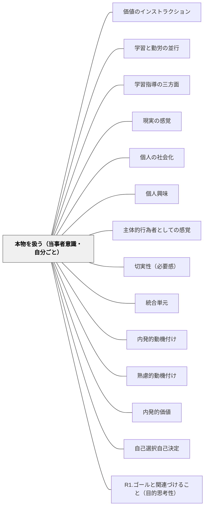

# 本物を扱う（当事者意識・自分ごと）

> 本物の課題・リアルな問題に向き合うとき、人は「傍観者」でいられなくなる。当事者意識が、内発的な学習の起爆剤になる。

## 背景（Context）
プロジェクト学習・探究学習において、学習者が「自分ごと」として問題に向き合えるかどうかが、動機の深さを大きく左右する。本物（authentic）の課題・素材・聴衆・プロセスは、学習の意味と当事者意識を高める。

## 問題（Problem）
教科書の練習問題や模擬的な課題では、「これは学校の中だけの話だ」という感覚が生まれやすい。本物感がない学習は形式的になり、解けばそれで終わりという受動的な関与にとどまる。

## 力のかたち（Forces）
- 本物の課題は複雑で、すべてを「正解」に向けてコントロールするのが難しい
- 本物に触れることで、予期せぬ学びや問いが生まれる豊かさがある
- 本物の聴衆（学校外に発表する・誰かの役に立つ）が当事者意識を強める
- 本物と向き合うことで、失敗や困難も「リアルな経験」として意味を持ちやすい

## 解決（Solution）
**学習者が直面する課題・素材・成果物の受け手を「本物」に近づけることで、「これは自分に関係がある」という当事者意識と動機を生み出す。**

地域の実際の問題を課題にする、本物の専門家に発表する機会を設ける、制作物が実際に使われる状況をつくる、フィールドワークや実際の素材に触れる機会を取り入れるなどが有効である。

## 結果（Consequences）
- 学習者が学習の目的を「テストのため」でなく「実際の問題を解くため」として捉えるようになる
- 本物への関与が深い理解・多角的な思考・創造性を促進する
- 学習の成果が実社会とつながることで、達成感と有能感が高まる

## クラスター図

## Actionable Insight

- 地域の実際の問題（環境・まちづくり・社会課題）を学習の課題にする——本物の課題が「これは学校の中だけの話」という感覚を払拭し当事者意識を生む
- 制作物が実際に使われる状況をつくる（地域への展示・当事者への発表・実物の配付）——本物の受け手がいることが学習の質と責任感を根本から変える
- フィールドワークや実際の素材に触れる機会を1単元に1回取り入れる——本物に向き合う体験が予期せぬ学びと問いを生む豊かさをもたらす

## 出典

- 一つの教育のパタン・ランゲージ（岩井輝久）

## 関連パタン
- [[パタン/価値のインストラクション]]
- [[パタン/学習と勤労の並行]]
- [[パタン/学習指導の三方面]]
- [[パタン/現実の感覚]]
- [[パタン/個人の社会化]]
- [[パタン/個人興味]]
- [[パタン/主体的行為者としての感覚]]
- [[パタン/切実性（必要感）]]
- [[パタン/統合単元]]
- [[パタン/内発的動機付け]]
- [[パタン/熟慮的動機付け]] — 親パタン
- [[パタン/内発的価値]] — 関連パタン
- [[パタン/自己選択自己決定]] — 関連パタン
- [[パタン/R1.ゴールと関連づけること（目的思考性）]] — 関連パタン（ARCSとの接点）
- [[パタン/パフォーマンス課題]] — 関連パタン
- [[パタン/フィールドワークの段取り]] — 専門家取材は「本物」に触れる典型的な経験

## このパタンが働く実践
- [[実践/ローベルみたいな物語を書こう]]
- [[実践/個別支援級の複式算数：重さと面積をわたり・ずらしで学ぶ]]

- [[実践/発達特性別の環境調整]] — 困りごとを本人の意思と環境のミスマッチとして扱い、参加可能な環境を設計する。
- [[実践/ライティング・ワークショップ年度初め]] — 書いた作品を読者に届ける経験が、書くことを自分ごとにする。
