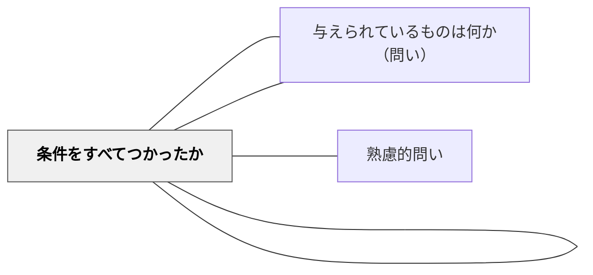

# 条件は何か（問い）

> 制約・条件・前提を明確にすることで、問題の境界線を把握する。

## 背景（Context）
多くの問題には、暗黙の制約や明示的な条件が含まれている。学習者がこれらを意識せずに解答しようとすると、解の範囲を誤ったり、条件を満たさない解を出してしまうことがある。問題の「縛り」を意識することは、有効な解法の選択に直結する。

## 問題（Problem）
学習者は条件を無意識に無視したり、逆に過剰に制限を加えたりしがちである。特に複数の条件が重なっているとき、どれが本質的かを見極めるのが難しい。条件を整理しないまま解き始めると、後で根本的な修正が必要になることがある。

## 力のかたち（Forces）
- 条件を言語化することで、問題の輪郭がはっきりする
- すべての条件を列挙することで、矛盾や不整合に気づける
- 「どこまでが許されているか」を知ることは解法の自由度を規定する
- 条件の見落としは、誤った解への直接の原因になる

## 解決（Solution）
「この問題の条件は何か？制約はどこまでか？」と問いかける。例えば「整数に限るのか、実数も含むのか」「時間的な制約はあるか」などを確認させる。また「この条件がなかったら問題はどう変わるか？」という問いと組み合わせると、条件の意味を深く理解させられる。

## 結果（Consequences）
- 解の範囲が明確になり、誤解に基づく解答が減る
- 条件を意識することで、解法の選択が適切になる
- 問題の構造を論理的に把握する習慣が身につく

## 関連パタン
- [[パタン/与えられているものをすべてつかったか]]
- [[パタン/熟慮的問い]] — 親パタン
- [[パタン/与えられているものは何か（問い）]] — 既知情報を整理する補完的な問い
- [[パタン/条件をすべてつかったか]] — 条件の活用を確認する問い

## クラスター図

## Actionable Insight

- 問題を解く前に「この問題の条件・制約を全部書き出してみよう」と促す——条件の明示化が解の範囲を明確にし見落としによる誤答を防ぐ
- 「整数に限るか・時間的制限はあるか」など解の範囲を規定する条件を確認する習慣を作る——条件意識が問題の構造を論理的に把握する力の土台となる
- 「この条件がなかったら問題はどう変わるか？」という問いを解後に加える——条件の意味への問いが条件の理解を表面的な確認から深い理解へと変える

## 出典
- [[文献/熟慮的問いのパターンリスト（動画記録）]]
- ジョージ・ポリア（1954）『いかにして問題をとくか』丸善出版
