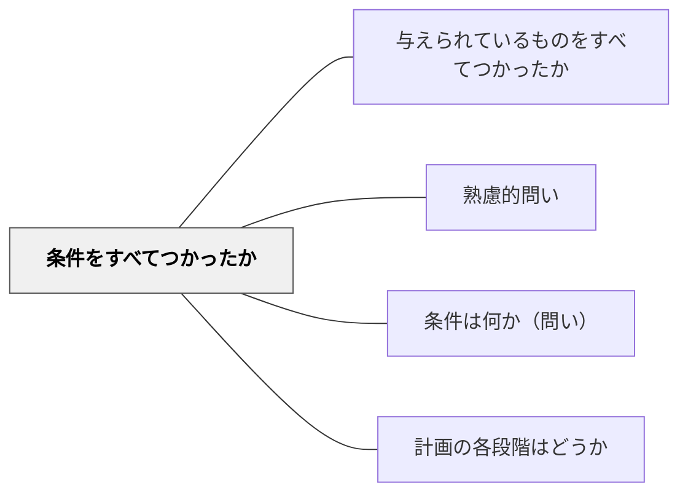

# 条件をすべてつかったか

> 解答後に条件の見落としを確認することで、解の完全性と正確さを担保する。

## 背景（Context）
問題を解いた後でも、与えられた条件のうち一部しか使っていない場合がある。特に複数の条件がある問題では、すべての条件が解に反映されているかを確認することが、解の正しさを保証するうえで不可欠である。また、使われていない条件は別のアプローチへのヒントになることもある。

## 問題（Problem）
学習者は解けた安心感から、条件の確認を省略しがちである。一部の条件しか使わずに解答を出してしまい、完全な解を得られていないことに気づかないまま終わることがある。また条件を全部使っているかどうかを意識的に確認する習慣が育っていないと、この誤りが繰り返される。

## 力のかたち（Forces）
- 全条件の活用確認は解の正確さの保証になる
- 使われていない条件の発見が、解の改善や別解への手がかりになる
- 振り返りのプロセス自体が学習の定着を助ける
- 「なぜこの条件があるのか」を問うことで問題設計の意図が理解できる

## 解決（Solution）
「問題に書かれていた条件を全部使ったか？使っていない条件はないか？」と解答後に問いかける。例えば「この問題には3つの条件があったが、解答に反映されているのは2つだけに見える。残りの1つはどこで使ったか？」と具体的に確認させる。条件ごとにチェックリストを作る方法も有効である。

## 結果（Consequences）
- 解答の完全性と正確性が高まる
- 条件を意識的に管理する習慣が育つ
- 問題の構造と解の対応関係を深く理解できるようになる

## 関連パタン
- [[教科/算数・数学で使うパタン]]
- [[パタン/与えられているものをすべてつかったか]]
- [[パタン/熟慮的問い]] — 親パタン
- [[パタン/条件は何か（問い）]] — 条件を最初に整理するパタン
- [[パタン/計画の各段階はどうか]] — 解法プロセス全体の振り返り

## クラスター図

## Actionable Insight

- 解答後に問題文を再度読み「使った条件」と「使っていない条件」を色分けして確認させる——条件の見落としを可視化するだけで解答の完全性が格段に上がる
- 使われていない条件を見つけたとき「この条件はなぜ問題に書かれているのか？」と問いかける——余計な条件に見えるものが別解や深い理解への鍵になることに気づかせる
- 解答を提出する前に「条件チェックリストに1つずつ印をつける」を授業ルールにする——確認習慣が自動化されると、解の正確さと問題設計の読解力が同時に育つ

## 出典
- [[文献/熟慮的問いのパターンリスト（動画記録）]]
- ジョージ・ポリア（1954）『いかにして問題をとくか』丸善出版
