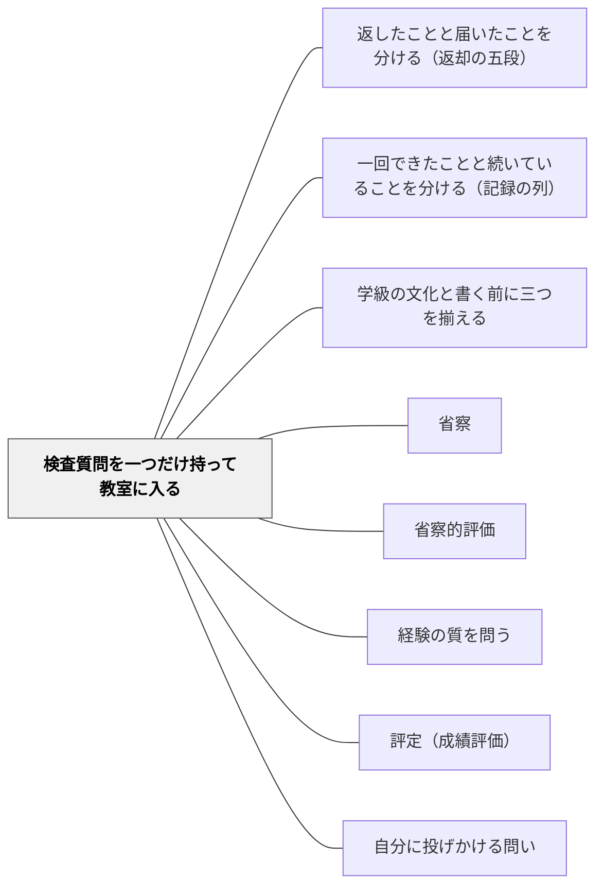

# 検査質問を一つだけ持って教室に入る

> 二冊の本が渡す検査質問は、合わせて二十二本ある。それを全部持っていくと、チェックリストになる。持っていくのは、今日の一つだけでいい。

## [Pattern Connection]

岩井の二冊の読み物版——[[文献/教育の見方が変わる十一の問い（岩井）]]（一時間の**中**を見る）と [[文献/続・教育の見方が変わる十一の問い（岩井）]]（その一時間の**あと**を見る）——は、どちらも各章の終わりに **検査質問** を一つだけ置いて閉じる。合わせて二十二本ある。

本パタンは、その二十二本を **教師がいつ・どこで・どう使うか** を扱う。二冊の内容を要約するのではない（要約は上の文献ページにある）。ここに置くのは、**手が止まった瞬間に、どの問いを一つ引くか** という運用だけである。

Wikiの体系のどこに接続するかを言えば、本パタンは既存の三つのパタン——[[パタン/返したことと届いたことを分ける（返却の五段）]]（返却の数日）、[[パタン/一回できたことと続いていることを分ける（記録の列）]]（記録の数週間）、[[パタン/学級の文化と書く前に三つを揃える]]（学級の一年）——の **起動装置** にあたる。三つはいずれも「どう分けて見るか」の中身を持っているが、**分けて見るべき瞬間が来たことを、教師に知らせる仕掛け** を持っていない。検査質問がそれを担う。手が止まった瞬間が、どのパタンを開く瞬間なのかを、問いのほうが教えてくれる。

[[パタン/省察]] との関係も同じ形をしている。省察は「経験に問い返す場をつくれ」と言うが、何を問い返すかは場面ごとに決まる。本パタンは、その問いを **場面から引ける形** にしたものである。

## 背景（Context）

教師の一日は、書く仕事でできている。ノートに赤を入れる。記録欄にメモを残す。学級だよりの一文を書く。校内研で報告する。所見を書く。成績表の欄を埋める。年度末に要録の「学級の実態」を書く。

これらの仕事の途中で、教師の手は、ときどき止まる。「効いた」と言いかけて声が小さくなる。「みんな」と書きかけてペンが止まる。「まだ何とも言えない」と二人分書いてから、この二つは同じ「まだ」だろうかと引っかかる。「安定して理解している」に丸をつけかけて、指が止まる。

**この、手が止まる一秒が、二冊の本が狙っている場所である。** 止まったこと自体は、たいていの教師が毎日経験している。問題は、止まったあと何をすればいいのかが分からないことだ。だから、たいていは、そのまま書く。書いてしまえば、止まったことは忘れる。

二冊の本は、その一秒に置く道具として、章ごとに検査質問を一つずつ渡してくる。前作は一時間の中の十一本、続編はその一時間のあとの十一本。合わせて二十二本。それは、教師の手が止まりうる二十二の場所の地図でもある。

## 問題（Problem）

**二十二本の問いは、そのままでは使えない。**

理由は三つある。

第一に、**多すぎる。** 二十二本を手元に置いて全部通そうとすると、それは検査質問ではなくチェックリストになる。チェックリストは、手を止めない。上から順に埋めていく作業になり、埋め終われば「点検した」という感触だけが残る。問いは、手を止めるからこそ働くのに、通すべき項目になった瞬間、手を止める力を失う。

第二に、**問いは、探しに行くと出てこない。** 「今日はどの問いを使おうか」と二十二本の一覧を眺めても、たいてい何も起きない。問いが働くのは、書く手が実際に止まった瞬間だけである。だから必要なのは一覧ではなく、**場面から引ける索引** である。「この場面で手が止まったなら、この一本」という形になっていないと、使うべき瞬間に取り出せない。

第三に、そして最も危ないのは、**問いが裁く棒になること** である。「証拠がないのに書こうとしている」「跳んでいることに気づいていない」——問いをそう読むと、教師は自分を責めるか、書くのをやめるかのどちらかになる。二冊とも、そう読まれないための構文を、はっきり用意している。それを外して問いだけを取り出すと、道具が凶器になる。

## 力のかたち（Forces）

- **問いは手を止める vs 手を止めている時間がない**——所見も成績表も、いちばん忙しい時期に来る。一つの欄で一秒止まることは、三十五人分では三十五秒では済まない。だから、**全部の欄では止まらない**という設計が要る
- **二十二本の網羅性 vs チェックリスト化の誘惑**——本が二十二本渡してくれた以上、全部使いたくなる。しかし全部使えば、一本も効かなくなる
- **「まだ言えない」と書けない書式 vs 正確に書きたい気持ち**——要録にも成績表にも「未記録です」という欄はない。問いを出しても、書式は答えを受け取ってくれない
- **自分に向ける道具 vs 他人に向けたくなること**——問いは、他人の言葉の粗さを指摘するのに、あまりにもよく効く。同僚や初任者の報告に向けた瞬間、それは対話ではなく審問になる
- **一度使えば身につくという期待 vs 癖は直らないという事実**——「二人分は、みんなではない」と一度学んでも、次の一文の前でまた滑る。問いは、習得して卒業する教材ではない
- **問いを出しすぎると書けなくなる vs 書かねばならない実務**——二冊とも「跳ぶな」とは言っていない。「跳んでいると知って跳べ」と言っている。問いを、書かない口実に使うと、実務が止まり、しかも子どもには何も返らない
- **問いが効くのは自分の弱いところ vs 弱いところは自分では見えない**——いちばん止まらずに書けてしまう欄が、たいてい、いちばん問いが要る欄である

## 解決（Solution）

**検査質問は、一度に一つだけ持つ。持ち方は、場面から引く。答えが「まだ言えない」でも、かまわない。**

### 三つの作法

この三つは、問いの中身と同じくらい、道具の一部である。どれを外しても、二十二本は働かなくなる。

**作法1：一度に一つだけ。** 本自体が「各章に検査質問は一つだけ」という設計になっている。二十二本の一覧を持ち歩かない。今日の一つを決めて、その日はそれだけを使う。使わなかった二十一本は、明日以降のためにしまっておく。

**作法2：「まだ言えない」を答えとして認める。** 続編では、検査質問のあとに必ず、次の形の一文が添えられている。

> 答えが「まだ分からない」でも、かまわない。「まだ分からない」と「届かなかった」は、別のことだから。（第1章）

> 答えが「まだ見ていないほうだ」でも、かまわない。まだ見ていないと知っていることと、見ていないことにすら気づかずに空欄を埋めることは、別のことだから。（第3章）

> 答えが「二人分だ」でも、かまわない。二人分の証拠を持っていることと、全員分の証拠を持っているふりをすることは、別のことだから。（第6章）

前作では、同じ働きが **自由** の形で書かれている——「してはいけない推論」がすべて「〜と訳さなくていい」の構文で置かれている。

> 「今日はまとまらなかった」を、「今日はだめだった」と訳さなくていい。この訳を手放すと、ずいぶん自由になる。（前作・第2章）

**この構文自体が道具の一部である。** 問いだけを抜き出して「答えられなければ書くな」と読み替えると、道具は裁く棒に変わる。問いは、決めつけからの解放のために置かれている。

**作法3：常備する。使い切って卒業しない。** 続編の結章が、その理由を書いている。

> 人は、空白を、放っておけない。空白を見ると、そこを、推論で、埋めてしまう。悪気からでは、ない。むしろ、まじめに読もうとするからこそ、埋めてしまう。

> 水の中の棒が、折れて見えることを知っても、棒は、折れて見え続ける。だから、この本の道具は……この癖を、直すためのものでは、ない。直らないからだ。それらは、**埋めた瞬間に、埋めた、と気づける場所を、作るためのものだ**。堤防を、一度築けば、波が来なくなる、のではない。波は、来続ける。

問いは癖を直さない。直らないからである。問いがするのは、埋めたときに、埋めたと気づける場所を作ることだけだ。だから検査質問は、修得して卒業する教材ではなく、**ずっと机の上に置いておく道具** である。

### 場面別の早見表——手が止まったら、ここから一つ引く

一覧を上から読む表ではない。**左の列で自分の場面を探し、右の一本だけを持っていく** 表である。前作＝『教育の見方が変わる十一の問い』、続編＝『続・教育の見方が変わる十一の問い』。問い文は原文のまま引いてある（全文と章の対応は各文献ページにある）。

| 手が止まる場面 | 持っていく問い |
|---|---|
| 授業の終わり方に迷ったとき | **前作②** この終わり方は、外から貼りつけたまとめか、それとも、先行する歩みが満ちた結果か |
| 「同じ考えですね」と言いかけたとき | **前作③** 私がいま「同じ」と言ったのは、同じ答えのことか、同じ理解のことか |
| 「この子は輪に入っていない」と書きかけたとき | **前作⑨** この子は、輪の外にいるのか。それとも、別の問いの中にいるのか |
| 返したノートの直しに丸をつけようとしたとき | **続編①** この直しは、私の一言に従ったのか、それとも、この子の判断が働いたのか。そして、それは今日の記録で、どこまで言えるか |
| 「効いた」と言いかけたとき | **続編②** 私がいま「効いた」と言おうとしているとき、閉じているのは、私の記録か。それとも、この子の学びか |
| 所見の欄に「まだ何とも言えない」と書いたとき | **続編③** 私がいま書いた「まだ言えない」は、何も見ていないから言えないのか、それとも、見たけれど保留する理由が手元にあって言えないのか |
| 「できるようになった」と書こうとしたとき | **続編④** 一回できたことか、続いていることか、それとも、その子の力になったことか。そのうち、今日の記録で言えるのは、どこまでか |
| 空欄を見て「やっていない」と書きかけたとき | **続編⑤** この記録の空白は、この子の学びの空白か。それとも、私の観察の窓が、そこに開いていなかっただけか |
| 学級だよりに「みんな」「複数の児童に」と書いたとき | **続編⑥** その裏には、誰の分の証拠が、手元に立っているか。それは、何人分か |
| 校内研で「全部で◯件」と報告しようとしたとき | **続編⑦** その合計の数は、誰の分を消しているか。その数の下に、見えていなかった子の「0件」が、まぎれ込んでいないか |
| 「このクラスには文化がある」と書きたくなったとき | **続編⑧** どういう意味かを名指しし、手元の証拠を添え、最後のひと跳びが自分の判断だと、知っているか |
| 「本校の」「学年の」と足そうとしたとき | **続編⑨** その足し算の規則を、私たちは、もう持っているか。それとも、まだ作っていないのか |
| 成績表に水準の言葉を書こうとしたとき | **続編⑩** これは記録なのか、それとも、記録から能力へ跳んだ判断なのか。跳んでいるとしたら、どれだけ見晴らしのよい場所から、跳んでいるか |
| 要録の「学級の実態」欄を書こうとしたとき | **続編⑪** その一文は、判決だろうか。それとも、次に誰の、どこに、窓を開ければよいかの、手がかりだろうか |

表を上から順に通さない。**引くのは、いつも一本だけ** である。

---

### 具体例1：一日一問——付箋に書いて机上に貼る

朝、教室に入る前に、今日の一問を決める。付箋に書いて、教卓か手帳の今日のページに貼る。その日はそれだけを使う。

四月の学級開きから二週間ほどは、**続編⑤**（空白は、学びの空白か、観察の窓の空白か）を貼っておくと効く。まだ誰のことも見えていない時期で、しかも「この子は書かない子だ」という読みが最も固まりやすい時期だからである。

学期末が近づいたら、**続編④**（一回できたか、続いているか、力になったか）に貼り替える。記録欄に「できるようになった」と書きたくなる時期だからだ。

一日一問にする理由は、単純である。二十二本を持ち歩くと、一本も出てこない。一本だけ貼っておくと、その一本の場面に来たときに、目に入る。

---

### 具体例2：協議会の言葉を変える

研究授業の後の協議会。誰かが「よくまとまりましたね」と言う。よくある一言である。

ここで、**前作②** を、自分の発言の形にして出す。「まとまりましたね」ではなく、**「あの終わりは、外から貼ったまとめでしたか、それとも、先行する歩みが満ちた結果でしたか」**。

この言い換えには、注意が要る。**授業者に向けて出すと、審問になる。** 「あなたは外から貼りましたね」と聞こえてしまえば、協議会は防御の場になる。出すなら、自分が見たものについて話す形にする。「私は、あの終わり方を『満ちた結果』として見ていたのですが、皆さんはどう見えましたか」。

問いを他人の授業の採点表にしない。**問いは、自分が見たものの記述の粗さに向ける。** 協議会で変えられるのは、他人の授業ではなく、自分たちが授業を語るときの語の粗さのほうである。

---

### 具体例3：所見・成績表を書く夜——手が止まった瞬間が合図

学期末の夜。所見の下書きを、名簿順に書いていく。

このとき、**全員の欄で問いを出さない。** 三十五人分の欄で毎回一秒止まっていたら、夜が明ける。出すのは、**書きかけて手が止まった欄だけ** である。止まらずに書けた欄は、そのまま次へ行ってよい。

止まった欄では、止まり方によって引く問いが違う。

- 「まだ何とも言えない」と書いた欄で止まった → **続編③**。C児の「まだ」（何も見ていない）と、E児の「まだ」（見たが保留の理由が手元にある）を書き分ける。書き分ければ、同じ空欄が、来学期の自分への別々の引き継ぎになる
- 「できるようになりました」と書いた欄で止まった → **続編④**。一回か、続いているか、力になったか。「二回目。ここから力になったと言うには、まだ距離がある」と記録欄に書けるなら、それでよい
- 成績表の水準の言葉で止まった → **続編⑩**。跳ぶことは避けられない。避けられないから、跳ぶ前にどこに立っているかを見晴らす

止まらなかった欄が多い夜は、それでよい。**止まらなかったことを、問いを使わなかった失敗として数えない。**

---

### 具体例4：校内研の報告の前——数字を読む前に一本出す

校内研で「今学期、自分で直した場面が全部で12件ありました」と報告しようとしている。

読み上げる前に、**続編⑦** を一本だけ出す。その合計は、誰の分を消しているか。その下に、見ていなかった子の「0件」がまぎれ込んでいないか。

出したあと、報告の形が変わる。「今学期、返却直後の時間とノートを中心に見た範囲で、D児が数件、もう一人が数件です。C児をはじめ、途中が見えにくかった子については、0件ではなく未記録です。無かったのではありません。来学期は、まだ一件も記録のない子の窓を先に作ります」。

言えることは減る。**しかし、同僚が明日試せる情報は増える。** 「12件でした」からは、次に何をすればよいかが一つも出てこない（→ [[パタン/学級の文化と書く前に三つを揃える]] の五点セット）。

---

### 具体例5：要録の引き継ぎ——判決ではなく、次の観察を書く

三月。要録の「学級の実態」欄。一年のまとめとして「このクラスには、自分の考えを見直す文化が育ちました」と書きたくなる。

ここで **続編⑪** を出す。その一文は、判決だろうか。それとも、次に誰の、どこに、窓を開ければよいかの、手がかりだろうか。

続編の結章は、この欄に判決を書かないことを選び、かわりに次の観察を書いて閉じている。

> この子については、まだ、途中を、あまり見られていない。来年度、受け持つ先生へ——この子の手元に、途中の見える窓を、もう一枚。

これは「書けませんでした」という報告ではない。**次の担任にとって、いちばん実用的な引き継ぎ** である。「できない子」の申し送りではなく、「まだ見えていない窓」の申し送りだからだ。

---

### 具体例6：自己教育での適用——自分の学習記録に、続編④と⑤を向ける

このWikiの持ち主は、小学校教師であると同時に、自分自身を学習者として実験する実践者でもある。数学の自己学習を、記録を取りながら続けている。その記録に、続編④と⑤を向けてみると、二つのことが見える。

**続編④を向ける。** 「この解き方が分かるようになった」と書いた日がある。しかし手元にあるのは、その日に一度解けたという記録である。翌週の別の問題で同じ手が出たかは、その記録には書かれていない。一回できた／続いている／自分のものになった——三つのうち、書けるのはどこまでか。自分の学習では、この三つが最も無自覚に一つに畳まれる。褒めてくれる人も、疑ってくれる人も、そこにいないからだ。

**続編⑤を向ける。** 記録の空いている日がある。「やらなかった日」と読んできた。しかし、机に向かわなかった日にも、歩きながら考えていたことがあったかもしれない。記録の空白は、学びの空白とは限らない——**この原則は、他人を見取るときと同じ強さで、自分に対しても働く。** 空白を「サボった日」と読むと、自分に対して、まさに続編が戒めている推論をしていることになる。

自己教育では、続編⑦（合計は主語を消す）はあまり出番がない。数えるべき他者がいないからである。かわりに、**続編②**（閉じているのは、記録か、学びか）が繰り返し効く。「この単元は終わった」と記録を閉じることと、その理解が自分の中で動かなくなったことは、まったく別である。

---

### 特別支援の視点：続編⑤は、表出の手段が限られている子に最も強く効く

観察の窓が薄くなるのは、静かな子、手のかからない子、そして **表出の手段が限られている子** である。書字に困難があれば、ノートに過程は残らない。話すことに困難があれば、口頭での確認も窓にならない。窓が構造的に閉じているところで、記録の空白は必ず生まれる。

その空白を「やっていない」と読むことは、その子の困難を、そのまま学習の不足として記録することになる。**続編⑤**（この空白は、学びの空白か、観察の窓の空白か）は、そこで最も強く効く。

そして、この問いを出した先にあるのは、その子を測り直すことではなく、**窓を別の形で開けること** である。ブロックの操作を見る三分。「どう考えた？」を一度だけ口頭で聞く。写真を一枚撮る。窓は短く、一つだけでよい。目的は、その子を評価することではなく、自分の見取りの空白を埋めることである。

## 結果（Consequences）

**利点**

- **手が止まった瞬間に、やることが決まる**——「これは言い過ぎかもしれない」という漠然とした不安が、「今日はこの一本を引く」という具体的な動作に変わる
- **書けなくなるのではなく、書けるようになる**——問いを出したあとに書く一文は、たいてい書く前と同じ長さである。変わるのは、その一文の裏に何を置いているかを、書いた本人が知っていること
- **記録が、次の観察の指示に変わる**——「まだ言えない」を書き分けて残すと、それは空欄ではなく、来学期の自分や次の担任への申し送りになる
- **語の粗さが自分で見えるようになる**——「効いた」「みんな」「文化がある」「本校の」。日常語のまま使っていた語が、どこで主語をすべらせているかが見える
- **二冊の内容が、読み終えたあとも働き続ける**——本は読み終わると忘れる。場面から引ける形にしておくと、忘れた本の内容が、必要な場面で戻ってくる
- **自己教育にもそのまま使える**——自分の学習記録に対して同じ問いを向けられる。子どもに向ける道具と、自分に向ける道具が同じであることが、実践者としての一貫性になる

**注意点・リスク**

- **詰問の道具にしない**——問いは、他人の言葉の粗さを指摘するのに、あまりにもよく効く。同僚や初任者の報告に向けた瞬間、それは決めつけからの解放ではなく **審問** になる。まず、**自分の手が止まった瞬間に、自分へ向ける**。他人に向けてよいのは、自分の見たものの語り方について自分から出すときだけである
- **書かない口実にしない**——「証拠がないから書けません」で止まると、実務が回らないうえに、子どもには何も返らない。二冊とも「跳ぶな」とは言っていない。**「跳んでいると知って跳べ」** と言っている。所見も成績表も要録も、書かねばならない。問いは、書かないためではなく、知って書くためにある
- **チェックリスト化しない**——二十二本を毎回通すと、問いは書式になり、手を止める力を失う。埋め終われば「点検した」という感触だけが残り、実際には何も見ていない。**一度に一つ**を守ることが、この道具の生命線である
- **全員の欄で止まろうとしない**——三十五人分の欄で毎回一秒止まる設計は、続かない。続かない手続きは、結局ゼロになる。止まった欄だけで出す
- **一度使えば身につくと思わない**——癖は直らない。「二人分は、みんなではない」と学んだ翌週、また滑る。問いは修得して卒業する教材ではなく、常備するものである。堤防を一度築いても、波は来続ける
- **問いを出したことを、実際に見たことと取り違えない**——「続編⑤を出した」ことと、「その子の窓を実際に一つ開けた」ことは別である。問いの出しっぱなしが増えると、丁寧に考えている感触だけが残る。問いのあとには、**短い観察を一つ** 置く
- **子どもの前で問いを口に出す場面を選ぶ**——検査質問は教師が自分の記録と判断に向ける道具であって、子どもに投げる発問ではない。子どもに向けるときは、[[パタン/自分に投げかける問い]] のように、その子が自分の理解を確かめられる形に組み直す

## 関連パタン

- [[文献/教育の見方が変わる十一の問い（岩井）]] — 前作。一時間の**中**の十一本。表の「前作◯」の原文と章の対応はこちら
- [[文献/続・教育の見方が変わる十一の問い（岩井）]] — 続編。その一時間の**あと**の十一本。表の「続編◯」の原文と、各問いに添えられた「〜でも、かまわない」の一文はこちら
- [[文献/圏論的教育記述の公理化ノート 第2巻（岩井）]] — 続編の対になる理論書。「同じ山の別の登り口」。区別の正確な形を確かめたいときはこちら
- [[パタン/返したことと届いたことを分ける（返却の五段）]] — 続編①②が開く先。返却の数日を、五つの段に分けて見る中身
- [[パタン/一回できたことと続いていることを分ける（記録の列）]] — 続編④が開く先。記録の数週間。一回・続いている・力になったの三つを分ける中身
- [[パタン/学級の文化と書く前に三つを揃える]] — 続編⑥⑦⑧⑨⑪が開く先。学級の一年。学級だより・校内研・要録の書き分けと五点セット
- [[概念/証拠不足と不成立の区別]] — 続編③⑤の概念的中核。「まだ言えない」と「無かった」を分ける手つきの一般形
- [[パタン/省察]] — 上位。本パタンは、省察を起動する問いを場面から引ける形にしたもの
- [[パタン/省察的評価]] — 問いを出したあとに、その答えを記録として残す場。「言える・言えない・まだ分からない」の三値で仕分ける
- [[パタン/経験の質を問う]] — 前作②（外から貼ったまとめか、満ちた結果か）が立つ実践の場
- [[パタン/評定（成績評価）]] — 続編⑩が働く場面。記録から能力への跳びを、書式が要求してくるところ
- [[パタン/自分に投げかける問い]] — 同じ構造を学習者の側に置いたもの。検査質問は教師が自分へ向ける道具であり、子どもへ渡すときはこちらの形に組み直す

## クラスター図

## Actionable Insight

- **明日の朝、付箋に一問だけ書いて机上に貼る**——二十二本の一覧は持ち歩かない。今日の一本だけ。四月なら続編⑤（空白は、学びの空白か、私の窓の空白か）、学期末なら続編④（一回か、続いているか、力になったか）
- **所見を書く夜、手が止まった欄にだけ問いを出す**——止まらずに書けた欄は、そのまま次へ行く。止まった欄で、「まだ言えない」なら続編③、「できるようになった」なら続編④、水準の言葉なら続編⑩を一本引く
- **「まだ何とも言えない」と書いた欄を、二種類に書き分ける**——「まだ見ていない。来学期、途中を見る場面を作る」と「見たが、二つの見え方がそろわない。もう一度確かめる」。同じ空欄が、別々の引き継ぎになる
- **校内研で数字を読み上げる前に、続編⑦を一度だけ出す**——「この合計は、誰の分を消しているか」。そのうえで「◯件は、未記録であって、無かったのではありません」の一文を、必ず声に出して添える
- **要録の「学級の実態」欄に、判決ではなく次の観察を一行書く**——「◯◯については、まだ途中をあまり見られていない。来年度受け持つ先生へ——この子の手元に、途中の見える窓をもう一枚」
- **協議会で「まとまりましたね」と言いそうになったら、自分が見たものの話に変える**——「私はあの終わり方を『満ちた結果』として見ていたのですが、皆さんはどう見えましたか」。授業者への採点にしない
- **自分の学習記録に、続編④と⑤を一度向けてみる**——「分かるようになった」と書いた日を、一回・続いている・自分のものになったの三つに分ける。記録の空いた日を「サボった日」と読んでいないか確かめる
- **問いを出したら、短い観察を一つだけ決める**——問いの出しっぱなしを増やさない。「明日、C児の机の横に三分立つ」で十分である

## 出典

- 岩井輝久（2026）『教育の見方が変わる十一の問い――外から与えられた終わりと、内から満ちて訪れた終わり』（電子書籍）

> 「今日はまとまらなかった」を、「今日はだめだった」と訳さなくていい。この訳を手放すと、ずいぶん自由になる。（第2章）
> — 前作の「してはいけない推論」はすべてこの**自由**の構文で書かれている。教師を裁く棒ではない。

> 確かめられていない、は、無かった、ではない。（全巻の反復句）

- 岩井輝久（2026）『続・教育の見方が変わる十一の問い――言いたくなることと、証拠から言えること』（電子書籍）

> 答えが「まだ分からない」でも、かまわない。「まだ分からない」と「届かなかった」は、別のことだから。（第1章）
> — 続編では、各検査質問のあとに必ずこの趣旨の一文が添えられている。この構文自体が道具の一部である。

> 幅が広がるたびに、言いたくなることと、証拠から言えることの隔たりも、大きくなる。この本の仕事は、その隔たりを消すことではない。隔たりを、見えるようにすることだ。（序章）

> 人は、空白を、放っておけない。空白を見ると、そこを、推論で、埋めてしまう。悪気からでは、ない。むしろ、まじめに読もうとするからこそ、埋めてしまう。（結章）

> 水の中の棒が、折れて見えることを知っても、棒は、折れて見え続ける。だから、この本の道具は……この癖を、直すためのものでは、ない。直らないからだ。それらは、埋めた瞬間に、埋めた、と気づける場所を、作るためのものだ。堤防を、一度築けば、波が来なくなる、のではない。波は、来続ける。（結章）

> この子については、まだ、途中を、あまり見られていない。来年度、受け持つ先生へ——この子の手元に、途中の見える窓を、もう一枚。（結章）

> 要録は、今夜、閉じる。この子たちの学びは、閉じない。（結章）

- 二十二本の検査質問の全文と章の対応：[[文献/教育の見方が変わる十一の問い（岩井）]] ／ [[文献/続・教育の見方が変わる十一の問い（岩井）]]
