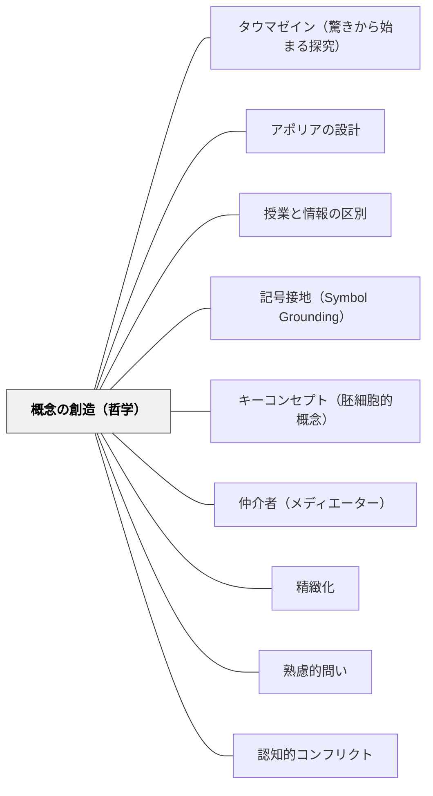

# 概念の創造（哲学）

> 概念は定義として渡すものではない——問いへの応答として共に創るものだ。概念を「教える」とは、概念が生まれた問いの運動に子どもを参加させることだ。

## [Pattern Connection]

### ドゥルーズ（1990）記号と事件——「哲学は概念を創造する」

ドゥルーズは哲学の本質を次のように定式化した：

> 「哲学は概念を創造する。概念は事件であり、問題への応答であり、不可分の領野を切り開くものだ。」——ドゥルーズ（記号と事件）

この定式が教育に与える含意は深い。「概念を教える」とは「定義を渡すこと」ではなく、「概念が生まれた問い（問題）に参加させ、その応答として概念が立ち現れる運動に加わらせること」だ。

**授業における「概念の創造」の順序：**

ドゥルーズの定式から導かれる授業設計の本質的な順序：

```
× 誤った順序：概念（定義）→ 問い → 適用
✓ 正しい順序：問い（問題） → 探索 → 概念が立ち現れる
```

概念は「問題への応答」として生まれる——だから「概念を教える前に問題を立てる」ことが本質的な順序になる。問いなき概念は「浮いた記号」であり、使える知識にならない（→[[パタン/記号接地（Symbol Grounding）]]）。

**「概念は事件（événement）である」という含意：**

概念は「伝達できる情報」ではなく「立ち現れる出来事」だ。授業で概念が「立ち現れる瞬間」——子どもが「あ、そういうことか」と感じる瞬間——は設計できるが、保証はできない。教師の仕事は「概念が立ち現れやすい問いの場を設計すること」だ。

**既存パタンとの関連：**
- **補強点**：[[パタン/タウマゼイン（驚きから始まる探究）]] の「驚きが探究の起点」という主張が「概念は問いへの応答として生まれる」という定式で裏打ちされる。
- **接続点**：[[パタン/アポリアの設計]] — アポリアは「概念を創造する前に立てる問い」を設計する操作。
- **補強点**：[[パタン/授業と情報の区別]] — 概念を「渡す（情報）」のか「生み出す（授業）」のかの区別に直結する。
- **波及するパタン**：[[パタン/キーコンセプト（胚細胞的概念）]] — 中核概念を「定義」でなく「問いへの応答」として設計する。

---

## 背景（Context）

授業で「概念を教える」場面は日常的だ。分数・光合成・民主主義・比喩——いずれも教師は「これがその概念だ」という形で概念名と定義を渡しやすい。

しかしドゥルーズが示すように、概念は本来「問題への応答」として生まれる。分数という概念は「等しく分けた場合の表現」という問題に応答して生まれた。光合成は「植物はどこからエネルギーを得るのか」という問題に応答して生まれた。概念にはつねに「それを必要にした問い」がある。

その問いを抜きに概念だけを渡すと、子どもは言葉を手に入れても概念は持てない。テストで定義を再現できるが、新しい場面で使えない——これが「わかった」ように見えて「使えない」状態の典型的なメカニズムだ。

## 問題（Problem）

「教えなければならない概念（学習指導要領・単元目標）」がある場合、教師は「概念を正確に伝えること」を優先しがちになる。

- 「○○とは〜のことです」という定義提示から授業が始まる
- 子どもが概念を「必要とする状況（問い）」に出会う前に概念が渡される
- 結果として概念は「浮いた記号」のまま——言葉は知っているが使えない

## 力のかたち（Forces）

- 学習指導要領には「教えるべき概念名」が列挙されており、それを「渡す義務」が生まれる
- 45分の授業時間の中で「問いから始める」ことは「定義から始める」より時間がかかる
- 教師自身が概念の「定義」を知っていても、その概念が「どんな問いへの応答として生まれたか」を知らない場合がある
- 子どもも「授業＝概念の定義を教えてもらう場」という前提で参加していることが多い
- テストが「定義を再現できるか」で評価する場合、「問いへの応答として概念を創る」ことの価値が見えにくい

## 解決（Solution）

**「その概念を必要とする問い」を授業の最初に設計する。概念の名前・定義は、問いへの探索の後に「立ち現れるもの」として位置づける。**

---

### 具体例①：概念を「渡す順序」と「創る順序」の比較

| 教科 | 渡す順序（定義先行） | 創る順序（問い先行） |
|---|---|---|
| 算数（分数） | 「分数とは、等分した部分の数を表します」 | 「ピザを3人で等しく分けたとき、1人分はどう表せる？」 |
| 理科（光合成） | 「光合成とは、光のエネルギーで養分を作る反応です」 | 「植物は何を食べて生きているんだろう？土？水？光？」 |
| 社会（民主主義） | 「民主主義とは、多数決で物事を決める仕組みです」 | 「クラス全員が納得できる決め方はあるか？多数決で傷つく人はどうなる？」 |
| 国語（比喩） | 「比喩とは、別のものにたとえた表現です」 | 「なぜ詩人はそのまま言わずにたとえるんだろう？たとえると何が変わる？」 |

「問いへの応答として概念が立ち現れる」授業では、子どもが概念に「出会う前の状態」を経験する。その欠如感が、概念を「必要なもの」として受け取らせる。

---

### 具体例②：「概念が生まれた問い」を教師が把握する

ドゥルーズの定式から、教師に求められる準備が変わる：

**従来の準備**：概念の「正確な定義」を把握する  
**概念の創造的準備**：「その概念が応答した問い」を把握する

- 分数 ← 「連続量を等分するとき、整数では表せない量をどう表すか」
- 速さ ← 「同じ時間で違う距離、同じ距離で違う時間——どちらが速いか比べるには？」
- 比喩 ← 「直接言えない感情・経験を言語化するには？」
- 民主主義 ← 「一人の絶対的支配者ではなく、共同体の意思をどう決定するか？」

概念を生んだ問いを知ることで、教師は「問いから概念へ」の経路を設計できる。

---

### 具体例③：「概念の立ち現れ」を観察する授業設計

概念は「立ち現れる瞬間」を子どもに体験させることで定着する。その瞬間の設計：

1. **問いを投げる**（分数なら「1/2と1/3、どちらが大きい？どうやって確かめる？」）
2. **探索させる**（折り紙を折る・図を描く・友達と議論する）
3. **概念の必要を感じさせる**（「これを表す共通の言葉が欲しいね」という状態を作る）
4. **概念が立ち現れる**（「これを分数といいます。1/2 は……」）
5. **概念を問いに戻す**（「この概念はあの問いへの応答だったね——他に使える場面は？」）

---

### 具体例④：「概念を創造した哲学者・科学者」を授業に登場させる

概念は「誰かが問いに応答して創った」もの——その「誰か」を授業に登場させることで、概念の「問いへの応答性」が見えやすくなる。

- 「ニュートンはリンゴが落ちるのを見て何を問うたのか？」（重力概念の問い）
- 「フロイトは人の不思議な行動を見て何を問うたのか？」（無意識概念の問い）
- 「デカルトは何を疑って、何が残ったのか？」（コギト概念の問い）

小学校でも同様：「分数を最初に使ったのは誰だろう？どんな問題を解こうとしていたのか？」

---

## 結果（Consequences）

- 子どもが概念を「言葉として知っている」状態でなく「問題解決の道具として持っている」状態になる
- 「なぜこの概念が必要なのか」という動機が内側から生まれる
- 新しい場面で概念を「使えるかどうか」の感覚が育つ（概念の転用能力）
- 教師自身が「概念の成り立ち」を問い直すことで、授業準備の質が変わる

## 関連パタン

- [[パタン/タウマゼイン（驚きから始まる探究）]] — 概念を必要とする問いは驚きから始まる
- [[パタン/アポリアの設計]] — 「知っているつもり」を崩すことが概念創造の前提
- [[パタン/授業と情報の区別]] — 概念を「渡す（情報）」のか「生み出す（授業）」のか
- [[パタン/記号接地（Symbol Grounding）]] — 概念（記号）は問い・経験に根を下ろすことで生きた理解になる
- [[パタン/キーコンセプト（胚細胞的概念）]] — 中核概念を「問いへの応答」として設計する
- [[パタン/仲介者（メディエーター）]] — 問いが仲介者として概念創造を媒介する
- [[パタン/精緻化]] — 概念の創造の後に「なぜ」を問うことで概念が深まる
- [[パタン/熟慮的問い]] — 概念創造の「出発点となる問い」を設計する技術
- [[パタン/認知的コンフリクト]] — 概念の必要感を生む認知的操作
- [[概念/ドゥルーズと出来事の哲学]] — 概念の創造論の哲学的基盤

## クラスター図



## Actionable Insight

- 今週の単元で「教えたい概念のリスト」を見直す——各概念について「その概念が応答した問いは何か？」を書き出してみる。答えられない概念があれば、それが設計の起点
- 次の導入授業で「概念名を最後に出す」試みをする——定義から入らず、問いと探索を先に置き、「これを○○といいます」が最後に来る授業を1本設計する
- 「この概念はどんな問いへの応答として生まれたか」を子どもに問う5分を単元の終わりに置く——「なぜこの概念が必要だったか」を振り返ることが転用能力を育てる

## 出典

ドゥルーズ，G．（宮林寛訳）（1992）．『記号と事件——1972-1990年の対話』河出書房新社．（原著: Deleuze, G. (1990). *Pourparlers, 1972-1990*. Minuit.）

> 「哲学は概念を創造する。概念は事件であり、問題への応答であり、不可分の領野を切り開くものだ。」——ドゥルーズ（記号と事件）
