# 概念の芯をつかむ（地力の学び方）

> 「そもそもこれは何をとらえようとしているか」——その問いが公式の奥にある芯に触れる。

---

## [Pattern Connection]

**小林俊行（2024）——「地力」をつける数学の学び方：感覚→論理→芯**

東京大学数理解析研究所の小林俊行は、文系1・2年生向けの微分・積分の講義経験から、「将来また新しいことを学べる素地」として「地力」を定義した。

> 「形だけを覚えた『公式』はすぐに忘れがちです。一方、『本質的なことをつかんで理解する』のは容易ではありませんが、いったん理解できれば細かいことを忘れても大事なことは残り、それが素養として長続きします」——小林（2024）

**「地力」の三要素：**

| 要素 | 内容 | 教育設計への示唆 |
|---|---|---|
| 感覚を先に磨く | 直観的なイメージが論理の道標になる | 定義の前に身近な場面で「感じる」時間を設ける |
| 概念の芯をつかむ | 公式でなく「これは何をとらえているか」を問う | 「なぜこの計算をするのか」を問い続ける |
| わからないことを育てる | ひっかかりを宝物として保持する | 「引っかかりは何か」を問い、切り捨てさせない |

**「感覚を研ぎ澄ませる」——複数の場面から同じ概念へ：**

小林は積分の芯（「細かく分けて積み上げる」）を、4つの方法で円の面積を求めることで体感させる：

| 方法 | アプローチ | 積分の原理との対応 |
|---|---|---|
| 方眼紙を使う | 細かいマス目で囲む（少なめ・多めの両端） | 区分求積法の直観 |
| 扇形を互い違いに並べる | 円を薄い扇に切って並べると長方形に | 微小部分の再組み立て |
| 同心円（バウムクーヘン）を使う | 年輪状の輪を切り開いて三角形に | 次元変換による積み上げ |
| 帯に切り分ける | 縦の細長い短冊を積み上げる | 区分求積の一般形 |

> 「積分という名称は非常によくできていて『細かく分けて積み上げる』という本質をとらえています。分割の方法はさまざまですが、どのように分割しても細かく分けて積み上げれば、同じ量にたどりつくという考え方です」——小林（2024）

**「わからないことを育てる」——アポリアを宝物として保持する：**

> 「『わからないこと』は切り捨てるのが楽ですが、そうせずに、気長に『自分の心の中で育てる』と、その一部が熟成して、大明な感じですっきりと理解できることもあります。『わからない気持ち』という宝物から、アンテナの感度が上がったり、新たな視野が開けたりして、『地力をつける』ことにつながっていくことでしょう」——小林（2024）

これはプラトンの「アポリア（知的困惑）」をフィールドに持ち続けることと同型の構造をなす。「何かしっくりこない」というひっかかりそのものが、後の理解の熟成の種になる。

**堀江真文（2019）との対比——「芯へのアプローチ」の二つの型：**

同じ微分積分を扱いながら、小林（2024）と堀江（2019）は対照的なアプローチをとる：

| | 小林俊行（2024）地力をつける | 堀江真文（2019）難しい数式は… |
|---|---|---|
| 対象 | 大学生（文系1・2年） | 数学が苦手な社会人 |
| 芯へのアプローチ | 複数の入口（4手法）から同じ芯へ | 等速→非等速の段階的橋渡しで芯へ |
| 記号への態度 | 感覚を先に磨いてから記号へ | 記号を出すたびに日常語に翻訳 |
| 「わからないこと」の扱い | 育てる（宝物として保持） | 「怖くない、意味がわかれば大丈夫」 |
| 目標 | 地力（自力再構成できる素養） | 数学脳の開花（現実と数式がつながる） |

どちらも「概念の芯をつかむ」ことを目指しながら、入口が異なる。小林は「感覚→論理」という内側からの掘り下げ、堀江は「記号の翻訳→意味の接地」という外側からの架け橋。

**他のパタンへの波及**：[[パタン/道具の限界から新概念へ（既知の壁を学びの入口に）]]（堀江の等速→非等速の設計）；[[パタン/記号接地（Symbol Grounding）]]（堀江の記号翻訳技法）；[[文献/難しい数式はまったくわかりませんが微分積分を教えてください（堀江真文）]]

---

**伊藤由佳理（2020）美しい数学入門——「数覚」と「深く考える」という芯のつかみ方：**

伊藤由佳理は第6章「数学との付き合い方」で、フィールズ賞受賞者・小平邦彦の「数覚（すうかく）」という概念を紹介しながら、「芯をつかむ」ための学び方について論じる。

> 「（数学センスとは）才能とはちょっと違う努力して得られるものに近い。たくさん練習したからと言って、上手なプレイヤーになれるわけではないというと理解しやすいかもしれない。もちろんもともとすごい才能を持っている人もいるが、いい指導者に巡り合うことや、いい練習方法に出会うことで得られる技術もある」——伊藤（2020）

**「たくさん解くより深く考える」という核心：**

> 「問題をたくさん解くことよりも、じっくり自分で考えることのほうが大事なのだ。他人が書いた解答を理解するよりも自分の頭で考えたほうが何倍も楽しいし、有意義である」

> 「問題集の解答を丸暗記する人もいるようだが、それは他人の作文を暗唱するのと同じだと言ったら、いかにおかしなことか気づいてもらえるだろう」

「公式を覚えて問題を解くのは数学ではない。数学は暗記科目ではない」という断言は、計算技術（スキル）と概念の芯（エッセンス）を区別する重要な宣言である。

**「問題の本質を見極める力」——数学の怠け者的知恵：**

「できるだけ楽な道を選ぶ努力をするので、実は数学は怠け者向きだともいえる」——これは「最もエレガントな方法を探す」という芯のつかみ方の別表現である。膨大な計算を強引に解くのではなく、「この問題の本質は何か？」を問うことで、一本の補助線や一つの変換が問題を一気に解決する。

**「正しいものは美しい」という感覚的ガイド：**

「全く根拠はないが、『正しいものは美しい』と信じているので、うまくまとまらないときは完成まで遠いと思ってしまうくらい『美しさ』にこだわる」——これは芯をつかんでいるかどうかを確認するための感覚的ガイドである。美しくまとまらないとき、それはまだ芯に届いていないサインである。

**三数学書の「芯のつかみ方」の比較：**

| | 小林（2024）地力をつける | 堀江（2019）難しい数式は… | 伊藤（2020）美しい数学入門 |
|---|---|---|---|
| 「芯」の定義 | 概念の本質（「積分＝細かく分けて積み上げる」） | 記号の意味（∫は無限に足し合わせるSのs） | 問題の本質（数覚） |
| 芯へのルート | 4手法から同じ結論へ（帰納） | 道具の限界→新概念の必要性 | 深く考える（量より質） |
| 「暗記」への態度 | 「公式は忘れがち、本質は残る」 | 「記号を翻訳すれば意味がわかる」 | 「解答丸暗記は他人の作文の暗唱」 |
| 美しさとの関係 | 「複数の入口が同じ芯に収束する」 | 「世界は微分で記述され積分で読む」 | 「正しいものは美しい」 |

**補強された点**：「たくさん解くより深く考える」「公式は暗記でなく自分で導く」という命題が、小平邦彦の「数覚」という概念と「正しいものは美しい」という感覚的ガイドによって補強される。算数教育において「計算ドリルをこなす」だけでは数覚は育たないという示唆は、実践的に重要。

**他のパタンへの波及**：[[パタン/分類の設計（「同じ」を決める力）]]（本統合の新規パタン）；[[文献/美しい数学入門（伊藤由佳理）]]

---

- **既存パタンとの関連**：[[パタン/具体から抽象へ]] の「複数の事例から共通の芯を発見する」プロセスを、数学の概念理解という文脈で具体化する。小林の「4つの入口から1つの積分の芯へ」という設計は、具体から抽象への実践形態として読める
- **補強された点**：「直観なき概念は空虚」（カント）・「五感から始めよ」（ペスタロッチ）という哲学的・実践的根拠に、「感覚を先に磨いてから論理へ」という数学教育の具体的な設計哲学が加わる。「感覚を研ぎ澄ませると論理思考のミスも減る」という洞察が注目に値する
- **修正・拡張された点**：「わからないことを育てる」という姿勢は、従来の「アポリアの設計（教師が困惑を設計する）」を超え、「学習者自身がアポリアを保持し続ける態度」——自己アポリア的姿勢——として拡張される
- **他のパタンへの波及**：[[パタン/タウマゼイン（驚きから始まる探究）]]（ひっかかりを宝物とする態度）；[[パタン/アポリアの設計]]（学習者自身のアポリア保持へ）；[[パタン/記号接地（Symbol Grounding）]]（記法が芯を運ぶ）

---

### 新装版 数学読本 1（松坂和夫, 1989）——「流れのあるストーリー」vs「技術や要領」

松坂和夫は1989年のまえがきで、本書の性格を次のように宣言する。

> 「私がこの講義で語りたいと思うのは、流れのある数学の一つのストーリーであって、技術や要領ではないからです。この講義はいわゆる受験数学とは関係ありません。この講義には人工的で不自然な棚はありません」——松坂（1989）

「技術や要領」の集積としての数学教育（受験数学）に対して、「流れとストーリー」を持つ数学教育が対置される。「人工的で不自然な棚」とは、理解の準備が整っていないのに強引に区切られたカリキュラムの節目のことである。

**小林（2024）・伊藤（2020）・松坂（1989）の三者比較——「芯」をめぐる系譜：**

| | 小林俊行（2024）| 伊藤由佳理（2020）| 松坂和夫（1989）|
|---|---|---|---|
| 「芯」の反対 | 形だけの公式暗記 | 「問題集の丸暗記は他人の作文の暗唱」 | 技術や要領（受験数学）|
| 「芯」への道 | 感覚→論理の順序・複数の入口 | 数覚・深く考える | 流れのある数学のストーリー |
| 「棚」の問題 | 単元ごとの切り離し | 学校数学vs現代数学のギャップ | 人工的で不自然な棚 |
| 時間軸 | 素養として「長続き」する | 生涯使える数学的思考 | 最終的に「かなり高いレベル」へ |

三者ともに「芯のない学習は揮発する」という認識を共有しながら、その処方箋の重点が異なる——小林は「感覚から入る設計」、伊藤は「量より質の学び方」、松坂は「ストーリーの流れに乗せる設計」。

**「統一的な方法を求める」——個別の技術から芯への姿勢：**

第1章で√2の無理数証明を扱った後、√3・√5・√6などにも同じ証明が使えないことを正直に認め：

> 「これらの数が無理数であることを統一的な方法によって『いっきょに証明する』機会をもちたいと思っています」——松坂（1989）

これは「芯をつかむ」とはアドホックな個別解法を積み上げることではなく、複数の場合を包む統一的原理を求めることだという態度を示している。

**補強された点**：
- 「地力（小林）」「数覚（伊藤）」「流れのあるストーリー（松坂）」という三つの用語が、「芯のある数学の学び」の同一の現象を異なる角度から照らしていることが確認される。
- 「人工的で不自然な棚はない」という設計原則は、算数授業の単元設計においても「なぜここで区切るか」という問いを生む。

**他のパタンへの波及**：
- [[パタン/わからなければ先に進む（迂回と再訪）]] — 松坂の「先に進んで戻る」戦略は、「ストーリーの流れに乗る」ことの実践形態
- [[文献/新装版 数学読本 1（松坂和夫）]]

---

## 背景（Context）

算数・数学の授業では、公式や手順を覚えて問題を解くという学習スタイルが広く定着している。短期的には有効だが、試験が終わると公式はすぐに揮発する。なぜなら、公式は「芯のない知識」——自分の経験・感覚・直観と接続していない記号列——だからだ。

一方、算数では「なぜこうなるか」という問いを深く扱う時間は少なく、「できる（計算できる）」ことが「わかる」と混同されやすい。

## 問題（Problem）

公式を覚えることで「わかった」と感じるが、初めて見る問題や文脈が変わった場面では使えない。あるいは「使えたはずの公式がどれかわからない」という状況に陥る。逆に「芯から理解しよう」と言われると、「難しすぎる」「時間がない」という壁に当たり、結局暗記に戻ってしまう。

## 力のかたち（Forces）

- 公式は短期的に効率的だが長期的に揮発する
- 感覚（直観）を先に磨くと、論理が明快になる——順序が大切
- ひとつの場面だけで理解を固定すると、文脈が変わったとき機能しない
- わからないことを保持する耐性が育っていないと、つまずいた瞬間に思考が停止する
- 「何をとらえているか」という問いを出発点にすると、公式は自然に「導ける」もの・「使える」ものになる

## 解決（Solution）

**「そもそもこれは何をとらえようとしているか」という根本的な問いを出発点とし、複数の身近な場面からアプローチして概念の「芯」を感じてから形式的な定義・公式へ進む。わからないことをすぐ解決しようとせず、「育てる」気持ちで保持する。**

---

### ステップ①：根本の問いを立てる

「公式を使う」の前に「これは何をとらえようとしているか」を問う。

- 「面積とはそもそも何か。なぜ計算できるのか」
- 「掛け算の意味をいくつかの場面で言い換えると？」
- 「わり算は何をしているのか」

---

### ステップ②：複数の身近な場面で「感じる」

抽象的な定義の前に、複数の場面で直観的に概念を体感する。

**積分の「芯」を感じる例（小学校版：面積を「細かく分けて積み上げる」）**

| アプローチ | 活動 | 体感できること |
|---|---|---|
| 方眼紙で囲む | 方眼紙の上に図形を置き、少なめ・多めに数える | 近似→精度が上がる感覚 |
| 切って並べる | 円を扇に切り、互い違いに並べる（折り紙でも可） | 形を変えても量は保存 |
| 同心円（バウムクーヘン） | 年輪状に切り開き、並べると三角形になる | 切り方を変えても同じ答え |
| 短冊に切る | 縦に細かく切ると短冊が積み上がる | 分割→足し合わせの直観 |

**微分の「芯」を感じる例（小・中学校版）**

- 坂道の勾配：「急な坂」と「ゆるやかな坂」は何が違うか
- 速度と位置：「1秒あたりどれだけ動いたか」
- 気温の変化：「昨日より今日は何度上がったか」

---

### ステップ③：わからないことを「育てる」

「この説明は何かしっくりこない」「どこかがわかっていない気がする」という感覚を切り捨てず、書き留めて持ち続ける。

- ノートの余白に「引っかかり」を書く（「なぜこうなるの？」「これと違うケースは？」）
- 答えを出そうとしなくてよい——保持すること自体が目的
- 後の授業・経験でそれが突然「わかった」瞬間が来ることが多い

---

### ステップ④：芯を言語化する

複数の場面から見えてきた「共通していること」を自分の言葉で言い換える。

- 「積分は、細かく切って足し合わせること。どう切っても同じ量になる」
- 「微分は、すごく小さい変化のときの割り算」
- 「面積は、細かい正方形の数のこと」

---

### 岩井の数学デイリーへの応用

毎日数学を学ぶ実践において、「地力をつける」視点から問いを一つ付け加える：
- 「今日学んだことは、何をとらえようとしているか」
- 「引っかかりは何か。切り捨てずに書き留める」
- 「別の場面で同じことが言えるか」

## 結果（Consequences）

- 公式を忘れても「芯」が残るため、必要なとき自力で再構成できる
- 新しい概念に出会ったとき、「これは何をとらえているか」という問いが自然に浮かぶ
- わからないことを「保持する力」が育つ——アポリアへの耐性
- ただし、感覚の段階に時間をかけすぎると形式的な学習が遅れる。感覚と論理のバランスが教師の腕の見せどころ

## 関連パタン
- [[パタン/アスペクトの気づき（もう見えていたのに見えていなかった）]]
- [[パタン/わからなければ先に進む（迂回と再訪）]]
- [[パタン/定義から始める（言葉を厳密にする）]]
- [[パタン/道具の限界から新概念へ（既知の壁を学びの入口に）]]
- [[パタン/分類の設計（「同じ」を決める力）]]

- [[パタン/具体から抽象へ]] — 複数の具体から「概念の芯（エイドス）」を取り出すプロセス
- [[パタン/Thin-Slicing設計（薄切り問題の作り方）]] — 一要素を変えて本質を際立たせる設計（本パタンとは補完的関係）
- [[パタン/タウマゼイン（驚きから始まる探究）]] — 「引っかかり」を宝物として育てる態度の源泉
- [[パタン/アポリアの設計]] — 知的困惑を設計的に生かす
- [[パタン/記号接地（Symbol Grounding）]] — 記法が概念の芯を運ぶ
- [[パタン/経験から出発すること]] — 感覚・身体的経験から出発する
- [[パタン/視覚的数学]] — 数学を図・イメージで感じる
- [[パタン/キーコンセプト（胚細胞的概念）]] — 単元・教科の「芯」を設計の核に置く
- [[パタン/既知から未知へ]] — 身近な場面から未知の概念へ進む
- [[パタン/認知的コンフリクト]] — わからない状態を生産的に設計する
- [[パタン/省察的評価]] — 「これは何をとらえているか」を問い続ける自己評価
- [[メタパタン/経験から出発する]] — 感覚→論理の順序の哲学的根拠

---

## クラスター図

```mermaid
flowchart LR
    ne6a682e5bfb5e381aee88aafe38292e381a4e3818be38280efbc88e59cb0e58a9be381aee5ada6e381b3e696b9efbc89["概念の芯をつかむ（地力の学び方）"]
    ne382a2e382b9e3839ae382afe38388e381aee6b097e381a5e3818defbc88e38282e38186e8a68be38188e381a6e38184e3819fe381aee381abe8a68be38188e381a6e38184e381aae3818be381a3e3819fefbc89["アスペクトの気づき（もう見えていたのに見えていなかった）"]
    ne3828fe3818be38289e381aae38191e3828ce381b0e58588e381abe980b2e38280efbc88e8bf82e59b9ee381a8e5868de8a8aaefbc89["わからなければ先に進む（迂回と再訪）"]
    ne5ae9ae7bea9e3818be38289e5a78be38281e3828befbc88e8a880e89189e38292e58eb3e5af86e381abe38199e3828befbc89["定義から始める（言葉を厳密にする）"]
    ne98193e585b7e381aee99990e7958ce3818be38289e696b0e6a682e5bfb5e381b8efbc88e697a2e79fa5e381aee5a381e38292e5ada6e381b3e381aee585a5e58fa3e381abefbc89["道具の限界から新概念へ（既知の壁を学びの入口に）"]
    ne58886e9a19ee381aee8a8ade8a888efbc88e3808ce5908ce38198e3808de38292e6b1bae38281e3828be58a9befbc89["分類の設計（「同じ」を決める力）"]
    ne585b7e4bd93e3818be38289e68abde8b1a1e381b8["具体から抽象へ"]
    n5468696e2d536c6963696e67e8a8ade8a888efbc88e89684e58887e3828ae5958fe9a18ce381aee4bd9ce3828ae696b9efbc89["Thin-Slicing設計（薄切り問題の作り方）"]
    ne382bfe382a6e3839ee382bce382a4e383b3efbc88e9a99ae3818de3818be38289e5a78be381bee3828be68ea2e7a9b6efbc89["タウマゼイン（驚きから始まる探究）"]
    ne382a2e3839de383aae382a2e381aee8a8ade8a888["アポリアの設計"]
    ne8a898e58fb7e68ea5e59cb0efbc8853796d626f6c2047726f756e64696e67efbc89["記号接地（Symbol Grounding）"]
    ne7b58ce9a893e3818be38289e587bae799bae38199e3828be38193e381a8["経験から出発すること"]
    ne8a696e8a69ae79a84e695b0e5ada6["視覚的数学"]
    ne382ade383bce382b3e383b3e382bbe38397e38388efbc88e8839ae7b4b0e8839ee79a84e6a682e5bfb5efbc89["キーコンセプト（胚細胞的概念）"]
    ne697a2e79fa5e3818be38289e69caae79fa5e381b8["既知から未知へ"]

    ne6a682e5bfb5e381aee88aafe38292e381a4e3818be38280efbc88e59cb0e58a9be381aee5ada6e381b3e696b9efbc89 --- ne382a2e382b9e3839ae382afe38388e381aee6b097e381a5e3818defbc88e38282e38186e8a68be38188e381a6e38184e3819fe381aee381abe8a68be38188e381a6e38184e381aae3818be381a3e3819fefbc89
    ne6a682e5bfb5e381aee88aafe38292e381a4e3818be38280efbc88e59cb0e58a9be381aee5ada6e381b3e696b9efbc89 --- ne3828fe3818be38289e381aae38191e3828ce381b0e58588e381abe980b2e38280efbc88e8bf82e59b9ee381a8e5868de8a8aaefbc89
    ne6a682e5bfb5e381aee88aafe38292e381a4e3818be38280efbc88e59cb0e58a9be381aee5ada6e381b3e696b9efbc89 --- ne5ae9ae7bea9e3818be38289e5a78be38281e3828befbc88e8a880e89189e38292e58eb3e5af86e381abe38199e3828befbc89
    ne6a682e5bfb5e381aee88aafe38292e381a4e3818be38280efbc88e59cb0e58a9be381aee5ada6e381b3e696b9efbc89 --- ne98193e585b7e381aee99990e7958ce3818be38289e696b0e6a682e5bfb5e381b8efbc88e697a2e79fa5e381aee5a381e38292e5ada6e381b3e381aee585a5e58fa3e381abefbc89
    ne6a682e5bfb5e381aee88aafe38292e381a4e3818be38280efbc88e59cb0e58a9be381aee5ada6e381b3e696b9efbc89 --- ne58886e9a19ee381aee8a8ade8a888efbc88e3808ce5908ce38198e3808de38292e6b1bae38281e3828be58a9befbc89
    ne6a682e5bfb5e381aee88aafe38292e381a4e3818be38280efbc88e59cb0e58a9be381aee5ada6e381b3e696b9efbc89 --- ne585b7e4bd93e3818be38289e68abde8b1a1e381b8
    ne6a682e5bfb5e381aee88aafe38292e381a4e3818be38280efbc88e59cb0e58a9be381aee5ada6e381b3e696b9efbc89 --- n5468696e2d536c6963696e67e8a8ade8a888efbc88e89684e58887e3828ae5958fe9a18ce381aee4bd9ce3828ae696b9efbc89
    ne6a682e5bfb5e381aee88aafe38292e381a4e3818be38280efbc88e59cb0e58a9be381aee5ada6e381b3e696b9efbc89 --- ne382bfe382a6e3839ee382bce382a4e383b3efbc88e9a99ae3818de3818be38289e5a78be381bee3828be68ea2e7a9b6efbc89
    ne6a682e5bfb5e381aee88aafe38292e381a4e3818be38280efbc88e59cb0e58a9be381aee5ada6e381b3e696b9efbc89 --- ne382a2e3839de383aae382a2e381aee8a8ade8a888
    ne6a682e5bfb5e381aee88aafe38292e381a4e3818be38280efbc88e59cb0e58a9be381aee5ada6e381b3e696b9efbc89 --- ne8a898e58fb7e68ea5e59cb0efbc8853796d626f6c2047726f756e64696e67efbc89
    ne6a682e5bfb5e381aee88aafe38292e381a4e3818be38280efbc88e59cb0e58a9be381aee5ada6e381b3e696b9efbc89 --- ne7b58ce9a893e3818be38289e587bae799bae38199e3828be38193e381a8
    ne6a682e5bfb5e381aee88aafe38292e381a4e3818be38280efbc88e59cb0e58a9be381aee5ada6e381b3e696b9efbc89 --- ne8a696e8a69ae79a84e695b0e5ada6
    ne6a682e5bfb5e381aee88aafe38292e381a4e3818be38280efbc88e59cb0e58a9be381aee5ada6e381b3e696b9efbc89 --- ne382ade383bce382b3e383b3e382bbe38397e38388efbc88e8839ae7b4b0e8839ee79a84e6a682e5bfb5efbc89
    ne6a682e5bfb5e381aee88aafe38292e381a4e3818be38280efbc88e59cb0e58a9be381aee5ada6e381b3e696b9efbc89 --- ne697a2e79fa5e3818be38289e69caae79fa5e381b8

    classDef hub fill:#f0f0f0,stroke:#555,color:#000,font-weight:bold
    class ne6a682e5bfb5e381aee88aafe38292e381a4e3818be38280efbc88e59cb0e58a9be381aee5ada6e381b3e696b9efbc89 hub
```

## Actionable Insight

- **「公式の前に問い」の習慣**：授業で公式を出す前に「これは何を求めようとしているか、自分の言葉で言えるか」を問う。答えられなくてよい——問うことが芯への扉を開く。
- **4つの切り方で面積を求める**：算数で面積の単元に入る前に、円（や不規則な図形）を「方眼紙・扇・年輪・短冊」の4方法で求めるグループワークを組む。どれも同じ答えになることへの驚きが積分の芯の体感につながる。
- **「引っかかりノート」を作る**：授業の最後2分で「今日のひっかかり（わからない、しっくりこない）」を1行書く。答えを出さなくてよい。2週間後に見返したとき「あ、これはあのときのひっかかりだ」という瞬間が生まれる。
- **岩井自身の実践**：数学デイリーに「今日学んだことは何をとらえているか」というメモ欄を一行加える。答えが出なくてよい——問いを保持することが地力の訓練になる。

---

## 出典

小林俊行（2024）『地力をつける 微分と積分 Learn Calculus, Expand Your Potentials』岩波書店
