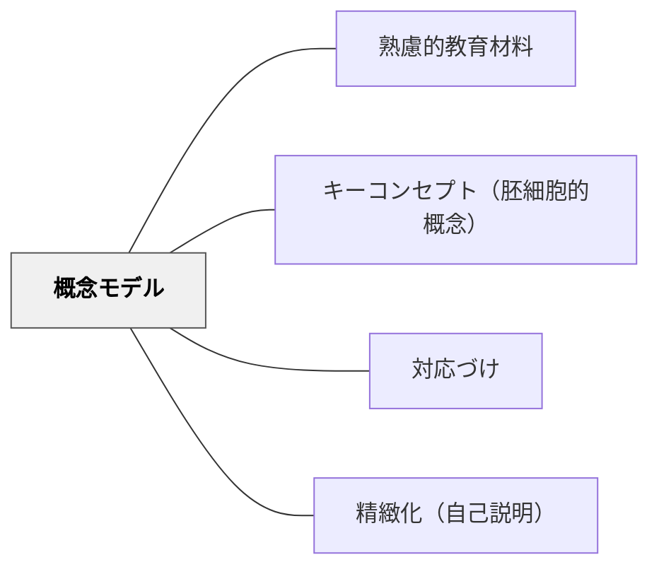

# 概念モデル

> 学習内容の構造・関係を図やモデルとして可視化し、学習者の理解を支援する。

## 背景（Context）

ノーマン「誰のためのデザイン？」におけるメンタルモデルの概念。学習者が内部に持つ「概念モデル（メンタルモデル）」を正確なものに育てることが学習の目標。概念図・概念地図・構造図・フレームワーク図などが手法。

## 問題（Problem）

言葉による説明だけでは、概念間の関係・全体構造が学習者に伝わらず、断片的な理解に留まる。

## 力のかたち（Forces）

- 図解は言語的説明より構造を直観的に把握させる
- 不正確なモデルは誤概念を固定化する
- シンプルすぎるモデルは細部を失う

## 解決（Solution）

**学習内容の核となる概念・関係・構造を図やモデルとして可視化する。学習者自身がモデルを構築・修正するプロセスが理解を深める。**

## 結果（Consequences）

- 概念の全体像と関係が把握しやすくなる
- 学習者のメンタルモデルが正確になる

## 関連パタン

- [[パタン/熟慮的教材教具]] — 親パタン
- [[パタン/キーコンセプト（胚細胞的概念）]] — モデルの核
- [[パタン/対応づけ]] — 既知との接続
- [[パタン/精緻化（自己説明）]] — モデルの内化

## クラスター図

## Actionable Insight

- 単元の終わりに「今日学んだ概念の関係を自由に図に描いてみよう」と言う——自分でモデルを構築するプロセスが理解の深さを確認・強化する
- 2人の学習者の概念図を並べてクラスで比較する——異なるモデルの対比が多様な理解の仕方を可視化し議論を生む
- 単元の導入時に不完全な概念図を示し、学習が進むにつれて学習者が修正・追記していく——モデルの更新過程が学習の進行を可視化する

## 出典

- 鈴木克明（2002）『教材設計マニュアル――独学を支援するために』北大路書房
- Donald Norman（1988）*The Design of Everyday Things*
