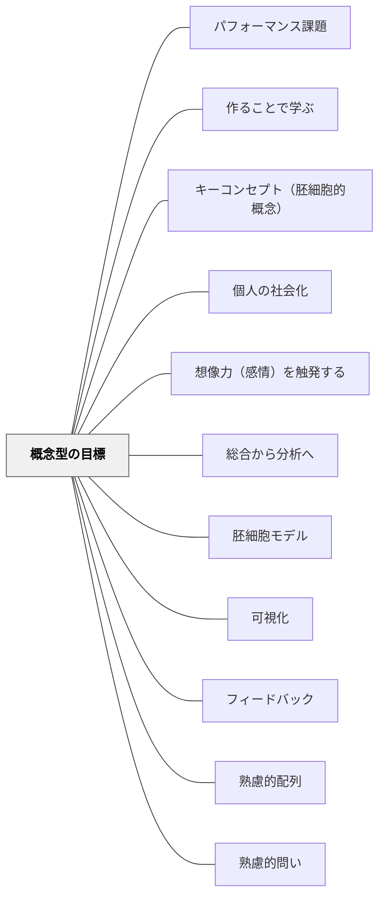

# 概念型の目標

**一文でいうと**：単なる活動目標でなく、学習者がつかむ概念や見方を目標に据える。

## 使いどころ・使いすぎ注意

| 観点         | 内容                                       |
| ------------ | ------------------------------------------ |
| 使いどころ   | 活動を概念理解へつなげたいとき。           |
| 使いすぎ注意 | 抽象語だけになると、子どもの経験と離れる。 |

> 概念型の目標を設定することで、網羅的学習を回避し、転移可能な深い理解への学習を設計できるようになる。

## 背景（Context）

教育の目標の分類にはさまざまな体系がある——ソロタキソノミー、ブルームのタキソノミー、ブルームのタキソノミーを修正したマルザノのタキソノミー、ガニエの学習成果の5分類など。

しかし目標の設計に失敗して、無数の教育実践は**網羅的学習を通して浅い知識の習得に終始**してきた。よりよい教育目標の設計が求められている。

## 問題（Problem）

「何を教えるか」のリスト（学習内容の網羅）が目標になってしまうと、学習者は深い理解に至らず、学んだことを別の場面へ転移・応用できない。なぜ概念型の教育目標の設計が大事か——転移可能な学習者の深い理解のために、網羅的学習を避けたいからだ。

## 力のかたち（Forces）

- 「何を教えるか」の羅列は教師にとって安心だが、学習者の深い理解につながらない
- 目標が曖昧だと、教師も生徒もフィードバックを得て学習を修正することができない
- 観察可能な目標があると、活動・評価・フィードバックが目標に向かって整合してくる
- 転移可能な概念を軸にした目標は、教育実践全体の「ぶれない軸」になる

## 解決（Solution）

**〇〇を通して、□□を△△するという概念型の目標を設計せよ。**

---

### 概念型の目標設計の前提：教材研究

よりよい教育目標の設計のためには、**教材研究が前提**として必要だ。教育経験の設計者は教材（現象）を深く理解しなければならない。ユーリア・エンゲストロームは「胚細胞モデル」という考え方を提案したが、これが教材研究にとても有用である（[[パタン/胚細胞モデル]]を参照）。

胚細胞モデルによって、**転移可能な胚細胞的な概念**を明らかにする。この胚細胞的な概念を含む命題は、ビッグアイデア／重大な観念（Wiggins ら, 2012）／キーコンセプトとなる。

---

### 目標設計の型：〇〇を通して、□□を△△する

| 要素       | 内容                                                                                                 |
| ---------- | ---------------------------------------------------------------------------------------------------- |
| **△△する** | 観察可能な動詞。「理解する」ではなく「説明する」「表現する」「プレーする」など学習を可視化するゴール |
| **□□**     | 転移可能な胚細胞的な概念を組み合わせて作る命題（ビッグアイデア）を入れる                             |
| **〇〇**   | □□の理解のために、どのような学習活動をするのかを入れる                                               |

**△△するを観察可能にする**理由：教師も生徒も目標を共有し、学習活動を通してフィードバックを得て学習を修正していくことができるようになるから。深い理解へと地に足をつけて共に進むことができるようになる。

---

### 具体例①：体育「ゴール型スポーツ」

**概念型の目標：**

> サッカーを通して、「スペースを広げて攻めたり、スペースを狭くして守ったりすることでより多くゴールできたり失点を少なくできたりすること」を表現する（説明する・プレーする）。

- **〇〇（学習活動）**：サッカー
- **□□（ビッグアイデア）**：スペースを広げて攻めたり、スペースを狭くして守ったりすることでより多くゴールできたり失点を少なくできたりすること
- **△△（観察可能なゴール）**：表現する・説明する・プレーする

この「スペース」という概念を理解することで、バスケットボールやハンドボール、ラグビーなど**他のゴール型スポーツに応用できるようになる**。これが転移可能な概念型目標の力だ。

---

### 概念型の目標設計の利点——ガニエの目標設計との比較

ガニエの教育目標の設定方法（状況・動詞・対象・道具・制約などの要素を組み合わせる方法）と比べて、**〇〇を通して□□を△△するという型の方がシンプルで使いやすい**。

ガニエの目標設計の要素にある「状況」や「手段」は、この型で記述した目標からおのずと出てくるものだと考えている。□□に重要な概念を含む命題（子どもたちに理解してほしいビッグアイデア）を入れれば、おのずと何の活動で・どのような状況で・どんな手段でが見えてくる。

---

### 概念型の目標が教育設計の軸になる

**概念型カリキュラムの肝は、目標の設計にある。** 日本の指導案で言えば「単元目標」にあたるものだ。

目標が明確になれば、一筋縄ではいかないけれども、**授業の目標や方法が芋づる式に出てくる**。胚細胞的概念や概念型の目標が定まると：

- どのようなスキルが必要になるかが分かる
- どのような学習活動が適切かが分かる
- 軽重がつけられ、網羅的学習を避けることができる
- その1つのまとまりの教育実践の最後まで、**1本ぶれない軸**ができる

---

### 授業エピソード：6年生「海の命」読書会（概念型目標の実例）

ある授業研究で関わった6年生の国語授業（「海の命」が主教材の読書会）の実践。

授業の中で子どもたちはテーマ（話題）によって**自分たちでグループを組んで話し合い**、さらに授業内で目的に応じて**グループを組み直して話し合い**を続けていた。

**なぜこれができたか**——話し合う価値のあるテーマの選定に成功していたからだ。

**教育設計の軸に据えた概念：「成長」**——多くの物語・文学作品に共通する鍵概念（胚細胞的概念）。

この「成長」という概念を軸に、子どもたちと話し合う価値のあるテーマ・話題を生成・体系化していた：

- 「成長するとはどういうことか」
- 「自分の成長を支えるものは何だろうか」
- 自分自身のこれまでの経験や読書とも関連づけて考えていく

話し合う価値のある読書会のテーマを作る段階から、**「成長」という概念が授業全体を最後まで貫いていた**ことがこの教育設計の効果的な要素だったと思う。

**具体的なテーマ例：「村一番と一人前にはどのような違いがあるのだろうか」**——あるグループの子どもたちはこのテーマについて熱心に解釈を伝え合っていた。「成長」という概念が教育設計の軸にあるからこそ選ばれたテーマだった。

このテーマは以下のすべてに価値のあるテーマとして機能した：

1. 作品テキストの解釈を深めるためにも
2. 「成長とは何か」「成長を支えるものとは何か」という問に答えるためにも
3. 自分自身の成長について考えることにも

これは概念型目標が教育設計の軸として機能した実例だ。

## 結果（Consequences）

- 網羅的学習を回避し、転移可能な深い理解を目指した教育設計ができる
- 教師も生徒も観察可能な目標を共有でき、フィードバックを得て学習を修正できる
- 目標が定まることで、活動・評価・方法が芋づる式に明確になる
- 学んだことが別の場面・教科・スポーツなどへ転移・応用できる力が育つ
- 教育実践全体の最後まで1本ぶれない軸ができる

## 関連パタン
- [[パタン/パフォーマンス課題]]
- [[パタン/作ることで学ぶ]]
- [[パタン/キーコンセプト（胚細胞的概念）]]
- [[パタン/個人の社会化]]
- [[パタン/想像力（感情）を触発する]]
- [[パタン/総合から分析へ]]

- [[パタン/胚細胞モデル]] — 概念型の目標の前提となる教材研究・胚細胞的概念の明確化
- [[パタン/可視化]] — 観察可能な目標が学習を可視化する
- [[パタン/フィードバック]] — 明確な目標があってはじめて有効なフィードバックができる
- [[パタン/熟慮的配列]] — 概念型の目標から逆算した学習の順序設計
- [[パタン/熟慮的問い]] — 概念型の目標から生まれる問い

## クラスター図

## Actionable Insight

- 次の単元目標を「〇〇を通して、□□を△△する」の型で書き直す——「算数を学ぶ」ではなく「3桁の計算を通して、位取りの仕組みを説明する」のように
- 授業の導入で「今日は何のために何を学ぶのか」を一文で伝える——概念型の目標が学習者と共有されると活動の意味が変わる
- 学習後に「これ、他の場面でも使えそう？」と問う——転移可能性を意識させる問いが概念的理解を深める

## 出典
- [[文献/一つの教育のパタン・ランゲージ]]

Wiggins, G. & McTighe, J.（2012）「理解をもたらすカリキュラム設計」（ビッグアイデア・重大な観念）  
ユーリア・エンゲストローム「変革を生む研修のデザイン」鳳書房（胚細胞モデル）  
ガニエ（学習成果の5分類・目標設計の要素）  
岩井輝久「岩井輝久『一つの教育のパタン・ランゲージ』」（2026-04-29 vault収録）  
岩井輝久「パタン　概念型の目標（動画記録）」https://youtu.be/txocZiY_kZc
