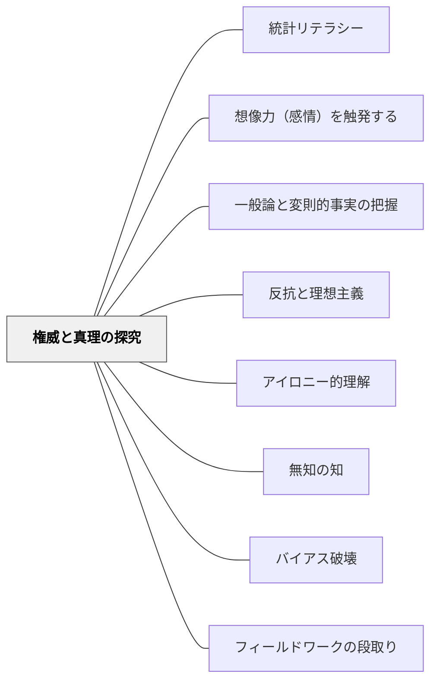

# 権威と真理の探究

> 「本当のところはどうなのか」という問いが、哲学・科学的探究の核心にある

## 背景（Context）

哲学や科学の歴史は、権威ある説への疑問と「本当のことを知りたい」という純粋な欲求によって推進されてきた。ソクラテスの無知の知から現代科学の仮説検証まで、真理への問いは人間の根本的な知的衝動である。

## 問題（Problem）

教育の場で「正解」を覚えることが中心になると、「本当のところはどうなのか」という問いそのものへの感覚が育たない。権威ある教科書や教師の言葉が絶対視され、探究の動機が失われる。

## 力のかたち（Forces）

- 「正しいとされていること」と「本当に正しいこと」の間には常に緊張がある
- この緊張が、哲学的・科学的探究のエネルギー源となる
- 権威への健全な疑問は、批判的思考の出発点である
- しかし、根拠のない反権威主義は懐疑主義や虚無主義に陥る危険もある

## 解決（Solution）

「権威ある説がどのように形成され、どのような証拠によって支持され、どんな反証によって修正されてきたか」を歴史的文脈とともに教える。「先生やテキストにそう書いてあるから」ではなく、「なぜそれが正しいといえるのか」を問う授業を設計する。

哲学・科学・歴史・倫理など各教科において、「本当のところ」を問い続ける態度をモデルとして示し、学習者自身がその問いを立てられるよう導く。

## 結果（Consequences）

学習者は知識を暫定的・検証可能なものとして扱う力を育む。探究・批判・対話の習慣が形成される。ただし、適切な証拠評価の能力なしに「何でも疑う」姿勢だけが育つと、学習の深まりが阻害されることがある。

## 関連パタン
- [[パタン/統計リテラシー]]

- [[パタン/想像力（感情）を触発する]]
- [[パタン/一般論と変則的事実の把握]]
- [[パタン/反抗と理想主義]]
- [[パタン/アイロニー的理解]]
- [[パタン/無知の知]]
- [[パタン/バイアス破壊]]
- [[パタン/フィールドワークの段取り]] — 専門家から直接学ぶ姿勢の実践化

## クラスター図

## Actionable Insight

- 「先生やテキストにそう書いてあるから」ではなく「なぜそれが正しいといえるのか」を問う場面を一単元に一度作る——権威への健全な疑問が批判的思考の出発点になる
- 科学・歴史の授業で「この説が修正されてきた歴史」を一例紹介する——知識が暫定的・検証可能なものであるという感覚が探究の動機を生む
- 「教科書は正しいか？ 本当のところはどうなのか？」という問いを一度立てさせ証拠を探す活動をする——「本当のことを知りたい」という欲求が学習の核心に火をつける

## 出典

Egan, K. (2005). *An Imaginative Approach to Teaching*. Jossey-Bass.（邦訳（2010）『想像力を触発する教育――認知的道具を活かした授業づくり』北大路書房）
