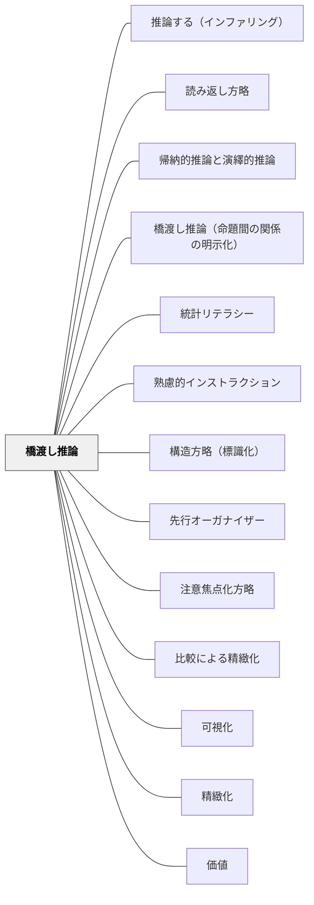

# 橋渡し推論

> 「AだからB」「AとBは対比関係にある」と関係を明示することで、理解の結束性を高める。

---

## 背景（Context）

テキストや説明の中に書かれた事実・命題は、それぞれ単独では意味を持っても、相互の関係が明示されていなければ「断片の集まり」に留まる。学習者が「わかった」と感じるのは、情報を並べた状態ではなく、命題と命題の間の関係（因果・対比・条件・順序）を推論し統合したときだ。

山本博樹（2019）はこの関係推論を**橋渡し推論（bridging inference）**と呼び、説明の質を左右する中核的な認知プロセスと位置づけた。そして教師の説明設計においては、学習者が自力でこの推論を行えるよう関係を明示的に示すことが有効だと示した。

## 問題（Problem）

「Aである。Bである。」と並べて書いても、AとBの関係は伝わらない。「AだからB」なのか「AだがB」なのか、「AはBの原因」なのか「AはBと対照的」なのかは、読者・聴衆が自分で推論するしかない。

この推論を必要以上に学習者に任せると、関係の誤読・見落とし・断片的な理解が起きる。特に抽象度が高い内容・初めて出会う概念では、関係の明示がなければ「並んでいる事実」として処理され、統合的な理解には至らない。

## 力のかたち（Forces）

- 接続詞・関係語（「なぜなら」「したがって」「一方で」「ただし」「つまり」）が橋渡し推論の言語的手段
- 矢印・記号・図解を使った視覚的な関係明示も有効
- 関係を明示しすぎると説明が冗長になり、学習者が自分で推論する機会が失われる
- 学習者に「この二つはどんな関係？」と問うことで、能動的な推論が生まれる
- 認識（何がどんな関係にあるか）と評価（良い・悪い）を混同すると、関係を問う場面が萎縮した雰囲気になる

## 解決（Solution）

**命題間の関係を接続詞・関係語・図解を使って明示的に示す。また、学習者自身が推論する機会を設ける。**

---

### 関係の種類と使う表現

| 関係の種類 | 接続表現の例 |
|-----------|-------------|
| **因果** | なぜなら・だから・したがって・その結果 |
| **対比** | 一方で・それに対して・ところが・しかし |
| **条件** | もし〜なら・〜という条件のもとで |
| **順序** | まず・次に・最後に・〜の後で |
| **換言** | つまり・言い換えると・要するに |

---

### 板書での実践

「A → B」と矢印を書いて「これはどんな関係？」と聞く。接続語を板書に明示する習慣をつくるだけで、授業の中に橋渡し推論の足場が生まれる。

---

### 「関係を問う」発問

- 「この二つの出来事、どんな関係があると思う？」
- 「Aが起きたのはなぜ？ BとCのどちらが原因に近い？」
- 「これとさっきの話は似ている？それとも反対？」

正解より**関係の言語化**を求める問いにすることで、学習者の推論が可視化される。

---

## 結果（Consequences）

- 断片的な知識が関係によってつながり、統合的な理解が形成される
- 学習者が因果・対比・条件などの論理的関係を自分で推論する力が育つ
- 説明の結束性が高まり、受け手の理解の正確さが向上する

## 関連パタン
- [[パタン/推論する（インファリング）]]
- [[パタン/読み返し方略]]
- [[パタン/帰納的推論と演繹的推論]]
- [[パタン/橋渡し推論（命題間の関係の明示化）]] — 本パタンの理論・研究版
- [[パタン/統計リテラシー]]
- [[パタン/熟慮的インストラクション]] — 親パタン
- [[パタン/構造方略（標識化）]] — 構造全体を明示する方略
- [[パタン/先行オーガナイザー]] — 全体の関係構造を事前に示す
- [[パタン/注意焦点化方略]] — 関係の核心に注意を向ける
- [[パタン/比較による精緻化]] — 比較・対比による関係の明確化
- [[パタン/可視化]] — 関係を図解で見える形にする
- [[パタン/精緻化]] — 命題間の関係づけが精緻化の核心
- [[パタン/価値]] — 認識と評価の区別；橋渡し推論は認識作用

## クラスター図

## Actionable Insight

- 板書するとき、2つの事柄の間に矢印と接続語（「なぜなら」「したがって」「一方で」）を書く習慣を今日1回試す——接続語が「見える」だけで理解の結束性が上がる
- 「AとBはどんな関係だと思う？」と子どもに問う——正解ではなく関係の言語化を促す
- 理論・研究の詳細は [[パタン/橋渡し推論（命題間の関係の明示化）]] を参照

---

## 出典

山本博樹（2019）『教師のための説明実践の心理学』ナカニシヤ出版
