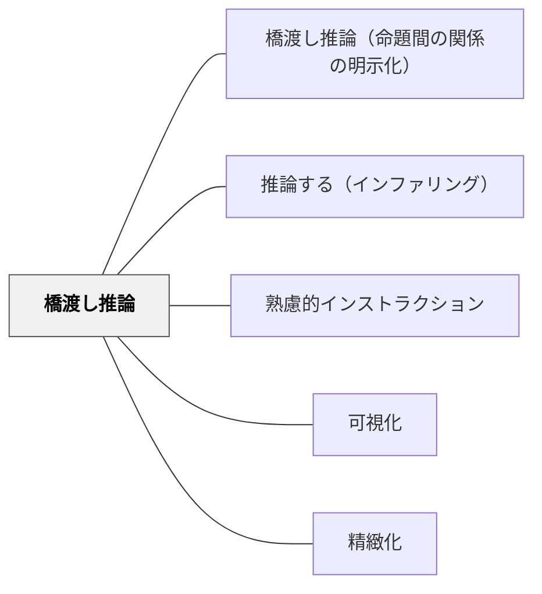

# 橋渡し推論

> 「AだからB」「AとBは対比関係にある」と関係を明示することで、理解の結束性を高める。

詳細は [[パタン/橋渡し推論（命題間の関係の明示化）]] を参照。

## 概要

テキストや説明で「Aである。Bである。」と並列に置かれているだけでは、AとBの関係（因果・対比・条件・順序）が伝わらない。命題間の関係を接続詞・矢印・図解で**明示**することで、学習者の統合的な理解が深まる。

**主な橋渡し表現：** 「なぜなら」「したがって」「一方で」「ただし」「ということは」「それに対して」

**板書・説明での実践：** 矢印・記号・関係語を意識的に使い、「この二つはどんな関係だと思う？」と問うことで能動的な推論を促す。

**出典：** 山本博樹（2019）『教師のための説明実践の心理学』ナカニシヤ出版

## 関連パタン

- [[パタン/橋渡し推論（命題間の関係の明示化）]] — 本パタンの主エントリー
- [[パタン/推論する（インファリング）]] — 読解における推論
- [[パタン/熟慮的インストラクション]] — 指示設計の上位パタン
- [[パタン/可視化]] — 関係を図解で見える形にする
- [[パタン/精緻化]] — 命題間の関係づけが精緻化の核心

## クラスター図

## Actionable Insight

- 板書するとき、2つの事柄の間に矢印と接続語（「なぜなら」「したがって」「一方で」）を書く習慣を今日1回試す——接続語が「見える」だけで理解の結束性が上がる
- 「AとBはどんな関係だと思う？」と子どもに問う——正解ではなく関係の言語化を促す
- 詳細は [[パタン/橋渡し推論（命題間の関係の明示化）]] を参照
