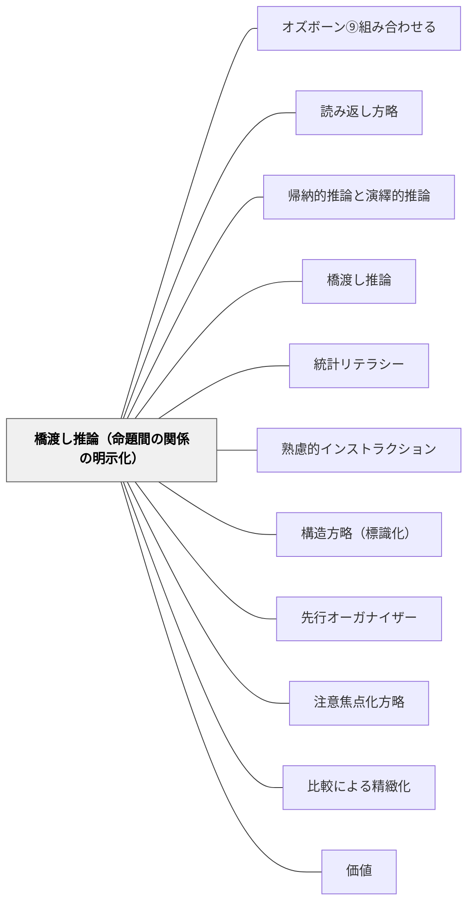

# 橋渡し推論（命題間の関係の明示化）

> 「AだからB」「AとBは対比関係にある」と関係を明示することで、理解の結束性を高める。

## Pattern Connection

### 牧口常三郎（1931）——認識と評価の区別：橋渡し推論は認識作用である

*創価教育学体系 第2巻* の「認識と評価の峻別」は、橋渡し推論の本質を哲学的に裏付ける。

**橋渡し推論は純粋な認識作用**

牧口は認識作用（対象の実在・関係を捉える働き）と評価作用（対象が自分の生命に対してどんな関係力を持つかを測る働き）を根本的に区別する。

橋渡し推論——「AだからB」「AとBは対比である」という命題間の関係の明示——は**認識作用**である。それは「何が何に対してどんな関係にあるか」という事実の把握であり、好悪や価値判断（評価）ではない。

**混同が起こすと教育場面でどうなるか**

> 「生徒が教師に『何ですか』と質問する。この場合に『まだこんな事が解らないのか』と反費するならば、これは明らかに認識作用と評価作用とを混希したるものではないか」（牧口）

橋渡し推論を促す場面でも同じことが起きる。「AとBの関係がわからない」は認識の問題であり、「まだわからないの？」という応答は評価の混入である。教師が「この二つの関係は何だと思う？」と問うとき、それは認識を求める行為であり、学習者の人格・能力の評価ではない——この区別が指導の安全性を作る。

**実践への示唆**

- 関係を問う（「AとBはどんな関係？」）は認識の問い——正解/不正解で評価せず、関係の言語化を純粋に促す
- 「なぜなら・したがって・一方で」の選択を間違えても、それは関係の認識の誤りであり人格評価ではない——訂正は認識の修正として行う

- **他のパタンへの波及**：[[パタン/価値]]（認識と評価を区別することが価値教育の前提）・[[パタン/熟慮的インストラクション]]（指示設計で認識と評価の場面を分ける）

**Blitzer（2014）統合（2026-05-24）——論理・条件文と橋渡し推論：**

*Thinking Mathematically* Ch.3「Logic」は条件文（Conditional Statement）を形式化する。p → q（「p ならば q」）は橋渡し推論の形式的な表現であり、「A だから B」という命題間の関係を論理的に扱う基盤を与える。

- **補強された点**：橋渡し推論の「だから・なぜなら・したがって」という接続は、条件文の方向性（p → q）と対応する。Blitzer が示す「必要条件（necessary condition）」と「十分条件（sufficient condition）」の区別——"q is necessary for p" / "p is sufficient for q"——は、橋渡し推論の「なぜ接続するか」の論理的精度を高める
- **拡張された点**：量化文の否定（「すべての A は B」の否定は「ある A は B でない」）は、橋渡し推論の誤りを検出する道具として使える。「A → B だから B → A」という誤った逆転を見抜く論理訓練として
- **他のパタンへの波及**：[[パタン/帰納的推論と演繹的推論]] — 演繹推論の形式化が橋渡し推論に論理的基盤を与える。[[パタン/統計リテラシー]] — 統計的因果推論の誤り（相関を因果と混同する）を橋渡し推論の精度で見抜く

---

## 背景（Context）
山本博樹（2019）『教師のための説明実践の心理学』ナカニシヤ出版で示された説明実践の方略の一つ。テキスト・説明の理解は、個々の命題（文・事実）を把握するだけでなく、命題間の関係（因果・対比・条件・順序など）を推論することで深まる。この命題間の関係を結ぶ推論を「橋渡し推論」と呼び、それを読者・聴衆が自力で行えるように関係を明示する方略が「橋渡し推論の促進」である。

## 問題（Problem）
テキストや説明は必ずしも命題間の関係を明示しているわけではない。「Aである。Bである。」と並列に書かれているだけでは、「AだからB」なのか「AだがB」なのかが分からない。関係が不明確なまま情報が並ぶと、学習者は断片的な知識を持つことになり、統合的な理解に至らない。

## 力のかたち（Forces）
- 関係の明示化は理解を助けるが、多すぎると説明が冗長になる
- 接続詞・関係詞（「したがって」「一方」「それゆえ」「ただし」）が橋渡し推論の言語的手段
- 学習者が自分で関係を推論する力も育てる必要がある
- 図・矢印を使った視覚的な関係明示も有効

## 解決（Solution）
**「AはBが原因で起こる（因果）」「AとBは対照的である（対比）」「Aを行う前提としてBが必要（条件）」など、命題間の関係を接続詞・関係語・図解を使って明示的に示す。**
説明の中で「なぜなら」「つまり」「一方で」「ということは」などの接続表現を意識的に使う。板書でも矢印・記号を使って関係を図示する。学習者に「この二つはどんな関係だと思いますか？」と問うことで、橋渡し推論を能動的に行わせる機会を設ける。

## 結果（Consequences）
- 断片的な知識が関係によってつながり、統合的な理解が形成される
- 学習者が因果・対比・条件などの論理的関係を自分で推論する力が育つ
- 説明の結束性が高まり、受け手の理解の正確さが向上する

## クラスター図

## Actionable Insight

- 「なぜなら」「つまり」「一方で」「ということは」などの接続表現を意識的に使う——断片的な知識が関係によってつながり統合的な理解が形成される
- 板書で矢印・記号を使って命題間の関係を図示する——視覚的な関係明示が論理的関係の理解を助ける
- 学習者に「この二つはどんな関係だと思いますか？」と問う——橋渡し推論を能動的に行わせる機会を設ける

## 出典

- 一つの教育のパタン・ランゲージ（岩井輝久）

## 関連パタン
- [[パタン/オズボーン⑨組み合わせる]]
- [[パタン/読み返し方略]]
- [[パタン/帰納的推論と演繹的推論]]
- [[パタン/橋渡し推論]]
- [[パタン/統計リテラシー]]
- [[パタン/熟慮的インストラクション]] — 親パタン
- [[パタン/構造方略（標識化）]] — 構造全体を明示する方略
- [[パタン/先行オーガナイザー]] — 全体の関係構造を事前に示す
- [[パタン/注意焦点化方略]] — 関係の核心に注意を向ける
- [[パタン/比較による精緻化]] — 比較・対比による関係の明確化
- [[パタン/価値]] — 認識と評価の区別；橋渡し推論は認識作用
