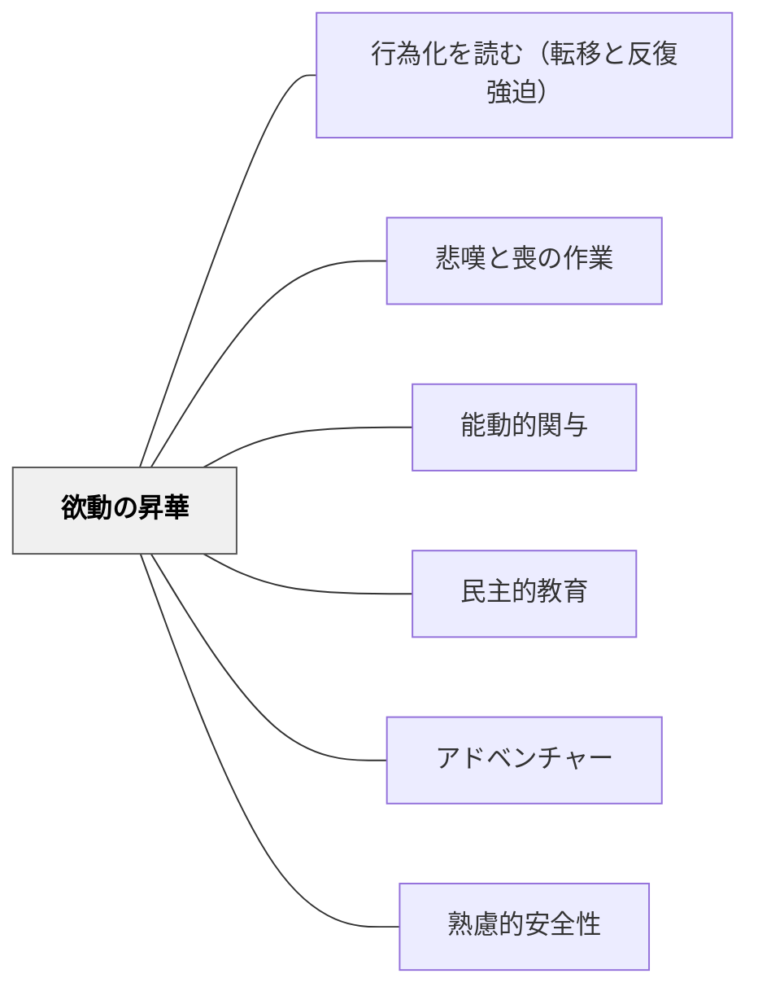

# 欲動の昇華

> 子どもの「壊したい」「勝ちたい」「暴れたい」というエネルギーを否定するな——それをどこへ向けるかを設計せよ。タナトスを否定しても消えない。昇華によってエロスへと変換することができる。

---

## Pattern Connection

**フロイト「人はなぜ戦争をするのか　エロスとタナトス」（中山元訳）統合（2026-06-03）：**

「昇華（Sublimation）」はフロイトの欲動理論の中核概念であり、攻撃欲動（タナトス）を文化的・社会的・知的活動に向け直すプロセスを指す。本パタンはこの概念を教育設計の原理として展開する。

- **既存パタンとの関連**：[[概念/エロスとタナトス]] が昇華を概念として定義しているのに対し、本パタンは教室でどのように昇華の「チャンネル」を設計するかという実践的次元を扱う。[[パタン/悲嘆と喪の作業]] が「失われたものの喪の作業」を扱うのに対し、本パタンは「攻撃的エネルギーの建設的転換」を扱う
- **補強された点**：子どもの問題行動（暴力・いじめ・反抗・破壊）への介入として「やめさせる」より「どこへ向けるかを設計する」という視点が加わる。フロイトの「攻撃性のない人間はいない。問題はその扱い方にある」という命題が教育設計の根拠になる
- **他のパタンへの波及**：[[パタン/能動的関与]]（タナトスの知的昇華が能動的関与を生む）；[[パタン/民主的教育]]（攻撃欲動の民主的な制御と昇華）；[[パタン/アドベンチャー]]（リスク・挑戦へのタナトスの昇華）

---

## 背景（Context）

教室には「壊したい」「打ち負かしたい」「暴れたい」「無視したい」というエネルギーを持つ子どもが必ずいる。これをフロイトは「攻撃欲動（タナトス）」の表れとして理解した——人間の根本的な欲動であり、根絶することはできない。

通常の教育的介入は「やめさせる（禁止）」か「罰する（抑圧）」に向かいがちだ。しかしフロイトの欲動理論が示すのは、抑圧された欲動は消えるのではなく、より見えにくい形（問題行動・身体症状・強迫的繰り返し）で表出するということだ。

昇華（Sublimation）は、欲動の目標を変えずにその方向を変える——攻撃エネルギーを「破壊」から「競争・批判・分析・スポーツ・表現」へと向け直す。昇華に成功した欲動は、文化・科学・芸術・知性の源泉になる。

## 問題（Problem）

子どもの攻撃的・破壊的エネルギーへの対応が、「やめさせる（禁止）」か「罰する（抑圧）」しかなくなってしまっている：

- 暴力をふるう → 指導・謝罪・罰
- 授業妨害をする → 注意・切り離し
- いじめる → 叱責・指導
- 乱暴に物を扱う → 禁止・取り上げ

これらの対応は「問題行動を消す」ことを目指しているが、欲動そのものには届かない。禁止されたエネルギーは別の形で噴出する——また問題行動が繰り返される理由がここにある。

## 力のかたち（Forces）

- 攻撃欲動（タナトス）は人間の根本的な欲動であり、教育によって根絶することはできない
- 禁止・罰は欲動を抑圧するが消滅させない——抑圧された欲動は別の出口を探す
- 攻撃エネルギーは、適切な「チャンネル」が与えられれば、文化的・知的・身体的活動の強力な燃料になる
- 昇華は意識的なプロセスではない——「攻撃欲動を昇華しよう」と子どもに言っても効果はない。設計者（教師）が「向かえる場所」を用意することが必要
- エロス（結びつき・愛着・共同体への参加）がある環境では、昇華が起きやすい——孤立・排除・不安の環境では昇華より抑圧・爆発が起きやすい

## 解決（Solution）

**「このエネルギーはどこへ向かったら建設的か」を問い、そのチャンネルを授業・活動・学級に設計する。**

---

### 1. タナトスを「読む」——攻撃エネルギーの分析

| 現れ方 | タナトスの方向 | 昇華のチャンネル候補 |
|---|---|---|
| 物を壊す・投げる | 解体・破壊への欲動 | 実験（壊して中を見る）・工作（解体して再構成）・リサイクルアート |
| 激しく主張する・言い争う | 支配・打ち勝つ欲動 | 討論・弁論・議論・批判的思考の場 |
| 暴力的なゲームに熱中する | 競争・敵対への欲動 | スポーツ・ゲーム型授業・クラス対抗活動 |
| 人の失敗を喜ぶ | 他者への支配欲 | 競争型クイズ・作品批評・改善提案活動 |
| 授業をかき乱す | 注目欲求・主導権欲動 | 発表・リーダーシップの役割・主体的な企画 |
| 自傷・自己批判が強い | 自己へのタナトス | 身体表現・スポーツ・感情の言語化・[[パタン/悲嘆と喪の作業]] |

---

### 2. 知的昇華のチャンネルを授業に組み込む

攻撃欲動の最も洗練された昇華は「知的活動」——批判・分析・解体・論証——だ。

**批判的思考の場を作る：**
- 「この答えに反論できる人？」という問いは、「打ち負かす」というタナトス的欲動を知的競争へ昇華する
- 「なぜこれは間違いか」「どこが矛盾しているか」という解体的問いは、破壊欲動の知的転換
- ディベート・反論・質問タイムは、攻撃的エネルギーを言語的競争として昇華する場

**解体・分析の活動を設計する：**
- 解剖・分解・バラして観察する理科実験
- 作品を「よい点・悪い点」で批評する国語・図工
- 「なぜ間違えたか」を分析するエラー分析活動

---

### 3. 身体的昇華のチャンネルを確保する

フロイトが指摘するように、欲動には「身体的源泉」がある——特に小学生低学年は、知的昇華より身体的昇華が有効なことが多い。

- 体育・スポーツ：競争・打ち勝つ・限界を超える
- 外遊びの時間：身体的な追いかけっこ・鬼ごっこ
- リズム運動・音楽：身体を通じたエネルギーの放出
- 力仕事：机の移動・荷物運び・道具の操作

---

### 4. 創造的昇華——「壊す」から「作る」へ

タナトスとエロスが融合したとき、「壊して作る」という創造性が生まれる：

- 粘土（壊して形を変える）
- ブロック・LEGOの解体と再組み立て
- プログラミング（動かない→デバッグ→直す）
- 工作（切る・貼る・壊す）
- 作文（消して書き直す・削る）

「壊す楽しさ」がある活動は、タナトスをエロス的創造活動に変換する最良の場だ。

---

### 5. 学級設計の原則として「昇華のチャンネルを複数持つ」

一人ひとりのタナトスの向かい方は異なる。「知的競争が好きな子」「スポーツで発散できる子」「工作で落ち着く子」——多様なチャンネルを学級の文化として持つことで、子ども一人ひとりが自分の昇華の形を見つけられる。

---

## 結果（Consequences）

- 攻撃的エネルギーが「問題行動」から「学習の燃料」に転換される
- 禁止・罰ではなく「向かえる場所」の設計によって、学級の雰囲気が穏やかになる（抑圧より昇華の方が持続的に有効）
- 「激しい子」が昇華のチャンネルを見つけると、学級の活力・探究の深さが増すことがある
- ただし：すべての攻撃行動が昇華で対応できるわけではない。深刻な自傷・他傷行為は昇華設計より先に安全確保・専門家連携が必要

⚖ **緊張関係**: [[緊張関係マップ]] — [[パタン/善意志（義務に基づいた行動）]]・[[パタン/エンクラテイア（自制の鍛錬）]] と拮抗する。判断軸：〈エネルギーに向け先を設計する〉

## 関連パタン

- [[概念/エロスとタナトス]] — 本パタンの理論的基盤：昇華の概念定義
- [[概念/無意識と教育]] — 欲動の無意識的力動：昇華の成立条件
- [[パタン/行為化を読む（転移と反復強迫）]] — 昇華に失敗した欲動が行為化として現れる
- [[パタン/悲嘆と喪の作業]] — 自己へのタナトスへの対処
- [[パタン/能動的関与]] — タナトスの知的昇華が能動的関与を生む
- [[パタン/民主的教育]] — 攻撃欲動の民主的制御と集団的昇華
- [[パタン/アドベンチャー]] — リスク・挑戦・競争へのタナトスの昇華
- [[パタン/心理的安全性（コンフォートゾーン）]] — 昇華が起きる心理的安全の条件
- [[文献/人はなぜ戦争をするのか（フロイト、中山元訳）]] — 本パタンの主出典

---

## クラスター図

## Actionable Insight

- **「このエネルギーをどこへ向けるか」を問う**——問題行動を起こした子に対して、「なぜそんなことをした」より「今、何のエネルギーがあった？それを使える活動は何か？」と問う（内省的な昇華への気づき）
- **授業に「壊す・批判する」場面を意図的に作る**——「この考えに反論してください」「どこが間違っているか見つけてください」という問いは、攻撃欲動の知的昇華として機能する。週に1回試してみる
- **「激しいエネルギーを持つ子」の得意な昇華チャンネルを把握する**——身体系か、知的系か、創造系か。その子が自然にエネルギーを使える活動を、学級の中に位置づける
- **授業の前後に「身体を動かす時間」を確保する**——特に低学年・特別支援の子どもたちにとって、知的昇華より身体的昇華が有効なことが多い。5分の身体活動が続く40分の授業を支える

---

## 出典

フロイト, S.（中山元訳）．*人はなぜ戦争をするのか　エロスとタナトス*．光文社古典新訳文庫．

- Freud, S. (1932). Warum Krieg? [Brief an Albert Einstein]
- Freud, S. (1933). Neue Folge der Vorlesungen zur Einführung in die Psychoanalyse.

> 「攻撃欲動は死の欲動の派生物であり、変形物であり、外界に向けられたものである」——フロイト（Warum Krieg?, 1932年）

> 「人間のあいだに感情的な絆を作りだすものは何でも、戦争を防ぐ役割を果たすはずです」——フロイト（Warum Krieg?, 1932年）
