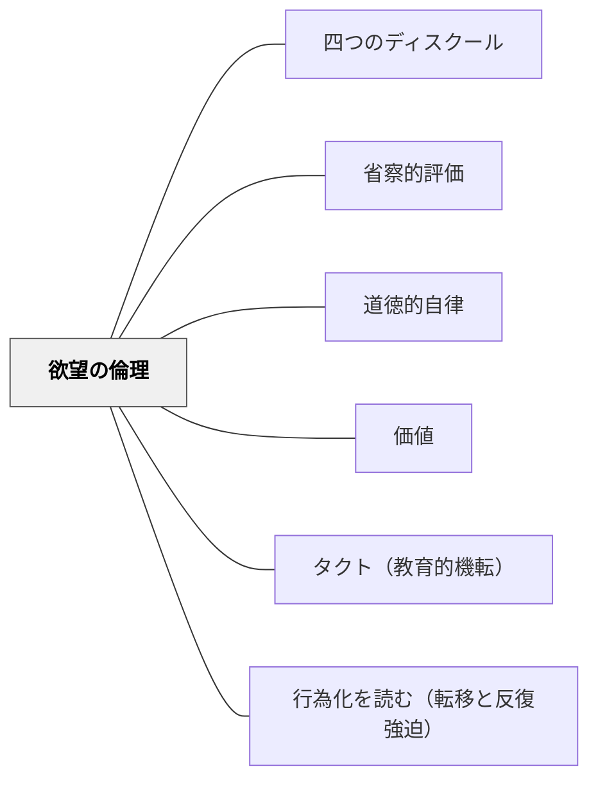

# 欲望の倫理

> 欲望から逃げるな——しかし、その欲望を行為に移すとき、他者を単なる手段にするな。ラカンはエンジン、カントはブレーキとハンドルである。

---

## Pattern Connection

**ラカン入門（向井雅明）＋ラカン倫理学とカント倫理学統合（2026-06-03）：**

ラカンのセミネールVII「精神分析の倫理」（1959-60年）の核心命題「汝の欲望から退くな（Ne cède pas sur ton désir）」と、カントの定言命法の統合が本パタンの理論的基盤。

- **既存パタンとの関連**：[[パタン/価値]] が「何が妥当か」を問う最上位の問いとして機能し、[[パタン/省察的評価]] が「自分の判断の背後にある欲望を振り返る」実践として接続する。[[概念/ラカン倫理学とカント倫理学]] が本パタンの理論的詳細を担う
- **補強された点**：「道徳教育」を「欲望の抑圧と規則の内面化」としてではなく、「自分の欲望の主体になりながら他者を尊重する主体を育てる」として再設計する枠組みが明確化した
- **他のパタンへの波及**：[[パタン/四つのディスクール]] における「分析家のディスクール」の教師スタンスが、欲望の倫理の実践的形として位置づけられる

---

## 背景（Context）

教育は「正しさ」を伝える営みである——しかし「正しさ」とは誰の、何のための「正しさ」か。

ラカンは精神分析の倫理として「汝の欲望から退くな（Ne cède pas sur ton désir）」という命題を立てた。これは「好き勝手にしてよい」という意味ではない。「正しさ・義務・期待・承認欲求という仮面をつけて、自分自身の欲望から逃げるな」という問いかけである。

カントは逆の方向から問う：「あなたの欲望から生まれた行動は、すべての人に通用する普遍的な原理になりうるか」——欲望を「普遍的形式でテストせよ」という要求。

この二つの命題は対立するように見えて、実は**欲望をどう扱うかについての二段構えの問い**である：
1. ラカン：欲望から逃げていないか（第一段）
2. カント：その欲望を他者への暴力にしていないか（第二段）

## 問題（Problem）

教育現場で教師が直面する問い：

- 「このクラスに○○の指導をすべきか」——それは本当に「子どものため」か、それとも「評価や同僚の目から逃げていないか」
- 道徳教育は「規則を守る子を育てる」か「欲望の主体を育てる」か
- 教師が「正しいことをしている」と感じるとき、その「正しさ」は普遍化できる行為原理か、それとも慣習・上位者の期待・過去のパターンへの服従か
- 子どもが「先生の言う通りにすること」を学ぶとき、それは道徳的自律か服従か

## 力のかたち（Forces）

- 「義務に従う」という安心感は、自分自身の欲望から逃げるための「道徳の仮面」になりうる
- 欲望から退くとき、人は「より安全な正しさ」に滑り込む——しかしその正しさは他者の期待・超自我の圧力への服従かもしれない
- 欲望に従うだけでは、自己中心的な正当化・他者への暴力になりうる
- ラカンのエンジン（欲望への忠実さ）とカントのブレーキ（普遍化テスト）の両方が必要
- 教師が自分の欲望から退いているとき、子どもの欲望も点火されない——欲望は伝染するから

## 解決（Solution）

**欲望に忠実であれ。ただし、その欲望を行為に移すとき、他者を単なる手段にするな。**

統合の二段構え：
1. **ラカンの問い（第一段）**：「私は今、社会的な正しさという仮面をかぶって、本当に向き合うべき自分自身の恐怖・欲望から目を逸らしていないか」
2. **カントの問い（第二段）**：「この行為の原理は、すべての人に同様に適用できる普遍的な法則になりうるか」

---

### 1. 教師自身の欲望の点検

授業設計・指導判断において二つの問いを同時にかける：

| カントの問い | ラカンの問い |
|---|---|
| この判断は、すべての子に同じ原理で通用するか | この判断は、自分が本当に信じていることから来ているか |
| 特定の子を贔屓していないか | 慣習・評価・見られ方から逃げていないか |
| 学校のルールは正当化できるか | そのルールを「正しいから」ではなく「楽だから」従わせていないか |

**具体的な自己点検の問い**（指導判断の前に）：
- 「なぜ私はこの指導をしようとしているか」
- 「これは子どもにとってよいことか、私の不安を鎮めるためか」
- 「この方針は、他のクラス・他の学校の子にも同様に通用する原理か」

---

### 2. 「欲望から退くな」という教師の在り方

ラカンの「分析家のディスクール」においては、分析家は自分が「答えを知っている者（SSS）」として機能することを拒む——分析家は自分の欲望（知への欲望）から退かず、しかしその欲望を「答えを与えること」で表明しない。

**教師への翻訳**：
- 教師が「この問いはまだ分からない」「自分もここで悩んでいる」と示すことは、欲望の倫理の実践
- 「すべての正解を知っている教師」の仮面（SSS）を脱ぐことが、子どもの欲望を解放する
- 教師自身が面白いと思っていない内容を「大切だから」と教えるとき、欲望から退いている——それは子どもに伝わる

---

### 3. 道徳教育への応用——「欲望を直視した上でカントのテスト」

ラカン-カント統合の実践：欲望を「きれいに整えてから認める」のではなく、欲望の暗さ・歪みを直視した上でカントのテストを通す。

子ども向けの二段の問いかけ：
1. 「あなたは今、本当は何をしたいと思っているか」（欲望を言語化する・隠さない）
2. 「そのことを、クラス全員がやったとしたら、クラスはどうなるか」（普遍化テスト）

この順序が重要——先にカントのテストを課すと「やってはいけない」で思考が止まる。先に欲望を言語化することで、欲望の倫理（自己理解）と義務の倫理（他者への責任）が接続される。

---

### 4. 超自我の罠と自律的道徳性

フロイトの超自我とラカンの欲望論は接続する：「義務に従っている」というとき、それは本当に自律的な道徳判断か、それとも超自我（内面化された権威・期待・罰の恐怖）への服従か。

超自我的道徳性と自律的道徳性の区別：

| 超自我的道徳性 | 自律的道徳性（ラカン-カント統合） |
|---|---|
| 「やらないと怒られるから」 | 「これが正しいと自分で判断するから」 |
| 「みんながやっているから」 | 「これは普遍化できる原理だから」 |
| 規則への服従が安心を生む | 欲望への忠実さが原動力で、普遍化がブレーキ |
| 「正しさ」が不安からの逃げ場 | 欲望を直視した上での判断 |

---

## 結果（Consequences）

- 教師が自分の欲望から退かないとき、子どもに「欲望の主体である人間の姿」を示せる——これが「教えること」の最も根本的な形
- 道徳教育が「規則の内面化（超自我形成）」から「欲望の主体として他者と共に生きることの自覚（自律）」へ変容する
- ただし、欲望の倫理は教師自身の継続的な自己点検を要求する——「汝の欲望から退くな」は永続的な実践であり、達成して終わるものではない
- 誤用の危険：「欲望に従え」を「自分のやりたいことをやる」という自己中心的正当化に使わないこと——ラカンの問いはそれより深い層にある

## 関連パタン

- [[概念/欲望の構造（ラカン）]] — 欲望の構造的理解（欲求→要請→欲望・大文字の他者）
- [[概念/ラカン倫理学とカント倫理学]] — 本パタンの理論的詳細
- [[概念/エゴイズムとカント倫理学]] — カント倫理学の基礎
- [[パタン/四つのディスクール]] — 欲望の倫理と教師スタンスの接続
- [[パタン/省察的評価]] — 欲望の自己点検としての振り返り
- [[パタン/道徳的自律]] — 超自我的服従から自律へ
- [[パタン/価値]] — 欲望の最上位にある問い
- [[パタン/タクト（教育的機転）]] — 欲望の倫理に基づくタクトの実践
- [[パタン/行為化を読む（転移と反復強迫）]] — 欲望と反復の接続
- [[文献/ラカン入門（向井雅明）]] — 欲望の倫理の主出典

---

## クラスター図

## Actionable Insight

- **一つの指導判断の前にラカンの問いをかける**——「なぜ私はこれをしようとしているか。子どものためか、自分の不安を鎮めるためか」。答えを出さなくてよい。問いを持つだけで判断の質が変わる
- **「自分も分からない」を一回言ってみる**——教師が「ここは私も答えを持っていない」と示す場面を一つ意図的に作る。これは欲望の倫理の実践——答えを持っている演技をやめること
- **子どもへの二段の問い**——何か問題が起きたとき「本当はどうしたかった？（ラカン）」を先に聞き、次に「もし全員がそうしたらどうなる？（カント）」を問う。順序を逆にしない

---

## 出典

向井雅明（2015）．*ラカン入門*．ちくま学芸文庫．

桑原旅人（2025）．*汝の「欲望」に従って行為せよ：ジャック・ラカンの倫理学*．ナカニシヤ出版．

Lacan, J. (1959-60). L'éthique de la psychanalyse. (Séminaire VII)

カント, I.（中山元訳）（2000）．*道徳形而上学の基礎付け*．光文社古典新訳文庫．

> 「Ne cède pas sur ton désir（汝の欲望から退くな）」——ラカン（セミネールVII, 1959-60年）

> 「欲望から逃げるな（ラカン）。しかし、その欲望を行為に移すとき、他者を単なる手段にするな（カント）」——岩井輝久（2026年）
