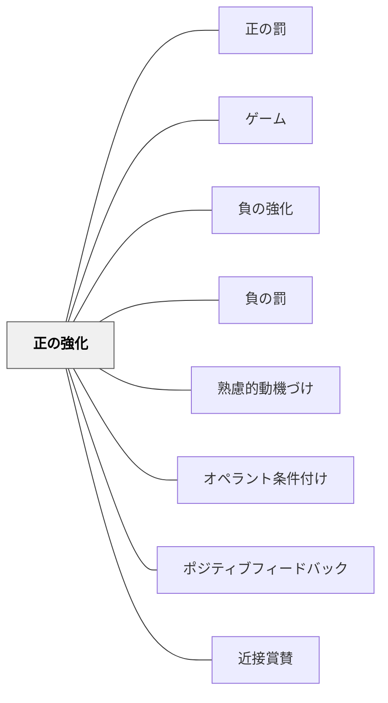

# 正の強化

> 望ましい行動のあとに良いものを与えることで、その行動が増える。

## 背景（Context）
オペラント条件付けの中核的な手法。望ましい行動の直後に肯定的な刺激（強化子）を与えることで、その行動の頻度を増やす。学校での賞賛・報酬・ポイントシステムなど、日常的に広く使われている。

## 問題（Problem）
学習者に望ましい行動を繰り返してほしいとき、ただ待っているだけでは行動が定着しない。どのタイミングで、どのような形で肯定的なフィードバックを与えれば効果的かが問われる。

## 力のかたち（Forces）
- 強化子は個人によって異なる（ある人には効くが他の人には効かない）
- 即時性：行動の直後に与えるほど効果が高い
- 連続強化から間欠強化へ移行することで行動が安定する
- 過度な外的報酬は内発的動機付けを低下させる可能性がある（アンダーマイニング効果）

## 解決（Solution）
**望ましい行動が起きた直後に、その学習者にとって価値ある肯定的な刺激を与えることで、行動の頻度を意図的に高める。**

賞賛の言葉・シール・ポイント・特権・自由時間など様々な強化子を活用する。強化のスケジュールを段階的に間欠強化へ移行させ、外的強化への依存を減らしていく。最終的には内発的動機付けへの橋渡しを意識する。

## 結果（Consequences）
- 望ましい行動の頻度が高まる
- 過度に使用すると外的報酬への依存が生じる
- 強化子の魅力が薄れると効果が低下する（飽和）

## クラスター図

## Actionable Insight

- 望ましい行動が起きた「直後5秒以内」に、行動を具体的に名指しして賞賛する——即時性が強化の核心であり、遅れると効果が急落する
- 強化スケジュールを「毎回→2回に1回→ランダム」と段階的に薄くしていく——間欠強化への移行が行動を安定させ外的報酬への依存を防ぐ
- 外的強化と同時に「自分でできたと感じた瞬間はどこ？」を言語化させる——内省が外発から内発への橋渡しになり、報酬なしでも続く学習行動を育てる

## 出典

- 一つの教育のパタン・ランゲージ（岩井輝久）

## 関連パタン
- [[パタン/正の罰]]
- [[パタン/ゲーム]]
- [[パタン/負の強化]]
- [[パタン/負の罰]]
- [[パタン/熟慮的動機づけ]] — 親パタン
- [[パタン/オペラント条件付け]] — 親パタン（直接の上位パタン）
- [[パタン/ポジティブフィードバック]] — 関連する賞賛・肯定のパタン
- [[パタン/近接賞賛]] — 関連する賞賛の活用パタン
