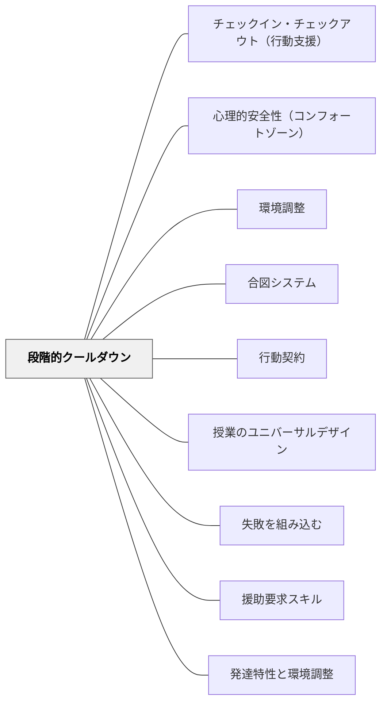

# 段階的クールダウン

> 危機になってから動くのでなく、危機になる前に「落ち着く場所」が設計されているクラスをつくれ。

## [Pattern Connection]

- **既存パタンとの関連**：[[パタン/心理的安全性（コンフォートゾーン）]] の「安全な出口がある」という概念を行動手続きとして実装する。[[パタン/環境調整]] の「空間の調整」として機能する——タイムアウトコーナーは空間的な設計である。[[パタン/合図システム]] とセットで使うと最も効果的——子どもが合図でサインを出し、そのまま段階的クールダウンに移行できる。
- **補強された点**：「タイムアウト」という言葉は罰的なニュアンスを持つことがあるが、本パタンはそれを「落ち着くための空間と時間」として再定義する。大人もストレスフルな状況でコーヒーを飲みに席を外す——それと同じことを子どもにも許可する。
- **修正・拡張された点**：4段階の段階性が重要。Step 1・2は予防的・先手的に使える。Step 3・4はエスカレーションした場合のみ。全員に4段階あることを「序列」として見せず、「どこまで必要かは状況による」として提示する。
- **他のパタンへの波及**：[[パタン/行動契約]] ——段階的クールダウンを「行動契約の一部」として組み込める（「気持ちが大きくなったときは〇〇コーナーに行く」）。[[パタン/合図システム]] ——合図でStepの開始を子どもが自分で選べる。
- **いるかどり（2023）統合（2026-05-20）**：Qさん（落ち着くことが苦手）のケーススタディが、段階的クールダウンのStep 1に直接対応する具体的な実装を示す。いるかどり（2023）は「落ち着くスペース」を単なる退避場所ではなく、「ここにいてよい」という[[パタン/シグニファイア]]として空間設計することを提案する——スペースの存在自体が「あなたはここでリセットしていい」というメッセージになる。また[[パタン/援助要求スキル]]との接続として：感情が高まる前に援助要求できれば（合図で「今きつい」を伝えられれば）、段階的クールダウンへの移行が穏やかになる。「問題行動が出てから対処する」のではなく「段階的クールダウンのStep 1に自分で行ける援助要求スキル」が育っているとき、支援が最も機能する。

## 背景（Context）

感情が高ぶり、行動のコントロールが難しくなる状況は、どの子どもにも起きる。しかし特別支援が必要な子ども、情緒行動障害のある子ども、あるいは大きなストレス下にある子どもにとっては、その頻度と強度が高い。

大人でも、怒りや不安が高まったとき「ちょっと席を外して一息つく」ことで落ち着けることがある。しかし子どもにはその「席を外すことが許されている」という事前の了解と場所の確保がないことが多い。

## 問題（Problem）

感情が高まっているとき、言葉での介入は効果が低いことが多い——「なぜそんなことをしたのか」という問いは、感情的な状態では処理できない。事後的・反応的な対応ではなく、「落ち着く場所と手順が事前に設計されている」ことで、エスカレーションを防げる。

## 力のかたち（Forces）

- 感情が高まったとき、人は思考より感情で動く
- 環境（クラスメートの視線・教室の雑音）がさらに状況を悪化させることがある
- 自分で「今は離れたい」という選択ができると、エスカレーションの前に止まれる
- Step 1・2が気軽に使えるものであれば、Step 3・4に至ることが減る
- 罰ではなく「冷静を取り戻すための場所」として提示することが信頼関係を守る

## 解決（Solution）

**「感情が高まったとき・困ったとき」の移動手順を4段階で事前に設計し、クラス全体に明示する。Step 1・2は予防的に使い、Step 3・4はエスカレーション時のみ使う。**

---

### 4段階の手順（TIME-OUT SEQUENCE）

**Step 1 ── 教室内の指定コーナー（「考えるコーナー」）**

教室の一角に、落ち着けるスペースを設ける。クラス全員が使えるものとして設計する（特定の子の「罰の場所」にしない）。

- 椅子・クッション・イヤーマフ・好きな本など「落ち着くもの」を置く
- 「ここに来たら何分でもいい、準備ができたら戻っておいで」と伝える
- Step 1は「自分から行ける」設計にする（合図で申し出る）

**Step 2 ── 教室外への移動（別の場所、監督あり）**

教室の環境が刺激になっている場合、廊下・別の教室・特別支援教員の部屋への短時間移動。

- 事前に受け入れ先（別の先生・スペース）を確保しておく
- 「一人で行く」ではなく「案内してもらう」か「安全な動線が確保されている」
- 監督は必ず行う

**Step 3 ── カウンセラー・管理職との時間**

直接関わっていない第三者（カウンセラー・主任・管理職）の部屋で落ち着く。

- 「怒られる」ではなく「別の大人と話して落ち着く」場として機能させる
- 状況に直接関わっていない大人が冷静に受け止めやすい

**Step 4 ── 保護者への連絡**

上記3ステップで対応できない深刻な状況の場合に保護者へ連絡する。

---

### 設計上の原則

**全員のものとして設計する**
- 「問題のある子のためのタイムアウト」ではなく「誰でも使えるクールダウンスペース」として全員に説明する
- 「先生も気持ちが大きくなったとき、一呼吸おくよ。みんなもそれでいい」と伝える

**Step 1・2を積極的に使う**
- 「Step 3・4にならないための先手」として Step 1・2を推奨する
- 合図システムと組み合わせ、「自分からStep 1に行ける」権限を子どもに持たせる

**手順を視覚的に掲示する**
- 4ステップを図にして教室に掲示する
- 全員が「どんなときにどこへ行くか」を知っていると、使うことが恥ずかしくなくなる

---

### 段階的クールダウンを使う前にすること

1. 予防的行動支援（ルーティン・選択肢・合図）で、段階的クールダウンに至らないよう設計する
2. 日常から「気持ちの言葉」を増やす（「怒っている」→「困っている」「圧倒されている」「疲れている」）
3. 特定の子どもと「どのStepから使いやすいか」を相談しておく

## 結果（Consequences）

- 感情が爆発する前に「出口がある」ことで、エスカレーションが減る
- 罰的でない設計が、クールダウン後に教室に戻りやすい雰囲気をつくる
- 全員が使えるシステムにすることで、特定の子どもが「自分だけ変」と感じなくなる
- 教師と子どもの関係が「対立」ではなく「一緒に落ち着く方法を見つける」方向になる
- 段階性があることで「次は何をするか」が子どもにも教師にも明確になる

## 関連パタン
- [[実践/インクルーシブ授業の設計]]
- [[実践/発達特性別の環境調整]]
- [[パタン/チェックイン・チェックアウト（行動支援）]]

- [[パタン/心理的安全性（コンフォートゾーン）]] — 安全な出口があることが安心の土台
- [[パタン/環境調整]] — クールダウンコーナーは空間的な調整
- [[パタン/合図システム]] — 合図でStep 1を子どもが自分で選べる
- [[パタン/行動契約]] — クールダウン手順を行動契約に組み込む
- [[パタン/授業のユニバーサルデザイン]] — 全員が使えるシステムとしての設計
- [[パタン/失敗を組み込む]] — 感情が崩れることを「学びの過程」として捉える文化
- [[パタン/援助要求スキル]] — 段階的クールダウンに自分で行けるための前提スキル（いるかどり, 2023）
- [[パタン/発達特性と環境調整]] — 落ち着くスペースの空間的環境設計（Qさんのケース）

## クラスター図

## Actionable Insight

- 教室の一角に「落ち着くコーナー」を作る。クッションと「静かに過ごすもの」（本・塗り絵・パズル）を1〜2個置く。名前を「○○コーナー」と貼る——全員が使えるものとして、最初に説明する
- 「気持ちが大きくなったとき、一呼吸おきたいときは、先生に合図してからここに来ていい」と伝える
- Step 1・2の受け入れ先（別の先生・スペース）を学期初めに確保しておく——「Step 3・4が必要になる前の準備」が最も大切

## 出典

Hammeken, P. A. (2007). *The Teacher's Guide to Inclusive Education: 750 Strategies for Success!* Corwin Press. (2nd ed.)

> "Time-outs are often used in response to behavioral difficulties or as proactive measures when problems are about to surface. The goal of the time-out is to allow the student time to calm down and rethink the situation. Adults often take a time-out when experiencing a stressful situation." — Hammeken (2007), Strategy #747

> "TIME-OUT: Step 1 - Time-out in a designated classroom area (Some teachers call this place the 'Thinking Area.') Step 2 - Time-out outside of the classroom area. Step 3 - Time out with a counselor or principal. Step 4 - Telephone call home." — Hammeken (2007), Strategy #747
