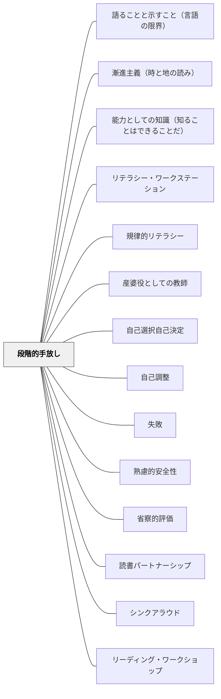

# 段階的手放し

> 教師が責任を持ちながら始め、学習者が責任を引き受けるまで徐々に手を離す——足場は最初からなくすのではなく、学習者の力が育ったとき初めて外す。

## [Pattern Connection]

**Dorn & Soffos（2005）統合（2026-05-19）——スケール・オブ・ヘルプ：セッション内の動的GRR：**

Dorn & Soffos は **スケール・オブ・ヘルプ（Scale of Help）** という概念を用いて、1つの授業セッション内での足場の動的調整を記述する。これは Pearson & Gallagher の GRR が「単元・週・年間」という大きな時間軸を扱うのに対して、「一人の子どもが詰まった瞬間から解決するまでの数秒〜数分」という小さな時間軸での GRR を扱う。

| 支援の度合い | 教師の言語・行動 | GRRとの対応 |
|---|---|---|
| **高支援（High）** | 「ここを一緒に指で追いましょう。この言葉に注目して」——明示的な言語＋行動 | I Do（全責任を持つ） |
| **中支援（Moderate）** | 「もう一度読んで、意味に合う言葉を3つ考えてみて」——リマインダー・選択肢 | We Do（選択肢を提供） |
| **低支援（Low）** | 「うん。よく読んでいるね」——聴いて励ます | You Do（観察・待つ） |

- **補強された点**：既存の GRR は「どこから始めて、どこで手を離すか」という設計問題を扱う。スケール・オブ・ヘルプは「手を離した後、子どもが詰まったとき何をするか」という介入の質を扱う——GRR の設計後に起きる「リアルタイムの判断」に根拠を与える
- **重要な原則**：高支援から始めて低支援へと段階的に降りるのではなく、**低支援から試し、子どもが解決できなければ高支援へ上がる**——最初に答えを与えない
- **拡張された点**：共有読書（[[パタン/共有読書（Shared Reading）]]）・文学討論グループのカンファリング（[[パタン/文学討論グループ]]）・1対1の面談（[[パタン/1対1の面談]]）のすべての場面で、同一の支援スケールを使って教師の言語を設計できる——GRR の設計原理が実践言語レベルで具体化する

---

**Diller, D.（2005）統合（2026-05-21）——ワークステーション設計における GRR：**

Diller は本書で Pearson & Gallagher（1983）を明示的に引用し、ワークステーション全体が GRR の「Independence（独立）」フェーズに位置することを示す。Diller の3ゾーン表現は **Modeling → Handholding → Independence** で、Fisher & Frey の4段階と一致する。

- **補強された点**：「ステーションに入れられる活動は、必ず先に Modeling・Handholding ゾーンで教えたものだけ」という制約は、GRR の「手放す前に十分に教える」という原則そのものだ。**「材料が先に教えられていない = ステーションで独立できない」**という鉄則が、ワークステーション設計の失敗原因を構造的に説明する。
- **新しい比喩**：Diller が使う「洗濯の比喩（Laundry Analogy）」——「洗濯のやり方を見せる → 一緒にやる → 手を取ってやる → 一人でやる」——は、I Do/We Do/Guided/You Do を生活感覚で説明できる。生徒・保護者への GRR 説明に使える。
- **他のパタンへの波及**：[[パタン/リテラシー・ワークステーション]] ——ステーション全体が GRR の「Independence」フェーズ。[[パタン/スタミナを育てる]] ——独立フェーズを機能させるスタミナの段階的構築は GRR の独立練習版。

---

## 背景（Context）

Pearson & Gallagher（1983）が提唱した「責任の段階的移行（Gradual Release of Responsibility: GRR）」は、教育実践における足場かけの根本原理として広く認められている。

核心は一つの問い：**「今この瞬間、誰が責任を持っているか？」**

新しいスキルや概念を学ぶとき、最初は教師がすべての責任を持つ（モデリング）。徐々に学習者に責任が移り、最終的には学習者が単独で実行できるようになる。この移行を計画的に設計することが学習の質を決める。

Vygotsky の「最近接発達領域（ZPD）」と連動する：学習者は「一人ではできないが、支援があればできる」段階に最も効率的に学ぶ。段階的手放しはこの支援を体系化したものだ。

## 問題（Problem）

足場かけの失敗は2方向に起きる：

- **手放しが早すぎる**：学習者の準備が整っていないのに独立を求める。「できない」体験が積み上がり、自己効力感が下がる
- **手放しが遅すぎる**：教師の手助けが続き、学習者が自律的に動く機会を失う。依存が生まれる

「やって見せる」「一緒にやる」「見守りながらやらせる」の3段階が意図なく飛ばされたり、逆順になったりすると、学習の転移が起きない。

## 力のかたち（Forces）

- 学習者は「少し難しいが支援があればできる」段階（ZPD）で最も成長する
- 早期の失敗体験は自己効力感を下げ、次の学習への構えを悪化させる
- 依存が深まると、支援を外したとき「何をすればいいか分からない」が起きる
- 「手放す」タイミングは教師の観察（カンファリング・観察メモ）なしには見えない
- 同じ学習者でも課題によって「今どの段階にいるか」が変わる

## 解決（Solution）

**I Do → We Do → You Do の3段階を意識的に設計し、学習者の実態に合わせて移行のタイミングを判断する。**

---

### GRRの3段階

| 段階 | 別名 | 教師の役割 | 学習者の役割 | 代表的な形式 |
|---|---|---|---|---|
| **I Do** | Focused Instruction | 全責任を持ちモデリングする | 観察・聴く | シンクアラウド・実演・読み聞かせ |
| **We Do** | Collaborative / Guided | 足場として支援する | 試みる・修正する | 共同作業・ガイド読書・ペアワーク |
| **You Do** | Independent Practice | 観察・フィードバックを与える | 独立して実行する | 独立読書・独立練習・一人作業 |

---

### Fisher & Frey（2008）の4段階拡張

Fisher & Frey はGRRを4段階に細分化した：

1. **Focused Instruction（焦点的指導）**：「私がやります」——目標を宣言し、思考を声に出す（シンクアラウド）
2. **Collaborative Learning（協同学習）**：「一緒にやります」——グループ・ペアで互いの考えをすり合わせる
3. **Guided Instruction（ガイド指導）**：「あなたがやります、私は見ます」——教師は問いかけて支援するが実行しない
4. **Independent Practice（独立練習）**：「あなた一人でやります」——教師は観察メモを取りながら介入しない

---

### 読書ワークショップにおける実装

段階的手放しは読書ワークショップの指導構造そのものに埋め込まれている：

| RWの場面 | GRRの段階 | 具体 |
|---|---|---|
| ミニレッスン（シンクアラウド） | I Do | 教師が本を読みながら思考を声に出す |
| ミニレッスン（対話部分） | We Do | 子どもが「あなたはどう思う？」と問われて考える |
| ガイド読書・カンファリング | Guided | 教師と1対1で「次に何をする？」と問い返す |
| 独立読書 | You Do | 子どもが自分の本で独立して読む |

---

### Daily 5の10ステップ（段階的手放しの具体）

Boushey & Moser（2014）の Daily 5 起動10ステップは、段階的手放しを「独立性そのものを教える」文脈で実装している：

```
1〜3：教師がI-チャートを使って「なぜ独立して読むか」を子どもと共同作成（I Do + We Do）
4〜6：1分間だけ試してみる（Guided）
7〜8：フィードバック・振り返り・ゴール設定（We Do）
9〜10：少しずつ時間を延ばし、完全な独立へ（You Do）
```

---

### リテラチャー・サークルにおける段階的手放し

Daniels（2002）の役割シート段階的消去は GRR の直接実装：

- 導入期：役割シートをすべて使う（We Do）
- 練習期：記述量を減らす（Guided）
- 移行期：メモのみ（You Do の直前）
- 自律期：役割なし、自然な対話（完全な You Do）

---

### 手放すタイミングの判断

「いつ手を離すか」を知るための観察指標：

| 観察の問い | 見ること |
|---|---|
| 支援なしで始められるか | ヒントなしに最初の一手を打つか |
| 間違いに自分で気づくか | 外部フィードバックなしに修正するか |
| 別の文脈・本で使えるか | 転移が起きているか |
| 「どうすればいい？」と聞かなくなったか | 依存からの脱却 |

---

## 結果（Consequences）

- 「できた」体験が段階的に積み上がり、自己効力感と学習者としての自律性が育つ
- 転移（新しい文脈でスキルを使う）が起きやすくなる
- 教師が「今誰が責任を持つべきか」を常に意識できる
- ただし、手放しのタイミングはデータ（観察・カンファリング記録）なしには判断できない——観察の習慣が前提

## 関連パタン
- [[パタン/語ることと示すこと（言語の限界）]]
- [[パタン/漸進主義（時と地の読み）]]
- [[パタン/能力としての知識（知ることはできることだ）]]
- [[学級経営/学級経営で使えるパタン]]
- [[実践/デイリー5の起動]]
- [[実践/テキストコーディング]]
- [[実践/思考の記録サイクル]]
- [[特別支援/環境調整（特別支援）]]
- [[特別支援/視覚支援]]
- [[実践/リテラチャー・サークルの起動]]
- [[パタン/リテラシー・ワークステーション]]
- [[パタン/規律的リテラシー]]
- [[パタン/産婆役としての教師]]
- [[パタン/自己選択自己決定]]
- [[パタン/自己調整]]
- [[パタン/失敗（インストラクション）]]
- [[パタン/心理的安全性（コンフォートゾーン）]]
- [[パタン/省察的評価]]
- [[パタン/読書パートナーシップ]]

- [[パタン/シンクアラウド]] — I Do段階の最も典型的な形式
- [[パタン/リーディング・ワークショップ]] — GRRが授業構造の骨格になる
- [[パタン/スタミナを育てる]] — 短く始めて手放していくGRRの独立学習版
- [[パタン/デイリー5]] — 10ステップがGRRの具体的実装
- [[パタン/リテラチャー・サークル]] — 役割消去がGRRの対話版実装
- [[実践/カンファリング（読書会議）]] — Guided段階で使う個別支援の形式
- [[パタン/熟慮的インストラクション]] — 指示設計の上位パタン
- [[パタン/フィードバック]] — We Do段階・Guided段階のフィードバック設計
- [[パタン/守・破・離（習熟の三段階）]] — GRRのYou Do先が「破・離」；守→破→離は段階的手放しの大きな時間軸版
- [[パタン/ガイデッド・リーディング（小グループの読み指導）]] — 読書指導におけるGuided段階の典型実装。教師が傍で支えながら子どもが自分で読む
- [[パタン/編集（Editing）]] — 教師の全直しから子ども自身の編集へ、責任を段階的に移すGRRの編集版実装

---

## クラスター図



## Actionable Insight

- **今週のミニレッスンの後、「一人でやってみて」の前に「隣の人と30秒話して」を入れる**——We Do なしで We Do → You Do に飛ぶと転移が起きにくい
- **独立作業の時間に子どものそばに行って「今何をやっているか教えて」と聞く**——Guided段階の問いかけが、自分でできる力に気づかせる
- **「できていない」ではなく「どの段階にいるか」で子どもを見る**——GRRのどのステップかを判断すると、支援の質が変わる

---

## 出典

Pearson, P. D., & Gallagher, M. C. (1983). The instruction of reading comprehension. *Contemporary Educational Psychology*, 8(3), 317–344.
Fisher, D., & Frey, N. (2008). *Better Learning Through Structured Teaching: A Framework for the Gradual Release of Responsibility*. ASCD.

> "The gradual release of responsibility is not a linear model—it's recursive. Teachers move back and forth across the phases as the learning demands change."
> —Fisher & Frey（2008）
