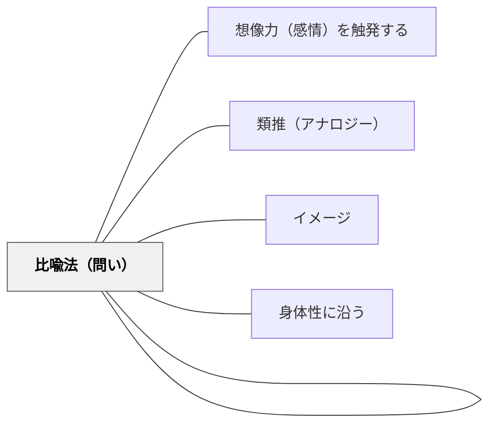

# 比喩

> 知らないものを知っているもので例えることで、感覚ごと理解させる

---

## Pattern Connection

**白谷明美（年不詳）統合（2026-05-21）：**

白谷明美の詩の指導法は、比喩を「技法として教える」のではなく「遊びとして体験する」入口から始める。詩の授業で比喩を扱うための3つの具体的操作を提供する。

- **「みたいみたい→みえるみえる」の転換**：直喩（〜みたい）から見立て（〜のように見える）への転換操作。「たんぽぽは黄色い→たんぽぽは太陽に見える」という転換が、比喩の「知らないものを既知で捉える」機能を詩的体験として定着させる。
- **名づけ遊び**：物に比喩の名前をつける活動（「この雲は○○だ」）が比喩の生成を遊びとして体験させる。技法の説明に先行して遊び的な操作から入る——[[パタン/いいえ詩]] の「否定して転換する」と対をなす「肯定しながら別の見方を重ねる」操作。
- **特長図から比喩詩へ**：物の特長を箇条書きにして（特長図）、自分の特性と重ねる比喩を生成する。「電球→つるっぱげで光る→ぼくはいっしょうけんめい輝きたい」という比喩の生成過程を視覚化——[[パタン/なりきる詩]] の「物になりきる」と「物に見立てる（比喩）」が補完する。

---

## 背景（Context）

抽象的な概念や馴染みのない現象を言葉で説明しても、学習者はなかなかリアルな感覚をつかめない。比喩は、未知の概念と既知の経験をつなぐ橋として機能する。

## 問題（Problem）

説明が論理的に正確であっても、学習者の感情や身体感覚と結びつかなければ、深い理解は生まれない。どうすれば抽象的な内容を学習者の「感覚の世界」に届けられるか。

## 力のかたち（Forces）

- 人間の理解は、身体感覚や経験に根ざした「具体的なイメージ」を介して深まる
- 比喩はある領域の構造を別の領域に転移させ、新しい視点を開く
- 「天井を突き刺すように手を上げる」といった比喩は、単なる説明を超えた動作の生き生きとしたイメージを呼び起こす
- 感情・身体感覚を動員することで、学習者の関与が高まる

## 解決（Solution）

授業の中で比喩（メタファー）・直喩（シミリー）を積極的に使う。たとえば「天井を突き刺すように手を上げる」という言葉を使うことで、単に「高く手を上げる」より強烈なイメージが生まれる。学習者自身に「これは何に似ているか？」と問い、比喩を生み出させることも理解の深化につながる。

## 結果（Consequences）

- 抽象概念が感覚や感情と結びつき、直感的な理解が生まれる
- 学習者の言語表現が豊かになる
- 比喩が誤解を生む場合もあるため、比喩の「ずれ」を明示的に扱う必要がある

## 関連パタン

- [[パタン/想像力（感情）を触発する]]
- [[パタン/類推（アナロジー）]]
- [[パタン/比喩法（問い）]]
- [[パタン/イメージ]]
- [[パタン/身体性に沿う]]

## クラスター図

## Actionable Insight

- 新概念を説明するとき「これは○○に似ている」という比喩を意識的に使う——未知の概念と既知の経験を結ぶ橋が感覚レベルの理解を生む
- 学習者に「今学んでいることは何に似ている？」と問いかけ比喩を自分で作らせる——比喩の自己生成が概念の理解の深さと個人的な意味付けを同時に促す
- 使った比喩の「ずれ」を明示的に扱い類似と相違を両方話し合う——比喩の限界を学ぶことが概念の正確な境界線を理解させる

## 出典

キアラン・イーガン（2010）『想像力を触発する教育――認知的道具を活かした授業づくり』北大路書房
