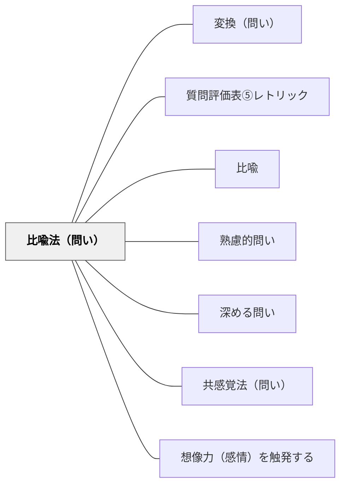

# 比喩法（問い）

> 別のものに喩えることでイメージを豊かにした問い

## 背景（Context）
比喩は、未知のものを既知のものに結びつけることで理解を深める認知的道具である。問いの形で比喩を用いることで、抽象的な概念や複雑な状況を具体的なイメージとして捉え直すことができる。「もしこの問題が天気なら？」のような問いは、論理的分析とは異なる直感的・感性的なアプローチを引き出す。

## 問題（Problem）
抽象的なテーマを正面から問うと、学習者は既習の語彙や概念を繰り返すだけになりやすい。新しい切り口を与えなければ、議論は予定調和になる。比喩的な問いがなければ、学習者は言語化しにくい感覚や直感を問いの中に持ち込めない。

## 力のかたち（Forces）
- 直感的理解 vs 論理的分析
- イメージの豊かさ vs 概念の正確さ
- 比喩の親しみやすさ vs 誤解を招くリスク
- 創造的発想 vs 厳密な思考

## 解決（Solution）
「もしこの問題が天気なら、今はどんな天気？」「この組織を建物に喩えるとしたら、どんな建物？」のように、テーマを別の領域に置き換えて問う。比喩は学習者が自由に選んでもよいし、ファシリテーターが特定の比喩（旅・植物・音楽など）を提示して問いかけてもよい。回答後に「なぜその比喩を選んだか」を問うと、さらに深い洞察が得られる。

## 結果（Consequences）
- 言語化しにくい感覚や直感が問いの場に持ち込まれる
- 参加者の多様な表現が尊重され、議論が活性化する
- 抽象概念への新しい切り口が生まれ、理解が深まる

## 関連パタン
- [[パタン/変換（問い）]]
- [[パタン/質問評価表⑤レトリック]]
- [[パタン/比喩]]
- [[パタン/熟慮的問い]] — 親パタン

- [[パタン/深める問い]] — 比喩が表面的な言語化を超えた理解を生む
- [[パタン/共感覚法（問い）]] — 比喩と感覚を組み合わせた兄弟パタン
- [[パタン/想像力（感情）を触発する]] — 比喩が感情・想像力を動かす
## クラスター図

## Actionable Insight

- 「もしこの問題が天気なら、今はどんな天気？」と問い、なぜその比喩を選んだかを語らせる——言語化しにくい感覚や直感が問いの場に現れる
- 「この組織を建物に喩えるとしたら、どんな建物？」のように具体的な比喩域（建物・天気・植物）を提示して問う——比喩域の指定が思考の足場になる
- 抽象的な概念を学んだ後、「この概念を何かに喩えるとしたら？」と問う——既習の語彙を繰り返すだけでなく新しい切り口で理解が深まる

## 出典
- [[文献/熟慮的問いのパターンリスト（動画記録）]]
