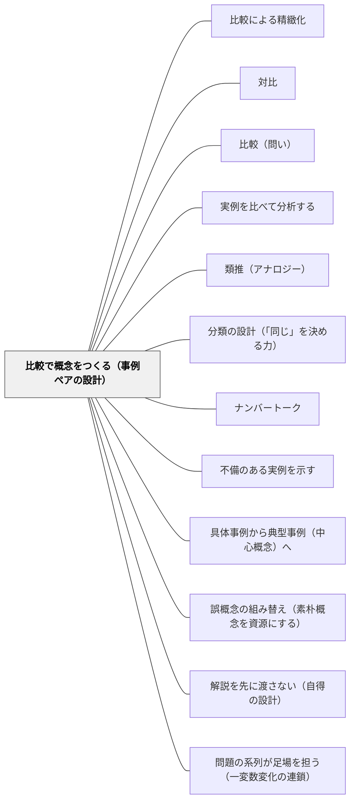

# 比較で概念をつくる（事例ペアの設計）

> 概念は定義から生まれるのではなく、よく設計された「比べるペア」から生まれる。何を揃え、何だけを変えるか——事例ペアの設計が概念の輪郭を決める。

## 背景（Context）

このWikiには「比較」を扱うパタンが既に4つある。「対比」はイーガン系で、感情的なコントラストによって意味の重さを実感させる手立て。「比較（問い）」は「AとBはどう違う？」という発問の型。「比較による精緻化」は学んだ後に別の概念と比べて理解を深める学習方略——学習者の操作である。「実例を比べて分析する」は完成した作品の質を比べて達成規準を共同構築する。

これらに対し本パタンの固有領域は、概念を**初めて形成する**場面で、教師が「どの2事例を・何を揃え・何を変えて・どう同時に並べるか」を**事前に設計する**ところにある。「学んでから比べて深める」のではなく、「比べることで概念がそもそも生まれる」場面の教材設計のパタンである。

理論的土台は Gentner の構造アラインメント理論（structure-mapping theory）。2つの事例を並べて対応づける（アラインする）とき、人は表面的特徴ではなく関係構造に注意を向け始める。共通構造の抽出（スキーマ誘導）と差異の発見（精密化）が同時に進む。Alfieri, Nokes-Malach, & Schunn（2013）が 57 研究をまとめたメタ分析は、事例の比較提示が単独提示よりも一貫して学習成果に勝ることを示した（中程度の効果量）。Rittle-Johnson & Star（2007）は、同じ方程式を2通りの解法で並べて比較させた群が、解法を1つずつ順に学んだ群より、概念理解と手続きの柔軟性の両方で伸びることを示した。

## 問題（Problem）

教師は新しい概念を「定義＋例ひとつ」で導入しがちだ。例が1つしかないと、子どもはその例のどの特徴が本質で、どれが偶然かを区別できない。三角形を「底辺が水平な正三角形」のイラストだけで導入すると、傾いた鋭角三角形や細長い鈍角三角形を「三角形ではない」と判断する子が出る——例の偶然的特徴（向き・対称性）を本質と取り違えている。

事例を順番に1つずつ提示する（逐次提示）と、前の事例の記憶が薄れて比較が成立しない。「先週やった例と今日の例、何が同じ？」と問うても、子どもの頭の中で前の事例の解像度はすでに落ちている。同時に視野に入る形で並んでいないと、比較は走らない——特にワーキングメモリへの負荷が大きい低学年や特性のある子では顕著である。

比較のチャンスを「気づいた子が気づけばいい」と子ども任せにすると、人間の比較は放っておけば表面的類似に引っ張られる（Gentner）。絵柄が似ている・数字の桁が同じ——そういう表面の比較で終わり、関係構造の比較には至らない。

事例ペアの設計を怠ると、子どもは「概念の定義文を暗記する」か「手続きだけを覚える」のどちらかに逃げる。どちらも概念は形成されていない。

## 力のかたち（Forces）

- 1事例では、本質的特徴と偶然的特徴が区別できない——偶然が概念に紛れ込んでしまう
- 人間の比較は放っておくと表面的類似に引かれる（Gentner）。構造に目を向けさせるには「何を揃えるか」を教師が統制する必要がある
- 近い比較（類似ペア・1点だけ違う）は精密な区別を生み、遠い比較（異質ペア・表面が違って構造が同じ）は抽象的なスキーマを生む——目的によって使い分ける必要がある
- 同時提示でなければワーキングメモリ上で比較が成立しない。特に低学年・特性のある子は逐次提示では比較が崩れる
- 両事例とも未習熟だと比較自体が負荷過多になる——Rittle-Johnson & Star は、少なくとも一方が足場として馴染んでいるときに比較がもっとも効くことを示した
- 事例ペアの設計には教材研究の時間がかかる——全単元でやると重い。核となる概念に絞る判断が要る
- 比較で立ち上がった概念は、その後の命名・定義によって固定しないと残らない——比較しただけで終わらせない後処理も要る

## 解決（Solution）

**概念を導入する場面で、その概念の本質次元を「1つだけ違う」よく統制された2事例として設計し、子どもの目の前に同時に並べる。そして「こっちのこれは、そっちのどれにあたる？」という対応づけ（アラインメント）の問いで、構造への注意を引き出す。**

設計の原則は4つ。

1. **同時に並べる**——黒板の左右、ワークシートの上下、スライドの分割画面。逐次でなく同時。「前の問題と比べてごらん」ではなく、両方が今この瞬間に視界に入っている状態を作る。物理的に隣に置く・指で対応づけながら話す——特別支援の場面ではこれが命綱になる。

2. **1つだけ変える**——概念の本質次元だけが異なり、他は揃っているペア＝「近い比較」を最初に置く。同じ数字で式の形だけ違う、同じ題材で文体だけ違う、同じ図形で向きだけ違う。揃えるべきものを揃えると、変わったところが概念の本質次元として浮かび上がる。

3. **目的で距離を選ぶ**——違いを際立たせて精密な区別を作りたいなら近いペア。共通構造を抽出して抽象的スキーマを作りたいなら、表面が違って構造が同じ「遠いペア」。Gentner の **progressive alignment**（漸進的アラインメント）の原則——まず近い比較で構造に気づかせ、それから遠い比較に進むと、構造的類似の検出が確実に育つ。

4. **対応づけを言語化させる**——「こっちのこれは、そっちのどれにあたる？」というアラインメントの問いを置く。比較表・ベン図・矢印で対応関係を構造化する。観点を絞る（「今日は『へん』だけ比べよう」）と、表面比較に流れない。

---

### 具体例1：算数・解法のペアで「手続きの柔軟性」と「概念理解」を同時に育てる

Rittle-Johnson & Star（2007）の実験設計をそのまま小学校に持ち込む。

導入の場面：

- 同じ方程式（あるいは文章題）を、架空の2人の子が違うやり方で解いたノートを左右に並べて見せる。たとえば「3×（x＋2）＝15」を、（左）両辺を3で割ってから引く（右）展開してから引く——どちらも正しい
- 「どちらも答えは合っている。どこが同じで、どこが違う？どんなときにどちらが速い？」と問う
- 子どもは「左の方法は3で割れる数のときに速い」「右の方法はどんな場合でも使える」など、手続きの**意味と適用範囲**を語り始める
- 1つの解法ずつ順に教えた群より、手続きの柔軟性と概念理解の両方が伸びる——これが Rittle-Johnson & Star の知見

ナンバートークの日常的舞台はこれの繰り返しと考えてよい。複数の解法を黒板に並べて「どこが同じで、どこが違う？」と問うのは、本パタンの最小ユニットを毎日回している姿である。

---

### 具体例2：「三角形」の概念を、正例と変則例・非例のペアで導入する

教科書の「三角形」の導入は、底辺が水平な正三角形1つで済まされがちだ。それでは概念は不完全にしか形成されない。

導入の場面：

- 黒板の左右に2つの図形を並べる。左：傾いた鋭角三角形。右：細長い鈍角三角形。「これとこれ、どちらも三角形だ。どこが同じ？」と問う。「3本の直線」「閉じている」「角が3つ」——本質的特徴が子どもの言葉で出てくる
- 次に、左：三角形。右：三角形に見えるが1辺が曲がっている図形（非例）。「これとこれ、どこが違う？片方が三角形でない理由は？」と問う。「辺がまっすぐじゃない」——非例との比較が本質の輪郭を鋭くする
- どちらの「同じ・違う」も、子どもが本質的特徴（3本の直線・閉じている）と偶然的特徴（向き・形の印象）を分離するために働く

ここで重要なのは、正例だけ／非例だけを並べないこと。「正例ペア（向きだけ違う）」で本質特徴を抽出し、「正例・非例ペア」で境界を確定する——2段構えで概念の輪郭が固まる。

---

### 具体例3：国語・同じ出来事を書いた2つの短文で「描写」の概念をつくる

「直接書く／様子で見せる（show, don't tell）」という概念を、定義から入らず、ペアから立ち上げる。

導入の場面：

- 黒板の左右に2つの短文を並べる。左：「ぼくは泣いた。」右：「気がつくと、ほおがぬれていた。」
- 「どちらも、ぼくが泣いた話。何が違う？」と問う
- 「左は『泣いた』と書いてある。右は書いてないのに、泣いたことが分かる」——子どもの言葉で違いが立ち上がる
- 「これとこれの違いに名前をつけるとしたら？」と問い、「直接書く／様子で見せる」という概念の輪郭を子どもと一緒に固める

ここでも揃えるところを揃えている——同じ出来事（泣いた）、同じ主語、ほぼ同じ短さ。違うのは「書き方」の1点だけ。だから「書き方」が概念の本質次元として浮かび上がる。

---

### 特別支援の視点：同時提示はワーキングメモリへの配慮そのもの

事例ペアの「同時提示」は、認知特性への配慮として極めて重要な手立てになる。

- **物理的に隣に置く**——黒板の左右、机の上に2枚のカード、ワークシートの上下。今この瞬間、両方が視界に入る状態を作る
- **指で対応づけながら話す**——「こっちのこれ」「そっちのこれ」と指差しと言葉を同期させる。記憶への負荷を視覚的・身体的な参照に肩代わりさせる
- **比較の観点を1つに絞る**——「今日は『へん』だけ比べよう」「今日は『答えの大きさ』だけ比べよう」。観点が多いと負荷過多になり、子どもは表面比較に逃げる
- **両方とも未習熟のペアにしない**——少なくとも片方は子どもが安心して扱える事例にする。両方とも未習熟だと比較自体が成立しない（Rittle-Johnson & Star）

同時提示・観点の絞り込み・片足の足場——この3つは特別支援の場面に限らず全員にとって有効だが、特性のある子・ワーキングメモリに負荷を抱える子にとっては「あるかないか」を分ける設計になる。

## 結果（Consequences）

**利点：**

- 本質的特徴の抽出が速く・確実になる——「定義の暗記」でなく「構造の理解」として概念が残る
- 「例の運の悪さ」による誤概念を予防する（[[パタン/誤概念の組み替え（素朴概念を資源にする）]] への接続）。1事例だけで導入したときに混入する偶然的特徴を、ペア設計の段階で排除できる
- 子どもは「比べる」という思考操作を、概念形成と同時に身につける——後の[[パタン/比較による精緻化]]や[[パタン/分類の設計（「同じ」を決める力）]]の前提になる
- 教師の側に「この概念を立ち上げるならこの2事例」というペアのストックが蓄積されると、教材研究の質が上がる

**注意点：**

- ペア設計には教材研究の時間がかかる——全単元でやると重い。各単元の中心概念1つに絞る。それ以外は「例＋追加例」で済ませてもよい
- 両事例とも未習熟だと比較が負荷過多になる——少なくとも一方は足場として馴染んでいる事例にする
- 比較の観点を絞らないと表面比較で終わる——「今日は何を比べるか」を最初に決める
- 比較で立ち上がった概念は、その後の**命名・定義・適用**で固定しないと残らない。「比べて違いを見つけた」で終わらせず、「だからこれを『◯◯』と呼ぶ」「どんな場面でこれが使える？」という後処理までセットで設計する
- 近い比較（1つだけ違う）ばかり繰り返すと、概念が狭く閉じる。ある段階で意図的に「遠い比較」を入れて、表面が違っても同じ構造を見抜く力に進める（progressive alignment）

## 関連パタン

- [[パタン/比較による精緻化]] — 学んだ後に別の概念と比べて理解を深める学習者の操作。本パタンは学ぶ最初に比べて概念をそもそもつくる教師の教材設計
- [[パタン/対比]] — イーガン系の感情的コントラスト（意味の重さの実感）。本パタンは認知的な構造アラインメントの設計（本質特徴の抽出）
- [[パタン/比較（問い）]] — 「どう違う？」という発問の型。本パタンはその問いが効くために必要な事例ペア側の設計
- [[パタン/実例を比べて分析する]] — 完成した作品の質を比べて達成規準を共同構築する。本パタンは概念の本質特徴を抽出することが目的
- [[パタン/類推（アナロジー）]] — 構造アラインメントという同じ認知メカニズムの上にある。類推は既知→未知への構造写像、本パタンは2事例→概念への構造抽出
- [[パタン/分類の設計（「同じ」を決める力）]] — 「何を同じとみなすか」の決定。比較ペアで立ち上がった概念は、次の段階で分類基準として固定される
- [[パタン/ナンバートーク]] — 複数の解法を黒板に並べて比較する場。具体例1（解法比較）の日常的な舞台であり、本パタンの最小ユニットの反復実装
- [[パタン/不備のある実例を示す]] — 正例と不備例のペアは「1つだけ違う」設計の一種。「あと一歩で良くなる」差分の言語化が改善の概念をつくる
- [[パタン/具体事例から典型事例（中心概念）へ]] — 事例群から中心概念へ向かう動き。本パタンはその最小単位（2事例のペア）の設計
- [[パタン/誤概念の組み替え（素朴概念を資源にする）]] — よく設計されたペアは「例の運の悪さ」による誤概念を予防する。予防（本パタン）と治療（誤概念の組み替え）の関係
- [[パタン/解説を先に渡さない（自得の設計）]] — 比較を「問題ペアとして設計する」本パタンに対し、比較を「ヒントとして渡す」位置づけ。同じ比較という手法の異なる運用面
- [[パタン/問題の系列が足場を担う（一変数変化の連鎖）]] — 比較を「問題ペア」で設計する共通点。比較軸の数を1に絞る点で一致。本パタンは2事例の比較で概念を立ち上げ、系列設計は連続した問題群の比較で難度を上げる

## クラスター図

## Actionable Insight

- **次の単元の中心概念を1つ選び、「1つだけ違うペア」を1組つくる**——その単元の核となる概念について、本質次元だけが異なり他は揃っている2事例を準備する。「同じ題材で文体だけ違う」「同じ数字で式の形だけ違う」「同じ図形で向きだけ違う」——どれか1つでよい。ペアを作る作業そのものが、自分が概念の本質を何だと考えているかの自己点検になる
- **例を出すとき「もう1つ、ちょっと違う例」を隣に並べてから問う癖をつける**——例を1つだけ出して説明するのではなく、必ず2つ並べてから「どこが同じ？どこが違う？」と問う。逐次でなく同時に。黒板の左右・ワークシートの上下・スライドの分割画面、どんな形でもよい。「隣に並べる」を授業の標準動作にする
- **「こっちのこれは、そっちのどれ？」という対応づけの問いを1日1回使う**——アラインメントの問いを意識的に教室に持ち込む。指差しと言葉を同期させる、観点を1つに絞る。子どもの目が表面ではなく関係構造に向かう一言を、毎日1回必ず投げる

## 出典

Gentner, D. (2010). Bootstrapping the mind: Analogical processes and symbol systems. *Cognitive Science*, 34(5), 752–775.

Rittle-Johnson, B., & Star, J. R. (2007). Does comparing solution methods facilitate conceptual and procedural knowledge? An experimental study on learning to solve equations. *Journal of Educational Psychology*, 99(3), 561–574.

Alfieri, L., Nokes-Malach, T. J., & Schunn, C. D. (2013). Learning through case comparisons: A meta-analytic review. *Educational Psychologist*, 48(2), 87–113.
