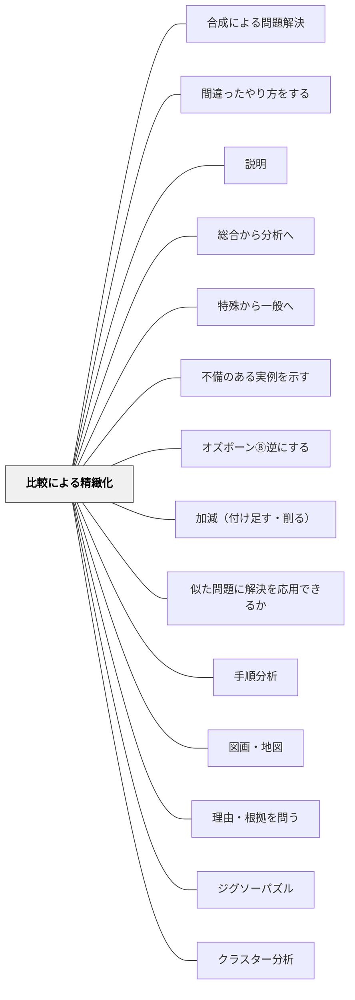

# 比較による精緻化

## Pattern Connection

### Milewski（2023）——関手（Functor）との接続

圏論において**関手（Functor）**は「構造を保ちながら圏間を移動する写像」である。関手は対象を対象へ、射を射へ写し、合成と恒等射を保つ——「構造の布地を引き裂かない」変換だ。

比較による精緻化は、この関手的思考の教育実践版と見なせる。

- 二つの概念（A圏とB圏の対象群）を比較するとき、私たちは「同じ構造（射のパタン）を両方に見出す」作業をしている
- 「このAとこのBは何が同じで何が違うか」という問いは、「A圏からB圏への関手はどんな構造を保ち、何を変えるか」という問いに対応する
- 関手的比較は「見た目が違うが本質的に同型（isomorphic）」か「見た目が似ているが構造が異なる」かを識別する力を育てる

[[概念/圏論と教育]] — 関手（Functor）の教育への接続
[[文献/Category Theory for Programmers（Milewski）]] — 本接続の出典

---

## 背景（Context）

[[パタン/精緻化]] によって、知識を深く・使えるものにしたい。概念を単体で学ぶだけでは、その概念の「何が特徴的か」「何と違うのか」が見えにくい。物の輪郭は、隣に別のものを置いてはじめてはっきり見える。

## 問題（Problem）

概念・出来事・作品・方法を、それだけで理解しようとすると、ぼんやりした印象のまま記憶に留まる。「似ているけど違う何か」と並べて比べることができなければ、概念は「ラベル」として貼られるだけで、内側の構造まで理解されない。

## 力のかたち（Forces）

- 人は差異によって世界を認識する（「これはあれとは違う」という把握が理解を生む）
- 比べる対象の選び方によって、際立つ特徴が変わる
- 類似性の高いもの同士の比較は精緻な区別を生み、類似性の低いもの同士は新しい見方を生む
- 比較に時間をかけすぎると本質から離れることもある

## 解決（Solution）

**学んだ概念・作品・出来事を、別の概念・作品・出来事と意識的に比べる。**

「同じところ」と「違うところ」の両方を探すことで、概念の輪郭・特徴・本質的な構造が浮かび上がる。

**実践例：**
- 国語：今読んでいる物語の主人公と前回読んだ作品の主人公を「性格・行動・変化」で比べる
- 社会：江戸時代の商業と現代のコンビニを「流通・情報・役割」で比べる
- 理科：植物の光合成と人間の呼吸を「原料・産物・目的」で比べる
- 算数：分数の割り算と整数の割り算を「意味・手順・感覚」で比べる
- 道徳：「正義」と「思いやり」が対立しそうな場面を考え、どちらを優先するか考える

**比較の枠組み（ベン図・比較表・対比文）を明示的に与えることで、比較が「表面的な差異探し」に終わらず、構造的な理解につながる。**

## 結果（Consequences）

- 概念の「似ているようで違う部分」が言語化され、理解が精密になる
- 比べる視点（軸）を自分で選ぶ経験が、批判的・分析的思考を育てる
- 複数の概念が関係づけられることで、知識がネットワーク化される
- 「なぜ違うのか」を問う習慣が、次の学習への問いを生み出す

## クラスター図

## Actionable Insight

- 学んだ2つの概念をベン図で比較させる——「共通点・相違点」を視覚化することで両者の本質的な構造が見えてくる
- 授業後に「似ているが違うもの」を1組見つけて対比文を書かせる——比較の言語化が理解を固める
- 比較表（横軸に概念、縦軸に観点）を共同で作成しクラスで検討する——多角的な観点が概念の理解を豊かにする
- 「これは○○と何が違う？」を授業中1回だけ投げかける——比較の問いが正解に向かう前に違いを考える思考を引き出す
- 「似ているが違う」ペアを子ども自身に1組見つけさせる——教師が与えるより自分で見つけた比較の方が印象に残る
- 比較の結論を「〜は…だが、一方〜は…」の文型で書かせる——接続詞を使った言語化が比較思考を定着させる

## 出典

- 一つの教育のパタン・ランゲージ（岩井輝久）

## 関連パタン
- [[パタン/合成による問題解決]]
- [[パタン/間違ったやり方をする]]
- [[パタン/説明]]
- [[パタン/総合から分析へ]]
- [[パタン/特殊から一般へ]]
- [[パタン/不備のある実例を示す]]
- [[パタン/オズボーン⑧逆にする]]
- [[パタン/加減（付け足す・削る）]]
- [[パタン/似た問題に解決を応用できるか]]
- [[パタン/手順分析]]
- [[パタン/図画・地図]]
- [[パタン/理由・根拠を問う]]
- [[パタン/ジグソーパズル]]
- [[パタン/クラスター分析]]
- [[パタン/橋渡し推論]]
- [[パタン/具体から抽象へ]]
- [[パタン/橋渡し推論（命題間の関係の明示化）]]
- [[パタン/具体事例から典型事例（中心概念）へ]]

- [[パタン/精緻化]] — 親パタン：知識をネットワーク化する学習原理
- [[パタン/例示による精緻化]] — 例を並べることは比較の準備になる
- [[パタン/語りによる精緻化]] — 比較したことを「物語」として語ると記憶に残る
- [[パタン/類推的学習①]] — 比較はアナロジー学習の中核的操作
- [[概念/推理と学習（アブダクション）]] — 差異から本質を逆算する推理としての比較
