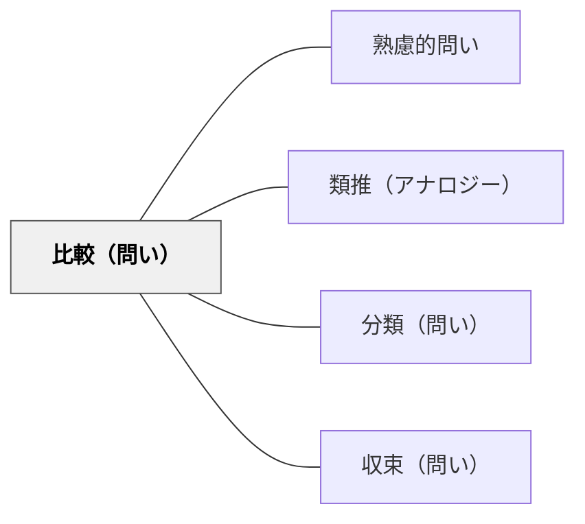

# 比較（問い）

> 「AとBはどう違うか？共通点は？」と並べることで、それぞれの輪郭を際立たせる。

## 背景（Context）
概念や事物の特徴は、それだけを見ていると見えにくいが、他と並べることで鮮明になる。
比較は思考の基本的な操作のひとつであり、分類・評価・選択の前提になる。
「違いを問う」ことは、両者への理解を同時に深め、思考の精度を高める。
教育においても、比較の問いは知識を整理し、深い理解を引き出す有効な手段だ。

## 問題（Problem）
学習者が概念・事例・立場・方法論などを学んでいるとき、それらを単独で捉えるに留まり、相互の関係が見えていない場合、どう思考を促すか。

## 力のかたち（Forces）
- 比較によって各対象の固有の特徴が浮かび上がる（対比効果）。
- 共通点と相違点を同時に問うことで、表面的な違いと本質的な違いを区別させることができる。
- 比較の枠組み（何の観点で比較するか）の選択自体が思考を要する。
- 比較しすぎると論点が散漫になる恐れもある。

## 解決（Solution）
「AとBはどこが似ていますか？どこが違いますか？」「どの点で比べますか？」と問いかける。
比較の軸・観点を学習者自身に設定させることで、思考の主体性を高める。
表（比較マトリクス）や図を使って比較を構造化することで、全体像が見えやすくなる。
「最も重要な違いはどれですか？なぜ？」と焦点化の問いをつなげる。

## 結果（Consequences）
対象の理解が深まり、それぞれの特徴・強みと限界が明確になる。
比較の観点を自分で設定する力が育ち、分析的な思考が強化される。
分類・評価・選択といった高次の思考操作の基礎が整う。
一方で、比較のための比較に終始すると、「だから何か」という意義の問いが失われる恐れがある。

## 関連パタン
- [[パタン/熟慮的問い]] — 親パタン
- [[パタン/類推（アナロジー）]] — 構造的類似に着目した比較
- [[パタン/分類（問い）]] — 比較から分類へと進む思考
- [[パタン/収束（問い）]] — 比較の後に最良のものを選ぶ問い

## クラスター図

## Actionable Insight

- 「AとBはどこが似ていますか？どこが違いますか？」と問い、比較マトリクス（表）で構造化させる——視覚的な比較が対象の固有の特徴を鮮明にし理解の精度を高める
- 比較の観点（何の軸で比べるか）を学習者自身に設定させる——観点の設定自体が分析的思考を育て主体的な学びを引き出す
- 「最も重要な違いはどれ？なぜ？」と焦点化の問いをつなげる——ただの比較で終わらせず「だから何が言えるか」へ進めることで高次の思考につながる

## 出典
- [[文献/熟慮的問いのパターンリスト（動画記録）]]
