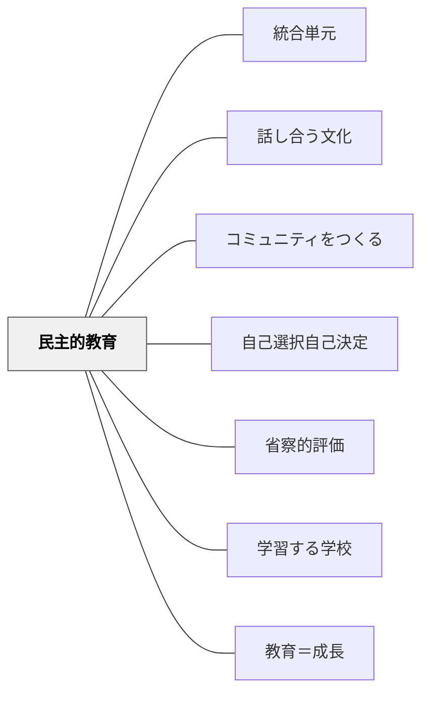

# 民主的教育

> 民主主義は教える内容である前に、教室で経験される関係と手続きである。

## Pattern Connection

### 細谷恒夫（1957）

細谷の *教育の哲学 人間形成の基礎理論* は、民主的教育のもっとも重要な問い——「なぜ対話・討議・共同決定が民主主義の体験になるのか」——に対して、**同志的交渉**という概念から答えを与える。

- **既存パタンとの関連**：Deweyが「民主主義は共同生活の様式（a mode of associated living）」と論じるとき、その共同生活においてどのような人間交渉が民主主義を体験させるのか、という問いが残っていた。細谷の交渉類型論はこの問いに答える。
- **補強された点**：民主的教育の実践（話し合い・共同決定・省察）が、単なる「手続き」ではなく、**思想・理想・問いを紐帯とする同志的交渉**を日常化することだという理解が深まる。

**同志的交渉と民主的文化の関係**

細谷が描く「同志的交渉」の特質は、民主的教育の理念と深く重なる：

| 同志的交渉の特質 | 民主的教育での対応 |
|---|---|
| 思想・世界観・理想を紐帯とする | 「なぜ」を問う文化——価値や理由を語り合う |
| 全人的・合理的（理屈と感情の両立） | 感情を排除しない論理的な対話 |
| 自覚的・選択的に結ばれる | 押し付けられた合意でなく、自ら選んだコミットメント |
| 未来志向（自らの責任で選び取る） | 未来に向けて共に設計する学び |

**同志的交渉が「退落」するとき**

細谷が指摘する同志的交渉の危険は、民主的教育の失敗のパターンと対応する：

1. **共感的退落**: 「なんとなく仲良し」に堕落し、批判的な問いが失われる——表面的な民主主義
2. **同僚的退落**: 建前として民主的な手続きを維持しながら、実際は利害調整だけが動く——形式的な民主主義

この分析は、民主的教育を維持するためには不断の緊張と更新が必要であることを示唆する。

> 「同志的交渉の性格を純粋に保つためには、与えられた既にでき上ったものの内に安住することなく（中略）自他を結びつけるものをお互に自らの責任において、選びとるという自覚がなければならない」

- **他のパタンへの波及**：[[パタン/話し合う文化]]（同志的交渉を日常化するための文化的基盤）・[[パタン/コミュニティをつくる]]（学校が同志的交渉の場として機能するための設計）・[[パタン/人間形成の様式]]（民主的教育は「覚醒」の条件でもある）

**学校の六機能と対極性——民主的教育の構造的位置**

細谷は学校教育の社会的機能を歴史的に分析し、現代学校が果たす六つの機能を三対の対極として整理する（第一篇第四章）。

| | 一方の極 | 他方の極 |
|---|---|---|
| **文化に対して** | 伝統的文化の伝達・維持 | 既成文化の批判・改造 |
| **社会に対して** | 社会成員の行動様式の統合 | 行動様式の分化（個性化） |
| **若い世代に対して** | 外からの形成 | 内からの開発 |

三つの「伝達的」極（伝達・統合・外からの形成）は内的に連関し、三つの「開発的」極（批判・分化・内からの開発）もまた内的に連関する。細谷は「どちらの極を重点とするかは教育的世界観の問題」と述べ、学校はこの緊張を構造的に内包していると示す。

> 「文化の伝達と維持を機能とする教育は、現在の社会成員の行動を統合するように働き、教育方法としては被教育者を外から形成することに傾く。これに対して、既成文化を批判し、新たな文化の創造を育成しようとする教育は、行動様式の分化をさけることができないであろうし、教育方法としては、被教育者自身の内にひそむ内的可能性の発見とその展開をはからなければならない」（第一篇第四章）

**民主的教育の構造的位置**：民主的教育が目指す「共同決定・問いの共有・多様性の尊重」は、三つの開発的極（批判・分化・内からの開発）と整合する。同時に文化的伝統の継承を完全に手放すことはできないため、学校はつねにこの緊張を内包している。「民主的」を宣言することは、一方の極への傾きを意識的に選び取ることであり、その緊張を引き受けることに外ならない。これは細谷の「教育的英知」——現実と世界観の矛盾を行為的決断によって乗り越えること——が要求される場面でもある。

- **他のパタンへの波及**：[[パタン/教育目的]]（三対の対極のどちらに重点をおくかは教育的世界観の問題として、三類型の文化主義・自由主義・社会主義と対応する）・[[パタン/人間形成の様式]]（「外からの形成 vs. 内からの開発」の対極は、しつけ・訓練・教え・覚醒という四様式の構造にも対応する）

---

### Dewey（1938）

*Experience and Education*（1938）の「社会的統制（Social Control）」概念は、なぜ「共同決定の積み重ね」が民主的教育の実装として有効かを説明する。統制はルールとして外から押し付けるものでなく、活動への参加から内側に生まれるものだ——これが民主的学習文化の機制。

- **補強された点**：「なぜ子どもたちは民主的な手続きの中で動けるのか」の答えが明確になる。ゲームのルールのモデル——プレーヤーはルールに服従しているのでなく、ルールがゲームそのものだから従う——が、民主的教室の設計原理として機能する。

**社会的統制のゲームルールモデル**

> "Control of individual actions is effected by the whole situation in which individuals are involved, in which they share and of which they are cooperative or interacting parts."（Dewey, 1938, Ch.4）

| ゲームのルール | 民主的教室での対応 |
|---|---|
| ルールはゲームの外にない——ルールがゲームである | クラスの手続き・合意はクラスという共同体そのもの |
| 違反への抗議はルールへの敬意から来る | 「フェアでない」という主張が民主主義の語彙になる |
| 参加者が統制の主体 | 学習者が統制の外にいない——共同体の一員として参加する |

**教師の役割転換（E&E Ch.4）**

> "The teacher loses the position of external boss or dictator but takes on that of leader of group activities."（Dewey, 1938, Ch.4）

- **他のパタンへの波及**：[[パタン/コミュニティをつくる]]（社会的統制は強制でなく共同生活から生まれる）・[[パタン/数学のクラス規範]]（クラスの規範がゲームルールとして機能する）

---

### Dewey（1916）

このパタンの核心命題はDeweyの *Democracy and Education*（Ch.7）の定義と完全に一致する。Daniels & Bizar（2005）やBeane（1993）の民主的教育論はすべてDeweyの系譜の上に成立している。

- **既存パタンとの関連**：「民主主義＝共同生活の様式（a mode of associated living）」というDeweyの定義が、「教室で経験される関係と手続き」がなぜ重要かの哲学的根拠を与える。制度として教えるのでなく、共同生活として経験させる——これが本パタンの核心。
- **補強された点**：「なぜ民主的教育か」の根拠が、実践的効果（声の大きい子を防ぐ）から哲学的根拠（共同生活そのものが教育する）へと深まる。Deweyの民主主義的社会の2条件が、教室設計の具体的な照合軸になる。

> "A democracy is more than a form of government; it is primarily a mode of associated living, of conjoint communicated experience."（Ch.7）

> "The very process of living together educates."（Ch.1）

| Deweyの民主主義の2条件 | 教室での実践例 |
|---|---|
| ①共有される関心の数と多様性が大きい | 単元の問いを全員から集め、多様な関心を可視化する |
| ②社会集団間の相互作用が自由で十全 | 異なる意見が安全に出せる話し合い文化を日常化する |

- **他のパタンへの波及**：[[パタン/学習する学校]]（学校＝縮小された民主的コミュニティ）・[[パタン/教育＝成長]]（外から目的を押し付けない教育観）と三角形を構成する。民主的教育の「なぜ」はこの3パタンをまとめて読むと見えてくる。

---

## 背景（Context）

民主主義を学ぶことは、制度や歴史を知ることだけではない。異なる意見を聴き、問いを出し、合意を作り、共同で計画し、ふり返る経験がなければ、民主主義は抽象概念のまま残る。

## 問題（Problem）

教師がすべての問い・活動・評価を決める教室では、学習者は民主主義を「内容」として学んでも、「自分たちで学びを作る」経験を持ちにくい。参加の手続きがないまま自由だけを渡すと、声の大きい子だけが場を動かすこともある。

## 解決（Solution）

**学習者が問い・活動・役割・評価の一部を共同で決める手続きを授業に組み込む。**

教師はすべてを委ねるのではなく、選択肢・制約・合意形成の方法を設計する。小さな共同決定を積み重ねることで、子どもは民主主義を知識としてだけでなく、教室の営みとして経験する。

## このパタンが働く実践

- [[パタン/統合単元]] — 生徒の問いからテーマを発見し、教師と生徒が共同で単元を設計する。
- [[パタン/話し合う文化]] — 異なる意見を聞き、合意を作る日常的な土台になる。
- [[パタン/コミュニティをつくる]] — 「私たちの学び」を共同事業として育てる。

## 関連パタン

- [[パタン/統合単元]]
- [[パタン/話し合う文化]]
- [[パタン/コミュニティをつくる]]
- [[パタン/自己選択自己決定]]
- [[パタン/省察的評価]]
- [[パタン/学習する学校]]
- [[パタン/教育＝成長]]

## クラスター図

## Actionable Insight

## 出典

- Daniels, H., & Bizar, M.（2005）Teaching the Best Practice Way. Stenhouse. / Beane, J. A.（1993）A Middle School Curriculum from Rhetoric to Reality.

- 単元の最初に「このテーマで知りたいこと」を全員から集め、3つだけ授業の問いとして採用する——小さな共同設計が民主的教育の入口になる
- 週1回のクラス会議で「授業のルールを1つ変えるとしたら」を問う——ルールへの参加がDeweyのゲームルールモデルを体験させる
- 単元末に「どの話し合いが一番考えが深まったか」を書いて振り返らせる——民主的プロセス自体を内省することで、手続きが「制度」から「文化」に育つ
- 細谷の三対の対極を授業設計の自己点検軸として使う：「この授業は外からの形成か内からの開発か」を問い、開発的極への意図的な傾きを確認する
