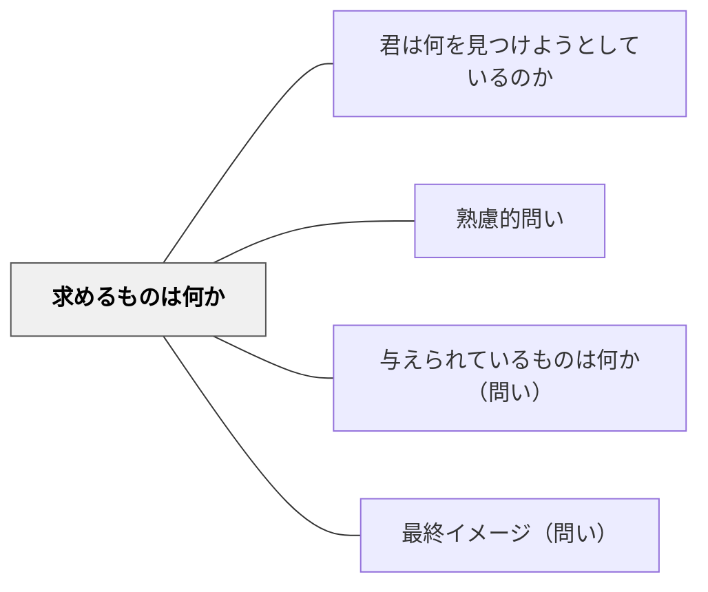

# 求めるものは何か

> 「何を答えとして求めているのか」を確認することで、学習者は問題解決のゴールを明確にしてから取り組む。

## 背景（Context）
問題を解こうとするとき、多くの学習者は問いをよく読まずに解き始める。何を答えとして求められているのかを正確に把握することは、問題解決の出発点として不可欠である。ポリアは「問題を理解すること」の第一歩として、「求めるものは何か」を問うことを挙げている。

## 問題（Problem）
求めるものを確認しないまま解き始めると、見当違いの方向に進んでしまう。計算問題で「何を求めるか」を確認せずに数値を操作し始めると、正しい手順でも違う答えを出してしまう。また、問題の「答え」が数値か言葉か図かによって、解法のアプローチが異なる。出発点での確認を怠ることが、多くの「解き間違い」の原因となる。

## 力のかたち（Forces）
- 「求めるもの」の確認は、問題解決の設計図を描く第一歩である
- ゴールが明確であるほど、どの情報が必要かが見えてくる
- 求めるものの確認は短時間だが、その後のプロセス全体に大きな影響を与える
- 問題によっては「求めるもの」が複数あったり、段階的に変化したりする

## 解決（Solution）
問題を読んだ後に「まず、この問題は何を求めているかを言葉にしてみましょう」と促す。例えば算数の文章題で「求めるのは何ですか？」とクラス全体で確認してから解き始める。自分の言葉で「〜を求める問題だ」と書かせることで、問いの理解を可視化する。テストや試験前の習慣として「問いに線を引く・求めるものを丸で囲む」などの具体的な行動として定着させる。

## 結果（Consequences）
- 問題の読み間違いや方向性の誤りが減り、問題解決の精度が高まる
- ゴールを先に確認する習慣が、計画的な問題解決スタイルを育てる
- 問いを丁寧に読む姿勢が、あらゆる教科の学習に好影響を与える

## 関連パタン
- [[パタン/君は何を見つけようとしているのか]]
- [[パタン/熟慮的問い]] — 親パタン
- [[パタン/与えられているものは何か（問い）]] — ゴールと既知情報をセットで確認する
- [[パタン/最終イメージ（問い）]] — 求めるものの明確化と最終イメージは補完的

## クラスター図

## Actionable Insight

- 問題を提示したら「まず解く前に、この問題は何を求めているかを言葉にしてみよう」と促す——ゴールを最初に言語化するだけで見当違いの方向への進行が防げる
- 文章題や複雑な問いでは「求めるものに線を引く・丸で囲む」という習慣を授業の最初から教える——具体的な身体動作として定着させることがゴール確認の習慣化につながる
- 答えを出した後に「問題が求めていたものと、自分の答えは一致しているか？」と照合させる——最後の確認ステップが問い読み間違いによる失点を減らす

## 出典
- [[文献/熟慮的問いのパターンリスト（動画記録）]]
- ジョージ・ポリア（1954）『いかにして問題をとくか』丸善出版
