# 沈黙に値をつけているのは誰か

> 沈黙は、音を立てない。記録の中に現れるのは、つねに、沈黙に与えられた値である。そして、その値の分かれ目を作ったのは、子どもではなく、窓の開け方である。

## [Pattern Connection]

本パタンは岩井（2026）『圏論的教育記述の公理化ノート 第3巻』第3章の**教室語版**であり、**理論の正は書籍にある**（定義・記号はこの Wiki に置かない）。ここに書くのは、教室で使える形に開いた記録の書き分けだけである。

そして、このページにも最初に釘を打っておく。**このパタンは、記録をめぐる非対称の当否を判定しない。** 「誰が値をつけるべきか」「その体制は不当か」を、このパタンは一言も言わない。渡すのは**正確に記述する手順**であって、**あるべき姿**ではない。

この釘が要るのには、形式上の理由がある。出典の理論は、「これは、これを意味しない」という**否定の形**で書かれている。ところがパタンという器は、そもそも**命令形で書かれる**——「こうしなさい」「こう置きなさい」。パタンという器そのものが、この本の抑制とは逆を向く力を持つ。だから本ページは、命令形を使う場所を、**記録の書き分けの側だけ**に限る。「二つを分けて書け」とは言う。「こうあるべきだ」とは言わない。

このWikiには、沈黙を**扱う**側のパタンがすでにある。ただし、扱っているものが違う。

> **[[パタン/沈黙の間の設計]] は、授業中の「間」の取り方——待つ時間の設計——を扱う。本パタンは、記録における無応答に、誰がどの値をつけたかを扱う。** 両者は同じ「沈黙」の語を使うが、対象が別である。あちらは教室の時間の中の沈黙、こちらは記録用紙の上の空白である。

[[概念/証拠不足と不成立の区別]] が「証拠がないことは、無いことではない」を評価の三値として確定したのに対し、本パタンは同じ手つきを**沈黙**に使い、さらに一歩踏み込む。**その値を決めたのは誰か**を問うところまで行く。

## 背景（Context）

記録には、空白が生まれる。

返却したのに、何の反応もなかった子。話し合いで一度も手が挙がらなかった子。アンケートを出さなかった子。ふりかえりの用紙が白いまま出された子。観察が薄かった時間帯の、誰についても何も書かれていない一週間。

これらはすべて、記録の上では同じ顔をしている。**何も書かれていない**、という顔である。

そして、学期末に記録を読み返すとき、この空白は、たいてい一言でまとめられる。「反応なし」。「変化なし」。「特になし」。あるいは、何も書かないまま次の欄へ進む。

だが、空白の後ろには、**まったく別の二つの出来事**が隠れている。そして、どちらであるかを決めたのは、たいてい、子どもの側ではない。

## 問題（Problem）

**同じ「応答が無かった」という記録が、二つの正反対に近い中身を持ちうる。そして、記録の表面からは、どちらであるかが読めない。**

出典の著者は、これをこう言い当てた。

> **沈黙は、音を立てない。記録の中に現れるのは、つねに、沈黙に与えられた値である。**

沈黙そのものは、記録に入ってこない。入ってくるのは、こちらがその沈黙につけた**値**である。

### 二つの中身

**① 見たうえで、無かった**

その場面を、はじめから終わりまで観察した。そのうえで、応答が観察されなかった。窓は全開で、その窓の中には、何も通らなかった。これは、**確かめられた不応答**である。

**② 見ていないから、分からない**

そもそも、その過程を見ていない。机の横を通らなかった。ノートを開かなかった。その時間、別の子についていた。だから、応答があったのかどうかが、分からない。これは、**観察の空白**である。

**表面は、どちらも同じ「応答が観察されなかった記録」である。だが、中身は、正反対に近い。**

①は、その子についての情報である。②は、**こちらの観察体制についての情報**であって、その子についての情報ではない。

### そして、いちばん重い一行

同じ無応答が、①にも②にもなる。何が分けたのか。

> **値の分かれ目を作ったのは、子どもではなく、窓の開け方である。**

観察の窓を全開にして見ていれば、その沈黙は①になった。窓を開けていなければ、同じ沈黙が②になる。**子どもは、何も変えていない。** 変わったのは、こちら側の体制と、書き手の裁定だけである。

だから、この問いが立つ。

> **誰の沈黙が、どの値で記録されるのか。**

これは、その子の性格の問いでも、意欲の問いでもない。**誰が観察の窓を開ける位置に立っているか**という、位置の問いである。同じことは、学級全体についても起きる。薄く見た記録と、窓を広げて見た記録では、学級について立てられる主張が変わる。**どれだけ広く窓を開けるかの選択は、観察する位置に立つ者の選択である。**

### 滑りの入口

滑りは、いつも同じところで起きる。**②を①として書いた瞬間**である。

「反応なし」と書く。あるいは、空欄のまま提出する。すると数か月後、その記録を読む人は——本人であっても——それを①として読む。「見たうえで、無かった」と読む。誰も嘘をついていないのに、記録は嘘になる。

そして、この癖は、暴いても消えない。一度「見ていないことと、無いことは違う」と学んでも、次の空欄の前で、また滑る。だから、書き分けは、毎回、その場でやることになる。

## 力のかたち（Forces）

- **値を分けて書く手間 vs 空欄で済ませる手軽さ**——「見ていない」と一言足すのに五秒かかる。五秒を、四十人分、毎日、というのが実際の重さである
- **「無かった」のほうが記録として据わりがよい**——「見ていないので分かりません」は、記録として頼りなく見える。「反応なし」は、断定されていて座りがよい。据わりのよさが、正確さを押しのける
- **観察の窓を広げる時間がない**——全区間を見れば①が書ける。だが全区間を見る時間は、どの授業にもない
- **窓を広げると、別のところが薄くなる**——ある子を厚く見ることは、別の子を薄く見ることである。窓の総量は限られている。だから、②は必ずどこかに残る
- **沈黙を「意思表示」と読みたくなる誘惑**——黙っていることを「納得」「同意」「抗議」「拒否」のどれかに読みたくなる。**どちら向きにも読めない、が正確である**
- **静かな子ほど②が溜まる**——手のかからない子、表出の手段が限られている子ほど、窓が向かない。窓が向かないから②が溜まり、②が溜まるから話題に上らず、上らないから窓が向かない。この循環は、放っておくと必ず強まる
- **①と書ける場面は、実はほとんどない**——正直に書き分けると、記録の大半が②になる。それを見るのは、気持ちのよいことではない
- **書き分けを始めると、自分の見取りの薄さが可視化される**——これは利点だが、同時に、書き分けをやめたくなる理由でもある

## 解決（Solution）

**空白を書くときに、二つの列のどちらであるかを、その場で分けて書く。**

やることは、これだけである。記録に空白を残すとき、次の二つのどちらかを選ぶ。

- **「見たうえで、無かった」**——その場面を通して観察した。そのうえで、応答が観察されなかった
- **「見ていない」**——そもそも観察していない。だから、分からない

そして、迷ったら**必ず後者**にする。「たぶん見ていたと思う」は、前者の証人にならない。

書式としては、二文字でよい。「無（見た）」「未（見ず）」。記号を決めておけば、五秒が二秒になる。

---

### 値をつけているのは、誰か

分けて書くようになると、ほどなく、次のことに気づく。

**「見たうえで、無かった」と書けるかどうかは、こちらが窓を開けたかどうかで決まる。**

つまり、**値をつけているのは、子どもではない。**

- 沈黙そのものは、値を持たない。音を立てないからである
- 値は、**観察の体制**（どこに・どれだけ窓を開けたか）と、**書き手の裁定**（その空白をどう書いたか）から生まれる
- したがって、値の裁定者は、**観察する位置に立つ者と、記録を書く位置に立つ者**である

これは、責任の追及ではない。**位置の記述**である。「値をつけたのはこちらだ」と分かることの意味は、こちらが自分を責めることではなく、**値を変えられるのもこちらだ**と分かることにある。

窓を三分だけ開ければ、②が①になる。子どもに何かを求める必要はない。

---

### 必ず書く二つの非含意

四段の確かめと同じく、ここにも塞いでおくべき読み替えが二つある。

**① 沈黙の記録は、どの値であれ、同意でも、異議の不在でもない。**

「見たうえで、無かった」と正確に書けたときでさえ、そこから「納得している」「異議が無い」は出ない。①は、**応答が観察されなかった**という事実までである。その先の解釈——同意・抗議・無関心・遠慮——は、どれもこの記録からは出ない。**どちら向きにも読めない、が正確である。**

**② 沈黙が値を持つことは、本人がその値を選んだことではない。**

値の裁定は、書き手・観察手の側にある。本人の態度とは、別である。「①と記録された」ことは、「その子が黙ることを選んだ」ことを意味しない。「②と記録された」ことは、「その子が隠した」ことを意味しない。

この二つを落とすと、この道具はたちまち、子どもの内面を読む装置に変わる。この道具は、内面を読まない。**記録の側の状態を、正確に書くだけ**である。

---

### 具体例1：返却後に何も反応がなかった子

算数の記述問題を返した。C児は、返された用紙を見て、何も書かず、何も言わなかった。

記録に何と書くか。

- **書きたくなるのは**——「反応なし」
- **確かめること**——返却のあと、C児の様子を、どれだけ見ていたか
- **実際は**——返却直後の三分は、別の子の質問に答えていた。C児の机の横を通ったのは、五分後である

だから、書けるのは②である。「返却直後は**見ていない**。五分後の時点では、用紙は机の上にあり、書き込みは無かった」。

そして、ここに具体的な続きがある。次の返却のとき、返却直後の三分だけ、C児の机の横に立ってみる。それだけで、次の記録は①になれる。**①にするために、C児に何かを求める必要はない。** こちらが立つ位置を変えるだけである。

---

### 具体例2：挙手のない子

話し合いの時間、A児は一度も手を挙げなかった。

- **①として書けるか**——話し合いの全区間、A児を見ていたか。見ていない。全体の進行を見ていた
- **書けるのは②**——「話し合いの場面での見取りは、**していない**。挙手が無かったことは観察したが、それ以外の応答（うなずき・つぶやき・隣との短いやりとり）は、見ていない」

ここで大事なのは、**「挙手が無かった」は①だが、「応答が無かった」は②だ**ということである。窓の大きさが違う。挙手という狭い窓では①が立ち、応答という広い窓では②しか立たない。

**窓の大きさを書かずに結論だけ書くと、狭い窓の①が、広い窓の①として読まれる。**

---

### 具体例3：アンケートの未提出

学級アンケートを配った。三人が未提出だった。

- **書きたくなるのは**——「三人は意見なし」
- **書けるのは**——「三人、未提出。**未提出の理由は、見ていない**」

未提出は、意見の不在ではない。持ち帰って忘れた、書く時間がなかった、書きたくなかった、書けなかった——どれでもありうる。**どれであるかは、この記録からは出ない。**

そして、未提出が三人だったことを、こちらの側から見る。配ったのはいつか。回収はどうしたか。書く時間を授業内に取ったか。**未提出の値も、配り方と回収の仕方で変わる。**

---

### 具体例4：振り返りの空欄

ふりかえりカードの「今日わからなかったこと」の欄が、白いまま出てきた。

- **①（見たうえで、無かった）**——書いている時間、その子の手元を見ていた。ペンを持ったまま止まっていて、そのまま提出した。**この場合は、「書こうとして書かなかった」という観察が、実際に立っている**
- **②（見ていない）**——回収してから気づいた。書いている時間の様子は、見ていない

同じ白い欄が、①にも②にもなる。そして**①のほうが情報が多い**。「ペンを持ったまま止まっていた」は、「わからなかったことが無かった」とは全く違う情報である。

だから、この欄については、書いている三分のあいだ、教室を一周する価値がある。一周するだけで、白い欄の値が変わる。

---

### 具体例5：観察が薄かった時間帯

十月の第二週。研究授業の準備と行事が重なり、その週の机間指導のメモは、ほとんど白紙だった。

学期末、記録を読み返すと、その週だけ、どの子についても何も書かれていない。

- **書きたくなるのは**——読み飛ばす。あるいは、「変化なし」と補う
- **書けるのは**——「十月第二週は、**観察が薄い**。この週の空白は、学びの空白ではなく、観察の空白である」

この一行を残しておくと、記録の列を読むときに間違えない。列の途中の空白を「途切れた」と読むか、「見ていない」と読むかで、その子について言えることが変わる。

そして、この一行は、**その子についての情報ではなく、こちらの体制についての情報**である。両者を、同じ記録の中で混ぜない。

---

### 具体例6：特別支援の文脈——表出の手段が限られている子の沈黙

この道具がいちばん効くのが、ここである。

音声言語での表出が難しい子がいる。指定された方法で答えることが難しい子がいる。その子について、「応答が無かった」という記録が積み上がる。

- **窓が「音声での発言」に固定されているとき**——その窓の中では、①が立ち続ける。「見たうえで、発言は無かった」。この①は、窓の内側では正しい
- **だが、窓の外は②である**——指さし・視線・表情・身体の向き・道具の操作・タイミングの一致。これらを見ていないなら、それらの応答については、**②しか立たない**

ここで、いちばん重い一行が効いてくる。**値の分かれ目を作ったのは、子どもではなく、窓の開け方である。** 音声という窓しか開けていないなら、その子の応答の大部分は、記録の上で②のまま残る。そして②が①として読まれると、「応答しない子」という記述が完成する。

だから、この文脈での書き分けは、次の形になる。

> 音声での応答は、全区間観察して、無かった（①）。指さし・視線・道具の操作については、**見ていない**（②）。次は、ブロックを一つ渡した場面を三分見る。

これは合理的配慮の話ですらある。ただし、**その子にとって何が適切かの判断は、この道具からは出ない。** 出るのは、いまどの窓が開いていて、どの窓が閉じているか、までである（[[特別支援/インクルーシブ教育]]、[[パタン/観念から表出へ]]）。

---

### 具体例7：自己教育での適用——自分の学習記録の空白に、自分でどの値をつけているか

このWikiの持ち主は、小学校教師であると同時に、自分自身を学習者として実験する実践者でもある。数学の自己学習を継続している。その記録にも、空白は生まれる。

三月の学習ノートを見返すと、十日ぶんが白紙である。この空白に、自分でどの値をつけているか。

- **たいてい、①として読んでいる**——「この十日、やらなかった」「続かなかった」。断定されていて、据わりがよい。そして、たいてい、自分を責める形になる
- **だが、②かもしれない**——通勤の電車で頭の中で考えていた日は、記録に残らない。別のノートに書いた日は、このノートには残らない。**記録の空白は、学習の空白とはかぎらない**

ここで、大人と子どもの差が出る。子どもの場合、値をつけるのは主に教師である。自己教育の場合、**観察手も書き手も、同じ一人**である。だから、値の裁定が自分に返ってくることに、気づきにくい。

自分の記録の空白を「やらなかった」と読むとき、それは**自分についての事実ではなく、自分の記録の取り方についての事実**かもしれない。この読み替えは、自分の学習の継続を評価するときに、そのまま効く（[[パタン/自己記録]]、[[パタン/一回できたことと続いていることを分ける（記録の列）]]）。

そして、ここでも同じ結論になる。**空白を①にするために、自分に何かを求める必要はない。** 窓の開け方——どこに何を残すか——を変えれば済む。

## 結果（Consequences）

**利点**

- **「反応なし」が二つに割れる**——同じ空白が、その子についての情報と、こちらの体制についての情報に分かれる。この二つは、次にやることがまったく違う
- **記録の列を読み間違えなくなる**——列の途中の空白を「途切れた」と読むか「見ていない」と読むかで、その子について言えることが変わる。②と書いてあれば、間違えようがない
- **観察の窓が、設計の対象になる**——「見ていない」と何度も書くうちに、どこに窓が向いていないかが見える。窓は、時間ではなく配置の問題だと分かる
- **子どもに何も求めずに、記録の質が上がる**——②を①に変えるのは、こちらが三分立つことである。子どもの態度が変わる必要はない
- **表出の手段が限られている子について、正確に書けるようになる**——「応答しない子」という記述が、「この窓では応答が観察されず、別の窓は見ていない」に変わる。この差は大きい
- **自分の見取りの薄さが、責める形ではなく、宿題の形で見える**——②が溜まっている場所が、次に窓を開ける場所になる
- **申し送りが実用的になる**——「できない子」の申し送りではなく、「まだ見えていない窓」の申し送りになる
- **自己教育にも同じ形で使える**——自分の記録の空白に、自分でどの値をつけているかを見直せる

**注意点・リスク**

- **このパタンは、当否を判定しない**——「誰の沈黙にどの値がついているか」は書ける。だが、その分布が**公正か・不当か**は、このパタンからは一言も出ない。「窓を向けないのは不当だ」も「これで十分だ」も、この道具の外である。判断は、実践者の側にある
- **同僚・管理職・学校を裁く道具にしない**——「あの先生はあの子に窓を向けていない」を数える道具ではない。この本自身が、校長の発言を検査する場面で「これは校長を責める言葉ではない」と断っている。同じ抑制が、ここにも要る。人に向けて使い始めた瞬間、この道具は本来と逆を向く
- **自分を責める道具にもしない**——②が大量に出るのは、正常である。窓の総量は限られており、②はどこかに必ず残る。②の多さは、怠慢の証拠ではなく、体制の記述である
- **沈黙を解釈しはじめる**——①が立ったとき、「見たうえで無かった」から「納得している」「抗議している」へ進みたくなる。**どちら向きにも読めない、が正確である**。この一線を越えると、記録は内面の推測になる
- **書き分けが儀式になる**——「未」と書く習慣だけが残り、実際には見たかどうかを思い出していない、という状態はありうる。**その場面を思い出せたか**が、儀式か否かの分かれ目である
- **窓を向けることが監視になりうる**——②を減らそうとして特定の子を注視することは、その子にとって圧になりうる。窓は短く（三分）、目的は「その子を測る」ではなく「自分の見取りの空白を埋める」であることを、自分の中で保つ
- **②の多さが、記録全体の信頼を落として見える**——正直に書き分けると、②ばかりの記録になる。それを見て「自分は何も見ていない」と結論しない。②は、見ていない範囲を**明示できている**という意味では、空欄より情報が多い
- **窓の大きさを書き忘れる**——「挙手は無かった」（狭い窓の①）と「応答は無かった」（広い窓の②）を区別せずに書くと、狭い窓の①が広い窓の①として読まれる。窓の大きさを、値と一緒に書く

## 関連パタン

- [[文献/圏論的教育記述の公理化ノート 第3巻（岩井）]] — 本パタンの出典。**理論の正はこの書籍にある**（定義・記号はこのWikiに置かない）
- [[パタン/沈黙の間の設計]] — **同じ「沈黙」の語を使うが、対象が別**。あちらは授業中の「間」の取り方（待つ時間の設計）、こちらは記録における無応答に誰がどの値をつけたか。教室の時間の中の沈黙と、記録用紙の上の空白
- [[パタン/誰が書けるかを明文と実効で読む]] — 同じ本の教室語版。誰が観察の窓を開ける位置に立てるかを読む。本パタンの「値をつけているのは誰か」は、その観察手位置の問いと同じものである
- [[パタン/声を聞く仕組みを四段で確かめる（欄・行使・考慮・反映）]] — 同じ本の教室語版。書かれた記録が〇件だったときに、その〇にどの値がついているかを、本パタンが受ける。「申立ての不在は異議の不在ではない」と直結する
- [[概念/証拠不足と不成立の区別]] — 「証拠が足りず判定できない」を第三の状態として確定した概念。本パタンはそれを沈黙に適用し、さらに「その値を決めたのは誰か」まで進む
- [[パタン/返したことと届いたことを分ける（返却の五段）]] — 前巻の教室語版。「応答が見られなかった」は「応答がなかった」ではない、を返却の場面で使う。具体例1の直接の隣
- [[パタン/一回できたことと続いていることを分ける（記録の列）]] — 前巻の教室語版。列の途中の空白を「途切れた」と読むか「見ていない」と読むか。本パタンの書き分けが、そのまま列の読み方を変える
- [[パタン/学級の文化と書く前に三つを揃える]] — 前巻の教室語版。観察の窓の広さが、学級の水準で立つ主張を左右するという論点で直結する
- [[パタン/つまずきを構造で記録する（診断の粒度設計）]] — 記録の粒度の設計。「見た／見ていない」を残せる様式でなければ、書き分けは続かない
- [[パタン/観念から表出へ]] — 表出の手段が窓の大きさを決める。窓を音声に固定しないための具体的な設計がここにある
- [[特別支援/インクルーシブ教育]] — 表出の手段が限られている子の沈黙にどの値がついているか。この道具がいちばん効く文脈
- [[パタン/理解のしるしを読む（fit と match）]] — 何をしるしとして読むかが、窓の形を決める。しるしを狭く取れば、記録の空白は増える
- [[パタン/自己記録]] — 自己教育での適用（具体例7）の場。観察手と書き手が同じ一人であるときに、値の裁定が見えにくくなる
- [[パタン/待ち時間（問いのあとの3秒）]] — 沈黙を待つ側の設計。待った沈黙は観察された沈黙になりうる点で、本パタンの①を作る場面と接する
- [[パタン/検査質問を一つだけ持って教室に入る]] — 「見たうえで無かったのか、見ていないのか」を、記録の手が止まった瞬間に引ける一問の形にしたもの
- [[文献/圏論的教育記述の公理化ノート 第2巻（岩井）]] — 前巻。観察の窓と記録の空白を、返却・記録の列・学級の水準で扱う

## クラスター図

```mermaid
flowchart LR
    ne6b288e9bb99e381abe580a4e38292e381a4e38191e381a6e38184e3828be381aee381afe8aab0e3818b["沈黙に値をつけているのは誰か"]
    ne6b288e9bb99e381aee99693e381aee8a8ade8a888["沈黙の間の設計"]
    ne8aab0e3818ce69bb8e38191e3828be3818be38292e6988ee69687e381a8e5ae9fe58ab9e381a7e8aaade38280["誰が書けるかを明文と実効で読む"]
    ne5a3b0e38292e8819ee3818fe4bb95e7b584e381bfe38292e59b9be6aeb5e381a7e7a2bae3818be38281e3828befbc88e6ac84e383bbe8a18ce4bdbfe383bbe88083e685aee383bbe58f8de698a0efbc89["声を聞く仕組みを四段で確かめる（欄・行使・考慮・反映）"]
    ne8bf94e38197e3819fe38193e381a8e381a8e5b18ae38184e3819fe38193e381a8e38292e58886e38191e3828befbc88e8bf94e58db4e381aee4ba94e6aeb5efbc89["返したことと届いたことを分ける（返却の五段）"]
    ne4b880e59b9ee381a7e3818de3819fe38193e381a8e381a8e7b69ae38184e381a6e38184e3828be38193e381a8e38292e58886e38191e3828befbc88e8a898e98cb2e381aee58897efbc89["一回できたことと続いていることを分ける（記録の列）"]
    ne5ada6e7b49ae381aee69687e58c96e381a8e69bb8e3818fe5898de381abe4b889e381a4e38292e68f83e38188e3828b["学級の文化と書く前に三つを揃える"]
    ne381a4e381bee3819ae3818de38292e6a78be980a0e381a7e8a898e98cb2e38199e3828befbc88e8a8bae696ade381aee7b292e5baa6e8a8ade8a888efbc89["つまずきを構造で記録する（診断の粒度設計）"]
    ne8a6b3e5bfb5e3818be38289e8a1a8e587bae381b8["観念から表出へ"]
    ne79086e8a7a3e381aee38197e3828be38197e38292e8aaade38280efbc8866697420e381a8206d61746368efbc89["理解のしるしを読む（fit と match）"]
    ne887aae5b7b1e8a898e98cb2["自己記録"]
    ne5be85e381a1e69982e99693efbc88e5958fe38184e381aee38182e381a8e381ae33e7a792efbc89["待ち時間（問いのあとの3秒）"]
    ne6a49ce69fbbe8b3aae5958fe38292e4b880e381a4e381a0e38191e68c81e381a3e381a6e69599e5aea4e381abe585a5e3828b["検査質問を一つだけ持って教室に入る"]

    ne6b288e9bb99e381abe580a4e38292e381a4e38191e381a6e38184e3828be381aee381afe8aab0e3818b --- ne6b288e9bb99e381aee99693e381aee8a8ade8a888
    ne6b288e9bb99e381abe580a4e38292e381a4e38191e381a6e38184e3828be381aee381afe8aab0e3818b --- ne8aab0e3818ce69bb8e38191e3828be3818be38292e6988ee69687e381a8e5ae9fe58ab9e381a7e8aaade38280
    ne6b288e9bb99e381abe580a4e38292e381a4e38191e381a6e38184e3828be381aee381afe8aab0e3818b --- ne5a3b0e38292e8819ee3818fe4bb95e7b584e381bfe38292e59b9be6aeb5e381a7e7a2bae3818be38281e3828befbc88e6ac84e383bbe8a18ce4bdbfe383bbe88083e685aee383bbe58f8de698a0efbc89
    ne6b288e9bb99e381abe580a4e38292e381a4e38191e381a6e38184e3828be381aee381afe8aab0e3818b --- ne8bf94e38197e3819fe38193e381a8e381a8e5b18ae38184e3819fe38193e381a8e38292e58886e38191e3828befbc88e8bf94e58db4e381aee4ba94e6aeb5efbc89
    ne6b288e9bb99e381abe580a4e38292e381a4e38191e381a6e38184e3828be381aee381afe8aab0e3818b --- ne4b880e59b9ee381a7e3818de3819fe38193e381a8e381a8e7b69ae38184e381a6e38184e3828be38193e381a8e38292e58886e38191e3828befbc88e8a898e98cb2e381aee58897efbc89
    ne6b288e9bb99e381abe580a4e38292e381a4e38191e381a6e38184e3828be381aee381afe8aab0e3818b --- ne5ada6e7b49ae381aee69687e58c96e381a8e69bb8e3818fe5898de381abe4b889e381a4e38292e68f83e38188e3828b
    ne6b288e9bb99e381abe580a4e38292e381a4e38191e381a6e38184e3828be381aee381afe8aab0e3818b --- ne381a4e381bee3819ae3818de38292e6a78be980a0e381a7e8a898e98cb2e38199e3828befbc88e8a8bae696ade381aee7b292e5baa6e8a8ade8a888efbc89
    ne6b288e9bb99e381abe580a4e38292e381a4e38191e381a6e38184e3828be381aee381afe8aab0e3818b --- ne8a6b3e5bfb5e3818be38289e8a1a8e587bae381b8
    ne6b288e9bb99e381abe580a4e38292e381a4e38191e381a6e38184e3828be381aee381afe8aab0e3818b --- ne79086e8a7a3e381aee38197e3828be38197e38292e8aaade38280efbc8866697420e381a8206d61746368efbc89
    ne6b288e9bb99e381abe580a4e38292e381a4e38191e381a6e38184e3828be381aee381afe8aab0e3818b --- ne887aae5b7b1e8a898e98cb2
    ne6b288e9bb99e381abe580a4e38292e381a4e38191e381a6e38184e3828be381aee381afe8aab0e3818b --- ne5be85e381a1e69982e99693efbc88e5958fe38184e381aee38182e381a8e381ae33e7a792efbc89
    ne6b288e9bb99e381abe580a4e38292e381a4e38191e381a6e38184e3828be381aee381afe8aab0e3818b --- ne6a49ce69fbbe8b3aae5958fe38292e4b880e381a4e381a0e38191e68c81e381a3e381a6e69599e5aea4e381abe585a5e3828b

    classDef hub fill:#f0f0f0,stroke:#555,color:#000,font-weight:bold
    class ne6b288e9bb99e381abe580a4e38292e381a4e38191e381a6e38184e3828be381aee381afe8aab0e3818b hub
```

## Actionable Insight

**記録に空白を書く、その場で（五秒）**

- **「無」か「未」かを、二文字で書き分ける**——「無（見た）」＝その場面を見たうえで、応答が無かった。「未（見ず）」＝そもそも見ていない
- **迷ったら「未」にする**——「たぶん見ていた」は「無」の証人にならない
- **窓の大きさを一緒に書く**——「挙手は無」と「応答は未」は別である。何を見ていて何を見ていないかを、同じ行に書く

**返却のあと（三分）**

- **返却直後の三分間、一人の子の机の横に立つ**——それだけで、その子の空白が「未」から「無」に変わる。子どもに何かを求める必要はない
- **立つ相手を、毎回変える**——名簿順ではなく、「未」がいちばん溜まっている子から

**学期に一度、「未」の分布を見る（十分）**

- **記録を、名前順ではなく「未」の多い順に並べ替える**——名簿順で見ているかぎり、窓が向いていない子は永遠に見えない
- **上位三人について、次の一週間の窓を一つだけ決める**——「算数の練習中に三分横に立つ」「どう考えたか一度だけ口頭で聞く」。窓は短く、一つだけ
- **これは、その子を測るためではないと自分に確認する**——目的は、自分の見取りの空白を埋めることである

**所見・要録で手が止まったとき（一分）**

- **「この空白は、見たうえでの空白か、見ていない空白か」と一度だけ自分に聞く**——答えられなければ、それは「未」である
- **「未」だったら、その旨を一行残す**——「〇〇の場面での見取りが十分でなかった」。これが翌年度への申し送りになる
- **「反応がなかった」を「納得していた」「不満だった」に読み替えていないか確かめる**——どちら向きにも読めない、が正確である

**特別支援の場面で（その場で）**

- **いま開いている窓を、口に出して確認する**——「自分はいま、音声だけを見ている」。それだけで、閉じている窓が見える
- **音声以外の窓を一つだけ開けて、三分見る**——指さし・視線・道具の操作・タイミング。見たものを、その窓の名前とともに書く
- **「応答しない子」と書きかけたら、窓の名前を足す**——「音声での応答は観察されず、他の手段については見ていない」

**自己教育で（月に一度）**

- **自分の学習記録の空白を、二つに分けて読む**——「やらなかった日」か、「記録に残さなかった日」か
- **残さなかった日があるなら、記録の置き場所を一つ増やす**——空白を減らすのは、自分に何かを求めることではなく、窓の開け方を変えることである

## 出典

岩井輝久（2026）『圏論的教育記述の公理化ノート 第3巻——権力・沈黙・訂正に、異なる住所を与える』第3章・終章。

> 沈黙は、音を立てない。記録の中に現れるのは、つねに、沈黙に与えられた値である。（第3章）

> 「見たうえで、無かった」と「見ていないから、分からない」は、同じ沈黙ではない。値の分かれ目を作ったのは、子どもではなく、窓の開け方である。（第3章）

> 表面は、どちらも同じ「応答が観察されなかった記録」である。だが、中身は、正反対に近い。（第3章）

> だからこそ、「誰の沈黙が、どの値で記録されるか」は、権限の問いになる。（第3章）

> 窓をどれだけ広く開けるかの選択が、学級の水準で立つ主張を左右する。その選択は、観察する位置に立つ者の選択である。（第3章）

> 沈黙の記録（どの値であれ）は、同意でも、異議の不在でもない。（第3章）

> 沈黙が値を持つことは、本人がその値を選んだことではない。値の裁定は、書き手・観察手の側にあり、本人の態度とは別である。（第3章）

> 本巻が扱うのは、記録をめぐる位置の非対称の記述であって、その非対称の当否ではない。記述は告発ではない。（第1章）

> 席は、空いている。（終章）

- 前巻：[[文献/圏論的教育記述の公理化ノート 第2巻（岩井）]]
- 数式ゼロで読む入口：[[文献/続・教育の見方が変わる十一の問い（岩井）]]
