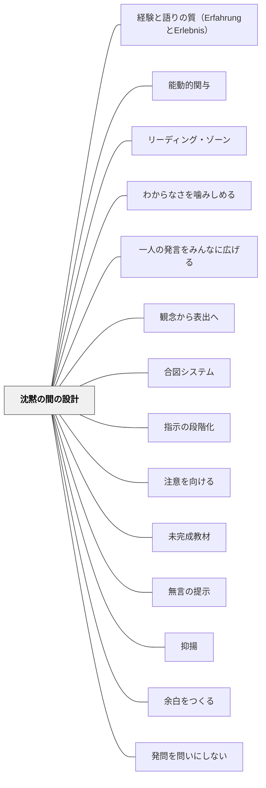

# 沈黙の間の設計

## [Pattern Connection]

### ベンヤミン（1913–1916）——「言葉は沈黙のなかから発せられる」：沈黙の言語哲学的根拠

ヴァルター・ベンヤミンは青年期の論考「青春の形而上学」（1913–14年）と友人への書簡（1916年）のなかで、沈黙と言語の根本的な関係を考察した。

**「語るとは聴くことである」：**

> 「語るとは聴くことである。それゆえ言葉は沈黙のなかから発せられる」——「青春の形而上学」

ベンヤミンにとって、言葉が生まれる場所は「沈黙の内側」である。語ることは「外から情報を出す」のではなく、「沈黙から新しい言語を産む」行為だ。この言語哲学は、沈黙を「空白（何もない時間）」ではなく「語りが産まれる場所」として位置づける。

**「語り手は、ある新しい言語の沈黙を創り出したのだ」：**

> 「聴く者は、対話を言語の辺縁へ導き、語る者は、ある新しい言語の沈黙を創り出したのだ。語り手とは、この新たな言語に最初に耳を傾ける者にほかならない」——「青春の形而上学」

この引用は教師の発問後の沈黙を理解する補助線になる。教師が「問い」を発した後に生まれる沈黙は、子どもたちが「新しい言語を産む」直前の時間である。沈黙を埋めることは、その言語が産まれる前に産道を閉じることに等しい。

**言語の肯定性——名前を呼ぶことと沈黙：**

ベンヤミンは「言語一般および人間の言語について」（1916年）で、言語の本質を「名（Name）」として論じた：

> 「新生児の名は、まだ言葉で応えることのない子を前にして生じ、同時にこの子へ呼びかけられる。いつか語り交わす関係へ向けて」

名前を呼ぶことは「相手がまだ語れない沈黙の中で」起きる。そして沈黙が先にあるから、名前が本当の意味で相手に届く。「答えを待つ沈黙」は、子どもが「自分の言葉」を産み出す前に「その子への呼びかけ」を置き続ける行為である。

| ベンヤミンの沈黙観 | 沈黙の間の設計への示唆 |
|---|---|
| 言葉は沈黙から産まれる | 発問後の沈黙は産道——埋めることは産まれる前に閉じること |
| 語ることは聴くことから始まる | 教師が「聴く者」になる沈黙が、子どもを「語る者」にする |
| 語り手は新しい言語の沈黙を創る | 深い発問は「沈黙を生む」——沈黙の深さが問いの深さを示す |

- **既存パタンとの関連**：Hammeken（2007）の「10秒待つ」という実践的指針に、「なぜ沈黙が必要か」という言語哲学的根拠が加わる
- **補強された点**：沈黙は「処理時間を与える待機」ではなく、「言葉が産まれる場所そのもの」。この認識の転換が、教師の「沈黙への不安」を和らげる根本的な視座を提供する
- **他のパタンへの波及**：[[パタン/経験と語りの質（ErfahrungとErlebnis）]] — 沈黙の中でErfahrungが熟成する；[[パタン/聴くことから語ることへ]] — 「語るとは聴くこと」はこのパタンの哲学的根拠；[[文献/闇を歩く批評（ベンヤミン・柿木伸之）]] — 本統合の出典

---

- **補強された点（インクルーシブ視点からの拡張）**：Hammeken（2007）はインクルーシブ教育の視点から、発問後の待ち時間を**最低10秒**とすることを推奨する（Strategy #505）。これは情報処理に時間がかかる子ども、言語処理に困難を抱える子どもへの配慮として設計されたものだが、同時にクラス全体の思考の質を高める。Rowe（1974）の研究が示す「3〜5秒」は一般学習者向けの基準であり、特別支援が必要な子どもを想定すると10秒が現実的な下限となる。
- **拡張された実装**：発問後すぐに挙手を求めない——「シグナル（合図）が出るまで手を挙げない」という構造が、処理の遅い学習者にも思考の時間を保証する。「手を挙げた子を指名する」から「全員が答えを準備してから発表する」への移行が、沈黙の質を変える。

## 背景（Context）

[[パタン/余白をつくる]] として、子どもが内的に動ける「間（ま）」を授業に設けたい。特に「問いかけた後」「読み語りの後」「作業が終わった後」には、言葉が生まれる前の沈黙の時間が重要な役割を果たす。しかし教室では、沈黙は「何かうまくいっていない」というサインと受け取られがちで、教師は反射的にそれを埋めようとしてしまう。

## 問題（Problem）

問いかけた直後にすぐ答えを求めたり、沈黙を別の言葉で埋めてしまったりすると、子どもが「自分で考える」プロセスが始まる前に終わってしまう。思考には時間がかかり、特に深い問いほど、答えが出るまでの沈黙が長くなる。

## 力のかたち（Forces）

- Wait time（待ち時間）の研究：発問後3〜5秒待つだけで、回答の質・長さ・多様性が上がる（Rowe, 1974）
- 沈黙への不快感は教師にも子どもにもある
- 沈黙が長すぎると、場の緊張が高まりすぎて参加の意欲が下がることもある
- 「静かに待つ」と「余白を楽しむ」は異なる——前者は抑圧的、後者は招待的

## 解決（Solution）

**問いかけや読み語りの後に、意図的に「沈黙の間」を設計し、その沈黙を教師が安心して保つ。**

沈黙は「空白」ではなく「思考が動いている時間」として教師が位置づけることが鍵。教師が沈黙を埋めることをやめるだけで、子どもの思考の時間が生まれる。

**具体的な設計：**
- 発問の後に「まず30秒、自分の中で考えてみてください」と告げてから待つ
- 読み語りの後に何も言わず、その場の余韻を5〜10秒共有する
- 「答えはすぐ言わなくていい。頭の中で何かが動いたら教えて」と伝える
- 教師が待つ間、視線を特定の子に集中させず、全体をふんわり見る
- ペアで「まず自分で考えてから話す」という順序を習慣化する

**教師の姿勢：**
「誰も答えないのは失敗だ」という思い込みを外す。沈黙の中に「考えている」「感じている」子どもたちがいる。

## 結果（Consequences）

- 答えの質・多様性・深さが上がる
- 「じっくり考えることが許される」という雰囲気が生まれ、思考の文化が育つ
- 子どもが「考えている自分」を感じる経験が積み重なり、内発的動機づけにつながる
- 教師も「沈黙に耐える力」が育ち、授業の余裕が増す

## クラスター図

## Actionable Insight

- 発問の後に「まず30秒、自分の中で考えてみてください」と告げてから待つ——この言葉一つで沈黙が「思考の時間」に変わる
- 読み語りの後に5〜10秒、何も言わずに余韻を共有する——この沈黙を埋めない勇気が子どもの内的なものを引き出す
- 「誰も答えない沈黙は失敗ではない」という前提で授業に臨む——教師が沈黙を安心して保てることが、最も深い問いへの招待になる

## 出典

- 一つの教育のパタン・ランゲージ（岩井輝久）/ Hammeken, P. A.（2007）The Teacher's Guide to Inclusive Education: 750 Strategies for Success!

## 関連パタン
- [[パタン/経験と語りの質（ErfahrungとErlebnis）]] — 沈黙の中でErfahrungが熟成する
- [[文献/闇を歩く批評（ベンヤミン・柿木伸之）]] — 「語るとは聴くことである・言葉は沈黙から産まれる」（ベンヤミン, 1913）
- [[パタン/能動的関与]]
- [[教科/算数・数学で使うパタン]]
- [[パタン/リーディング・ゾーン]]
- [[パタン/わからなさを噛みしめる]]
- [[パタン/一人の発言をみんなに広げる]]
- [[パタン/観念から表出へ]]
- [[パタン/合図システム]]
- [[パタン/指示の段階化]]
- [[パタン/注意を向ける]]
- [[パタン/未完成教材]]
- [[パタン/無言の提示]]
- [[パタン/抑揚]]

- [[パタン/余白をつくる]] — 思考・感情の動きのための「間」をつくる上位パタン
- [[パタン/発問を問いにしない]] — 問わないことで生まれる沈黙の質は特に深い
- [[パタン/問い返しのデザイン]] — 沈黙の後に問い返すことで思考が深まる
- [[パタン/安心基地]] — 沈黙が安心して保てるのは心理的安全があってこそ
- [[パタン/待ち時間（問いのあとの3秒）]] — 本パタンのマイクロ単位（発問・応答直後の数秒）を扱う階層下のパタン
## このパタンが働く実践
- [[実践/インクルーシブ授業の設計]]

| 実践パタン | どのように沈黙の間を設計しているか |
|------------|------------------------------------|
| [[パタン/ナンバートーク]] | 答えが出てもすぐ発表させず、親指サインまでの個人思考の時間を守る |
| [[パタン/問い返しのデザイン]] | 問い返した後にすぐ補足せず、学習者が考え直す間を残す |
| Think-Pair-Share | 個人で考える時間を先に置き、対話の前に思考を立ち上げる |
| [[実践/10や100を単位にして計算しよう]] | 共有の前に一人で考える時間を置き、各自が数の見方をもってから相談に入る |
