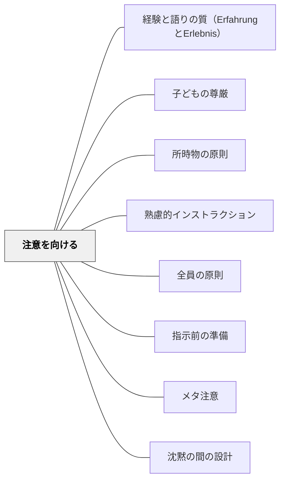

# 注意を向ける

> 注意が向いていない状態での指示は届かない。まず受け手の注意を集めることが先決だ。

## [Pattern Connection]

### ベンヤミン（1934–1936）——Aufmerksamkeit（注意深さ）：「魂の自然な祈り」としての注意

ヴァルター・ベンヤミンは、フランツ・カフカを論じた論考（1934年）のなかで、17世紀フランスの哲学者マールブランシュの言葉を引きながら「注意深さ（Aufmerksamkeit）」を論じた。

**「魂の自然な祈り」としての注意深さ：**

マールブランシュは「注意深さ」を「魂の自然な祈り（la prière naturelle de l'âme）」と呼んだ。ベンヤミンはこの言葉を引いて、カフカがその注意深さを「忘れられて歪められた被造物」へ差し向けたと論じた。

> オドラデク（カフカの奇妙な生き物）をはじめ、カフカがその小説に描く奇妙な生き物は、地上の生そのものの歪みの究意であり、「せむしの小人」とは、その祖型にほかならない——ベンヤミン「フランツ・カフカ」（柿木, 2021より）

**「歪められたものへの注意深さ」——教育への示唆：**

ベンヤミンの注意深さは、現在の[[パタン/注意を向ける]]が扱う「受け手の注意を集める技術」とは異なる次元を持つ。それは：

- **向ける主体**が「子ども」だけでなく「教師」でもある
- **向ける対象**が「教師の言葉」だけでなく「見過ごされた子ども」でもある
- **注意の性質**が「情報処理の開始」ではなく「存在への敬意」に近い

| 注意のタイプ | 現在のパタン（受け手の注意管理） | ベンヤミンのAufmerksamkeit |
|---|---|---|
| 主体 | 子ども（注意を向ける側） | 教師（注意深さを持つ側） |
| 対象 | 教師の言葉・指示 | 「歪められた」子ども・見落とした細部 |
| 機能 | インストラクションを届ける | 見過ごされたものを見る |
| 態度 | 管理・調整 | 祈り・応答 |

**「無視された現実の最小の細胞でさえ、残りの世界全体に釣り合う」：**

アドルノがベンヤミンの思考を評したこの言葉は、特別支援の哲学と深く共鳴する。教室の中で「できない子」「はみ出す子」「不器用な子」への微視的な注意深さが、クラス全体の学びを照らし出す可能性を持つ。最小の細胞への注意が、残りの世界全体（教室・授業・共同体）に釣り合う。

- **補強された点**：「注意を向ける」技術の向こうに、「注意深さとしての教師のあり方」という倫理的・哲学的次元が加わる。受け手の注意を集める「手段としての注意」と、存在に向けられた「態度としての注意深さ」は区別される
- **他のパタンへの波及**：[[パタン/子どもの尊厳]] — Aufmerksamkeitは子どもの存在への尊重と同根；[[パタン/経験と語りの質（ErfahrungとErlebnis）]] — 語り得ない体験を持つ子への注意深さ；[[文献/闇を歩く批評（ベンヤミン・柿木伸之）]] — 本統合の出典

---

## 背景（Context）
インストラクションの送り手と受け手のシステム（ワーマンの「理解の秘密」）において、受け手の注意はコンテクストの重要な要素である。人の注意は複数のものに同時には向かない。作業中・会話中・他のことを考えている状態では、どんなに明確な指示も届かない。

## 問題（Problem）
受け手がまだ別の作業をしていたり、隣の子と話していたりする状態で教師が指示を始めることがある。教師には「伝えた」という記憶があるが、受け手には届いていない。注意が向いていない状態での発話は、ノイズとして処理されてしまう。

## 力のかたち（Forces）
- 注意を引くために使う手段（声かけ・音・動作）が増えすぎると逆効果になる
- 待つことで全員の注意が集まるが、時間がかかりすぎる場合もある
- 「こちらを向いてください」という言葉だけでは効果が薄い場面がある

## 解決（Solution）
**「手を止めてこちらを見てください」「先生の話を聞きます」のような明確なシグナルを出し、全員の注意がこちらに向いてからインストラクションを始める。**

「3秒待ちます」「音楽が止まったら聞きます」「先生が手を挙げたら止まります」のように、注意を向けるためのルーティンを確立すると効果的である。全員の注意が集まった（目が合った・手が止まった）ことを確認してから指示を始める。

## 結果（Consequences）
- 指示が全員に届くようになる
- 受け手が「注意を向けるタイミング」を学習し、習慣化する
- 教師が指示を繰り返す必要がなくなり、授業のテンポが改善される

## クラスター図

## Actionable Insight

- 「手を止めてこちらを見てください」のような明確なシグナルを出し、全員の目が合ったことを確認してから指示を始める——注意が向いていない状態での発話はノイズとして処理されてしまう
- 「先生が手を挙げたら止まります」のように注意を向けるためのルーティンを授業の最初に確立する——ルーティン化することで毎回口頭で呼びかける必要がなくなりテンポが改善される
- 指示を繰り返したくなる衝動を抑え「全員が向くまで待つ」実践をする——待つ姿勢が学習者に「注意を向けることが前提」という文化を育てる

## 出典

- 一つの教育のパタン・ランゲージ（岩井輝久）

## 関連パタン
- [[パタン/経験と語りの質（ErfahrungとErlebnis）]] — 語り得ない体験を持つ子への注意深さ（Aufmerksamkeit）
- [[パタン/子どもの尊厳]] — 魂の自然な祈りとしての注意は子どもの存在への尊重と同根
- [[文献/闇を歩く批評（ベンヤミン・柿木伸之）]] — Aufmerksamkeit（注意深さ）：「魂の自然な祈り」・微視的まなざし（ベンヤミン, 1934）
- [[パタン/所時物の原則]]
- [[パタン/熟慮的インストラクション]] — 親パタン
- [[パタン/全員の原則]] — 全員に届けるための前提
- [[パタン/指示前の準備]] — 注意を含む準備全体
- [[パタン/メタ注意]] — 注意そのものへの意識化
- [[パタン/沈黙の間の設計]] — 注意を集める沈黙の活用
