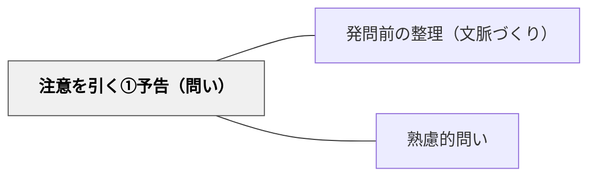

# 注意を引く①予告（問い）

> 「次にこんな問いをします」と事前に伝えることで、参加者の関心と準備状態が高まる。

## 背景（Context）

問いを突然投げかけると、参加者が「何を考えればよいかわからない」まま時間だけが過ぎることがある。特に深い思考を要する問いほど、事前の心理的準備が重要になる。問いを予告することで、参加者は無意識のうちにその問いに向けた思考を始める。

## 問題（Problem）

準備なく投げかけられた問いに対して、参加者は表面的な反射的応答を返しがちである。深く考えることを求める問いほど、事前の問いの提示なしには思考が深まりにくい。また、問いを突然提示されると、内容よりも「形式への適応」に認知資源が使われてしまう。

## 力のかたち（Forces）

- 予告が長すぎると、参加者が問いに対する答えを「作りすぎて」しまう
- 予告の内容が曖昧すぎると、期待した準備状態が生まれない
- 問いの予告は、テスト的な緊張感を生む場合もある
- 予告によって問いへの期待感が高まり、動機付けになることもある

## 解決（Solution）

「10分後にこんな問いをします」「この話を聞きながら、〇〇について考えておいてください」「後で問います：あなたにとって最も大切なことは何か？」のように、問いを事前に提示する。講義の冒頭で「今日の最後に、この問いに答えてもらいます」と伝えることで、学習者は聴きながら考え続けるようになる。

## 結果（Consequences）

- 問いへの思考準備が進み、より深い・具体的な答えが返ってくるようになる
- 参加者の関心が事前から問いの方向に向けられる
- 予告によって答えを「準備しすぎる」参加者が出ることもあるため、自由な発想を妨げないよう配慮が必要

## 関連パタン
- [[パタン/発問前の整理（文脈づくり）]]

- [[パタン/熟慮的問い]] — 親パタン

## クラスター図

## Actionable Insight

- 授業の冒頭に「今日の最後にこの問いに答えてもらいます」と1文で予告する——学習者が授業を聴きながら考え続ける準備状態が生まれる
- 「この話を聞きながら○○について考えておいてください」と聴く方向を具体的に示す——目的を持って聴く姿勢が授業全体の関与度を高める
- 予告は短く（1文）——長い予告は答えを「準備しすぎる」状態を生み自由な思考を妨げる

## 出典

- [[文献/熟慮的問いのパターンリスト（動画記録）]]
