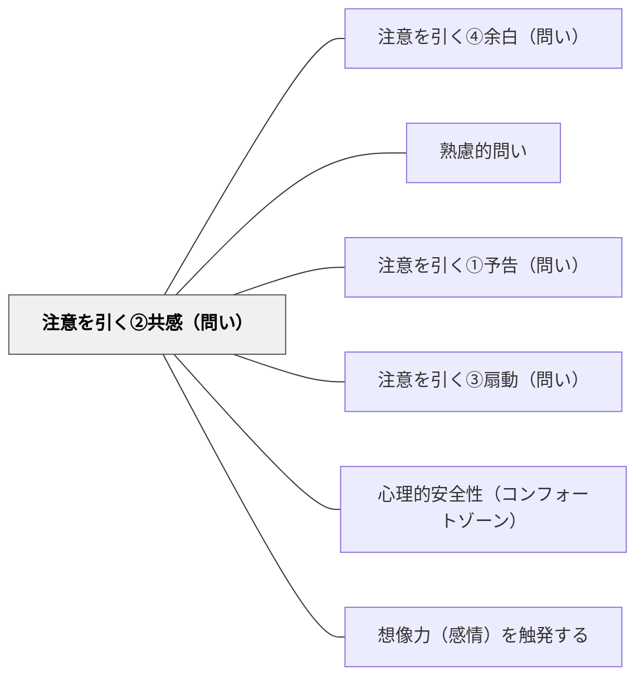

# 注意を引く②共感（問い）

> 相手の心情や状況を代弁してから問うことで、参加者が「自分ごと」として問いに向き合える。

## 背景（Context）

問いを投げかけても、参加者がそれを「自分に関係のないこと」として受け取ると、思考が深まらない。特に抽象的なテーマや、参加者が「難しそう」と感じるテーマでは、疎外感が生まれやすい。問いの前に参加者の心情や経験を代弁する言葉を添えることで、問いへの心理的な距離が縮まる。

## 問題（Problem）

問いの内容が参加者の現実から遠く感じられると、表面的な回答に終わりやすい。「正直言って難しそう」「私には関係ない」という感覚があると、問いへの関与度が低下する。共感のない問いは、たとえ質問の中身がよくても、参加者に届かない。

## 力のかたち（Forces）

- 共感の言葉が不自然だと、むしろ不信感を生む
- 代弁が一般化されすぎると、個人の具体的な感情とずれる
- 過度に感情に訴えると、思考よりも感情反応が優先されることがある
- 短い一言でも、「あなたの気持ちを知っている」という姿勢が伝わることが重要

## 解決（Solution）

「こういう問いに答えるのは難しいと感じているかもしれませんが、」「みなさんも日々こんな場面に直面していると思います。そこで問います：」「この悩みはあなただけではありません。では一緒に考えましょう：」のように、問いの前に共感・代弁・状況確認の言葉を置く。参加者の置かれた文脈や感情に寄り添ってから問いを提示することで、問いが「自分ごと」に変わる。

## 結果（Consequences）

- 参加者が問いを「自分に関係あること」として受け取り、関与度が高まる
- 心理的安全性が生まれ、本音の回答が出やすくなる
- 共感表現の不自然さや過度な感情誘導は逆効果になるため、自然な言葉で行うことが大切

## 関連パタン
- [[パタン/注意を引く④余白（問い）]]

- [[パタン/熟慮的問い]] — 親パタン
- [[パタン/注意を引く①予告（問い）]] — 事前の予告で注意を喚起する兄弟パタン
- [[パタン/注意を引く③扇動（問い）]] — 重要度を強調して注意を集める兄弟パタン
- [[パタン/心理的安全性（コンフォートゾーン）]] — 共感の言葉が心理的安全を生む上位パタン
- [[パタン/想像力（感情）を触発する]] — 共感が感情・想像力の扉を開く

## クラスター図

## Actionable Insight

- 難しいテーマの問いの前に「こういう問いに答えるのは難しいと感じているかもしれませんが」と一言添える——共感の言葉が心理的安全性を生み問いへの関与度を高める
- 「みなさんも日々この場面に直面していると思います。一緒に考えてみましょう」と状況確認してから問う——学習者の現実に寄り添うことで問いが「自分ごと」に変わる
- 共感表現は自然な言葉で1文以内にとどめる——長くなると不自然になり逆に不信感を生むリスクがある

## 出典

- [[文献/熟慮的問いのパターンリスト（動画記録）]]
