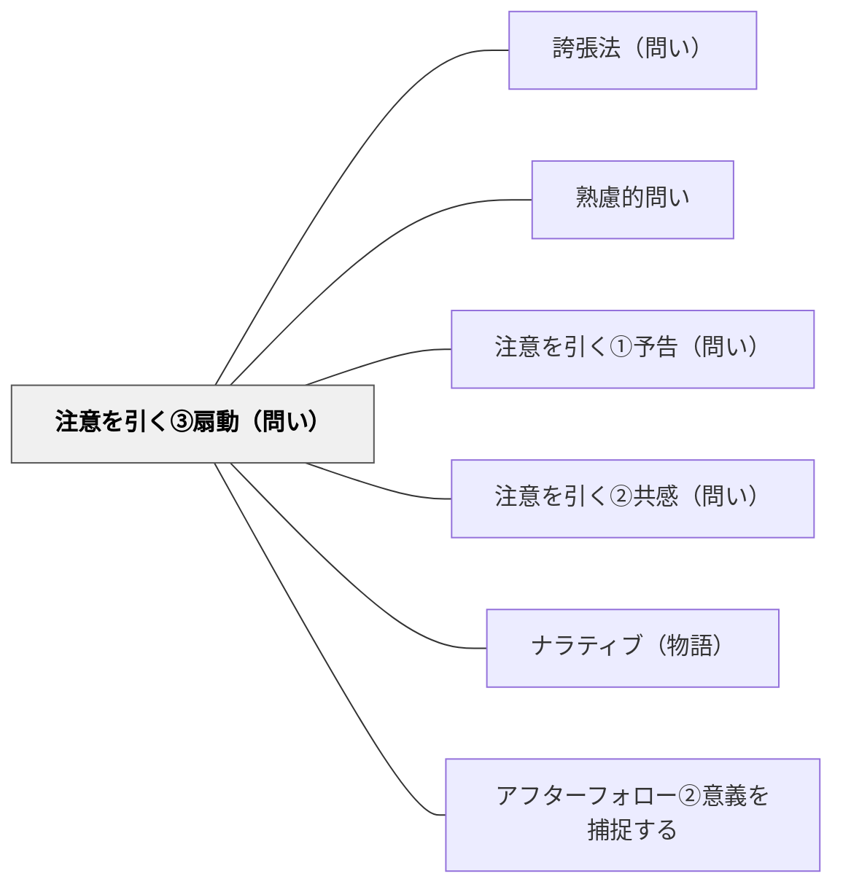

# 注意を引く③扇動（問い）

> 「実はこれが非常に重要なんです」と問いの前に重要性を強調することで、参加者の集中度が高まる。

## 背景（Context）

多くの情報や問いが飛び交う場では、参加者の注意はすぐに分散する。問いを特別なものとして際立たせるには、問う前に「これはとても大切な問いだ」と伝える工夫が有効である。重要性の強調が適切に行われると、参加者の認知リソースが問いに集中する。

## 問題（Problem）

すべての問いが「同じ重みで」提示されると、どれが重要かが伝わらない。参加者は優先順位をつけられず、表面的な対応で済ませることが増える。問いの重要性を事前に伝えないと、参加者は「どれくらい真剣に考えればよいか」の判断がつかない。

## 力のかたち（Forces）

- 「重要だ」と言いすぎると、言葉の効果が薄れる（オオカミ少年効果）
- 扇動的な前置きは、参加者に過度な緊張を与える可能性がある
- 「これが最重要」という前置きが、探究の自由さを狭める場合もある
- 問いの重要性を具体的に説明すると、なぜ重要かの理解が深まる

## 解決（Solution）

「ここから先の問いが、今日一番大切な問いです」「これが答えられると、残りの問題がすべて見通せます」「実はこの一問が、全体の核心を突いています」のように、問いに入る前に重要性を強調する。ただし、乱用を避け、本当に重要な問いに限定して使うことで、参加者の注意を確実に引き寄せる効果が発揮される。

## 結果（Consequences）

- 特定の問いへの集中度が高まり、思考の質が向上する
- 問いの序列が明確になり、参加者が優先的に取り組む問いを認識できる
- 重要性の強調を多用しすぎると効果が薄れるため、使用頻度のコントロールが必要

## 関連パタン
- [[パタン/誇張法（問い）]]

- [[パタン/熟慮的問い]] — 親パタン
- [[パタン/注意を引く①予告（問い）]] — 事前の予告で注意を喚起する兄弟パタン
- [[パタン/注意を引く②共感（問い）]] — 共感で関与度を高める兄弟パタン
- [[パタン/ナラティブ（物語）]] — 扇動的な問いは物語の緊張・クライマックスと同じ構造を持つ
- [[パタン/アフターフォロー②意義を捕捉する]] — 問いの意義を伝えることで扇動から深い参加へつなぐ

## クラスター図

## Actionable Insight

- 「ここから先が今日一番大切な問いです」と授業中1〜2回に限定して使う——乱用を避けることで言葉の重みを保ち、学習者の認知リソースを集中させる効果が維持される
- 「これが答えられると、残りの問題がすべて見通せます」と問いの意義を具体的に説明する——なぜ重要かが伝わることで参加者の動機と集中の質が変わる
- 重要性の強調は「本当に核心となる問い」にだけ使うという自分ルールを決める——節制が言葉の効果を長期的に維持する

## 出典

- [[文献/熟慮的問いのパターンリスト（動画記録）]]
