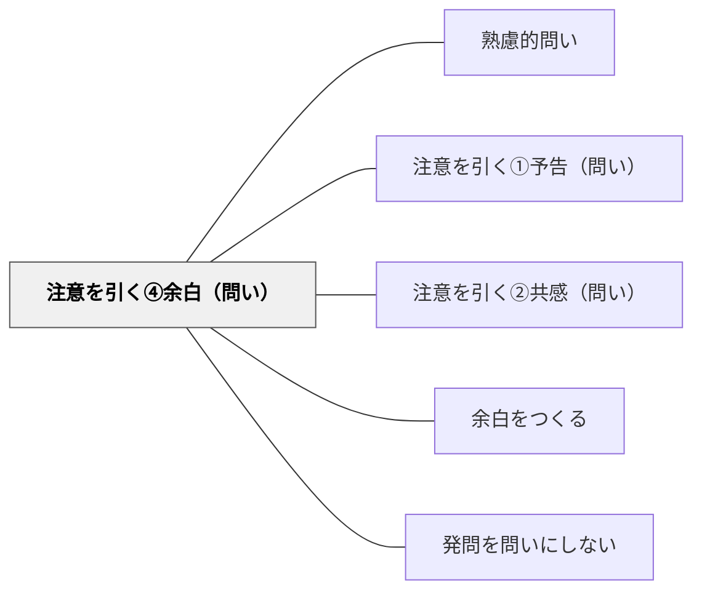

# 注意を引く④余白（問い）

> 問う前にあえて間（ポーズ）を演出することで、参加者の思考と注意が問いの方向に向かう。

## 背景（Context）

言葉が絶え間なく続く場では、参加者は受け取ることに忙しく、深く考える余裕が生まれない。問いを投げかける直前に沈黙や間を設けることで、参加者の内側に「何か来る」という準備状態が生まれる。余白は思考の助走距離である。

## 問題（Problem）

問いを矢継ぎ早に投げかけると、参加者はそれぞれの問いを十分に処理できないまま次の問いに流される。沈黙を恐れるあまり問いの後に急いで補足説明を加えると、参加者が自分で考える時間が奪われる。問いと問いの間の「空白」を恐れないことが、深い思考の条件になる。

## 力のかたち（Forces）

- 沈黙は文化や場によっては不自然に感じられ、居心地の悪さを生む
- 間を取りすぎると、参加者が「何が起きているか」と混乱する
- ポーズは問い手の自信と意図が伝わる場合にのみ有効に機能する
- 間の前後の言葉の選び方が、余白の効果を大きく左右する

## 解決（Solution）

問いを述べる前に意識的に2〜3秒の沈黙を置く。「…では、ここで問います。」のように、言葉の速度を落とし、声のトーンを変えてから問いを投げかける。問いの後も急いで次に進まず、参加者が考えるための沈黙を維持する。「少し時間を取って考えてみてください」と明示的に伝えることで、沈黙が不自然にならずに済む。

## 結果（Consequences）

- 参加者の注意が問いに集まり、思考の質と深さが高まる
- 「考えることが許されている」という心理的安全性が生まれる
- 沈黙の使い方に慣れるまで問い手自身が居心地の悪さを感じることがあるため、練習が必要

## 関連パタン

- [[パタン/熟慮的問い]] — 親パタン
- [[パタン/注意を引く①予告（問い）]] — 事前の予告で注意を喚起する兄弟パタン
- [[パタン/注意を引く②共感（問い）]] — 共感で関与度を高める兄弟パタン
- [[パタン/余白をつくる]] — 沈黙・余白を意図的に設計する上位パタン
- [[パタン/発問を問いにしない]] — 問いの後に答えを急がない問いかけの姿勢

## クラスター図

## Actionable Insight

- 問いを述べる前に2〜3秒の意識的な沈黙を置く——余白が「何かが来る」という準備状態を生み問いへの注意と思考の質を高める
- 問いの後も急いで補足せず「少し時間を取って考えてみてください」と明示して沈黙を維持する——問いの後の沈黙こそが深い思考の時間であり、急いで埋めることがそれを奪う
- 問い手自身が沈黙に慣れる練習を意識的に積む——居心地の悪さを感じながらも維持することが「考えることが許されている」文化を育てる

## 出典

- [[文献/熟慮的問いのパターンリスト（動画記録）]]
