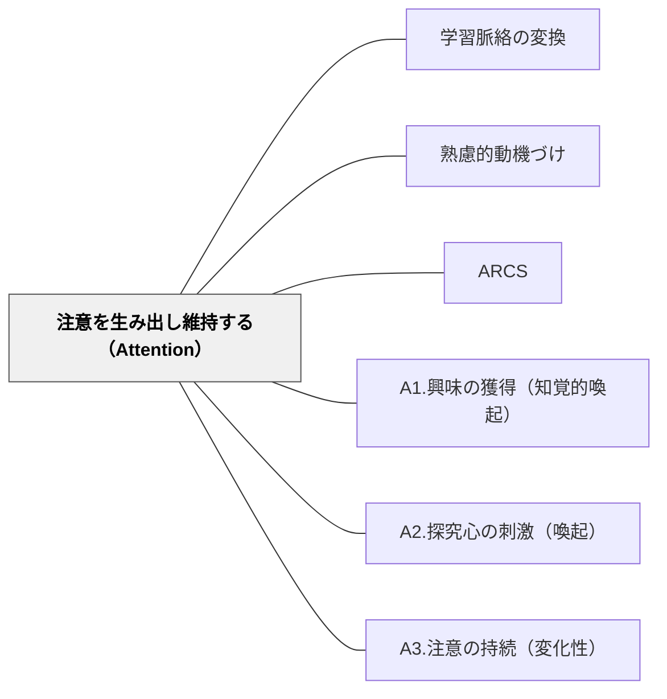

# 注意を生み出し維持する（Attention）

> 学習者が「気になる」と感じなければ、学習は始まらない。新奇性・驚き・問いかけで注意を呼び起こし、変化によって持続させる。

## 背景（Context）
ARCSモデルの最初の要素。どれだけ重要な内容でも、学習者が注意を向けていなければ学習は起こらない。授業や学習活動の冒頭での注意の獲得と、それを持続させる工夫の両方が必要になる。

## 問題（Problem）
学習者の注意は有限で、競合する刺激（スマートフォン、疲労、不安など）によって容易に散漫になる。また、一度引いた注意も、単調な進行によってすぐに薄れてしまう。

## 力のかたち（Forces）
- 注意を引く刺激は時間とともに慣れが生じ、効果が薄れる
- 過剰な刺激は注意を引くが、本来の学習目標から離れることがある
- 驚きや新奇性は強い注意喚起になるが、使いすぎると陳腐化する
- 変化のない単調な授業は、どれほど内容が良くても注意が続かない

## 解決（Solution）
**新奇性・驚き・問いかけ・変化という4つの要素を意図的に配置することで、学習者の注意を引きつけ、持続させる。**

授業の冒頭に驚きの事実やデモを置く（A1.興味の獲得）、問いや謎を投げかけて探究心を喚起する（A2.探究心の刺激）、活動の形式や pace を変化させて単調さを避ける（A3.注意の持続）という3つのサブパターンを組み合わせて設計する。

## 結果（Consequences）
- 学習者が授業や活動に積極的に参加しやすくなる
- 内容への入口が開かれ、後続の学習に取り組む下地が整う
- 注意喚起だけでなく関連性・自信・満足との組み合わせが重要であることを意識できる

## クラスター図

## Actionable Insight

- 授業の冒頭に「驚きの事実・デモ・謎めいた問い」を1つ置く——学習者が「気になる」と感じることが学習の入り口を開く最初の鍵
- 授業中20〜25分おきに活動の形式（聴く→書く→話す）や pace を変化させる——単調さが最大の注意の敵であり、変化だけで持続時間は大きく変わる
- 問いや謎を授業の途中で投げかけ「次の活動が終わったらこれを考えます」と持続的な探究心を生む——次への期待が注意の持続を支える強力な動機になる

## 出典

- 一つの教育のパタン・ランゲージ（岩井輝久）

## 関連パタン
- [[パタン/学習脈絡の変換]]
- [[パタン/熟慮的動機づけ]] — 親パタン
- [[パタン/ARCS]] — 上位フレームワーク
- [[パタン/A1.興味の獲得（知覚的喚起）]] — サブパターン
- [[パタン/A2.探究心の刺激（喚起）]] — サブパターン
- [[パタン/A3.注意の持続（変化性）]] — サブパターン
