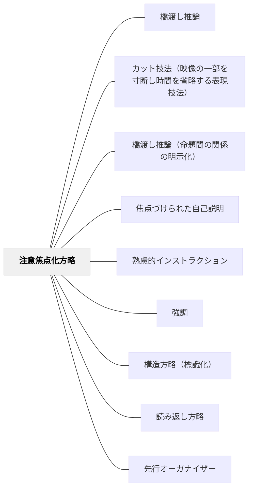

# 注意焦点化方略

> 「ここに注目」という言葉がけと視覚的強調で、受け手の注意を学習の核心に向けさせる。

## 背景（Context）
山本博樹（2019）『教師のための説明実践の心理学』ナカニシヤ出版で示された説明実践の方略の一つ。人間の注意資源は有限であり、学習材料の全てに等しく注意を向けることはできない。注意焦点化方略は、教師が意図的に学習者の注意を特定の部分（重要な情報・問題の核心・見るべきポイント）に向けさせる言語的・視覚的操作である。

## 問題（Problem）
学習材料には重要な部分と補足的な部分が混在しているが、学習者はどこに注意を向けるべきかを常に自分で判断できるわけではない。教師が強調しない限り、学習者の注意は重要でない部分に向いたままになることがある。注意の焦点が定まらないと、説明を聞いても理解が表面的にとどまりやすい。

## 力のかたち（Forces）
- 注意焦点化は理解を深めるが、焦点が多すぎると効果が分散する
- 言語的な注意喚起（「ここ」「重要」）と視覚的な強調（囲み・矢印・色）を組み合わせると効果が高まる
- 学習者が自分で注意を焦点化できるよう教えることが長期的な目標
- 焦点化する部分の選択が教師の教科内容理解を反映する

## 解決（Solution）
**「ここに注目してください」「この点が重要です」「黒板のこの部分を見てください」という言語的指示と、囲み・矢印・色・ポインターなどの視覚的強調を組み合わせて、学習者の注意を特定の部分に向けさせる。**
説明の前に注意を焦点化することで、後続の説明の理解が促進される。「なぜここが重要か」を短く添えることで、注意焦点化の意味が分かり、学習者が自分で重要性を判断する力を育てる。1回の説明で注意焦点化する箇所は3〜5か所に絞る。

## 結果（Consequences）
- 学習者が重要な情報に注意を向け、深い処理が促進される
- 教師が「何を大切にしているか」が学習者に伝わる
- 学習者が自分で注意を焦点化する自己調整力が育まれる

## クラスター図

## Actionable Insight

- 「この点が重要です」という言語的指示と、囲み・矢印・色などの視覚的強調を同時に使う——言語と視覚の組み合わせが注意焦点化の効果を最大化する
- 1回の説明で注意焦点化する箇所を3〜5か所に絞る——多すぎると焦点の意味が薄れ、すべてが等しく重要に見えてしまう
- 「なぜここが重要か」を短く一言添える——理由が伝わることで学習者が自分で重要性を判断する力が育ち、自己調整学習の基盤になる

## 出典

- 一つの教育のパタン・ランゲージ（岩井輝久）

## 関連パタン
- [[特別支援/インクルーシブ教育]]
- [[特別支援/TEACCHとシグニファイア]]
- [[特別支援/視覚支援]]
- [[パタン/橋渡し推論]]
- [[パタン/カット技法（映像の一部を寸断し時間を省略する表現技法）]]
- [[パタン/橋渡し推論（命題間の関係の明示化）]]
- [[パタン/焦点づけられた自己説明]]
- [[パタン/熟慮的インストラクション]] — 親パタン
- [[パタン/強調]] — 強調技法との連動
- [[パタン/構造方略（標識化）]] — 構造全体を明示する方略
- [[パタン/読み返し方略]] — 注意焦点化との組み合わせ
- [[パタン/先行オーガナイザー]] — 事前に注意の方向を示す
